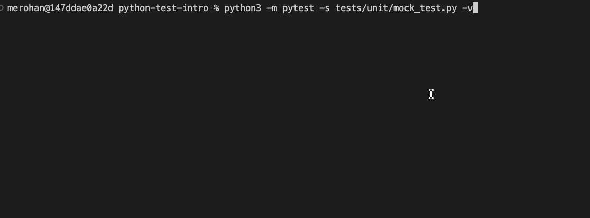

<h2>
Serverless Test Samples
</h2>
This repo is designed to provide developers with guidance for implementing comprehensive test suites for their serverless applications.
 
<b>Runtime Guides:</b>

<a href="https://github.com/aws-samples/serverless-test-samples/tree/main/python-test-samples">Python</a>
·
<a href="https://github.com/aws-samples/serverless-test-samples/tree/main/python-test-samples">Typescript</a>
·
<a href="https://github.com/aws-samples/serverless-test-samples/tree/main/python-test-samples">Java</a>

## Getting Started
How do you use this repo? 

- If you would like to understand the guidance behind the test samples, please read [Serverless Testing Principles](Serverless%20Testing%20Principles.md). 
- If you would like to implement the test samples in your own project, check out the sample code.

## Sample Code
The sample code in this project will illustrate techniques for creating automated tests in several languages. The initial samples are written in Python and we will publish samples in other languages over time. The samples demonstrate a variety of approaches including testing in the cloud, mocking and emulation. 

### Runtime Samples
- [Python](./python-test-samples/)
- TypeScript (coming soon)
- Java (coming soon)
- .NET (coming soon)
- Go (coming soon)

### Sample Content
Each runtime sample covers the following topics:
- Unit, Integration and Load Tests
- Mocks and Emulators
- Using AWS SAM during testing
- Testing in the Cloud
- Application Tracing

### Event-Driven Architecture / Async System Test Samples
- SAM (coming soon)
- CDK (coming soon)
- Terraform (coming soon)
- Serverless Framework (coming soon)