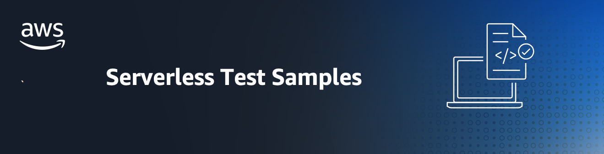

# Serverless Test Samples

AWS guidance and examples for testing serverless and event driven applications.

# Getting Started
We recommend reviewing the companion website for this repository: [Serverlessland - Testing Serverless Applications](https://serverlessland.com/testing). 

If you'd like to jump right into code, you can begin with a starter project in your favorite language:

- [Python starter](./python-test-samples/apigw-lambda)
- [Java starter](./java-test-samples/apigw-lambda-list-s3-buckets)
- [TypeScript starter](./typescript-test-samples/typescript-test-intro)
- [.NET starter](./dotnet-test-samples/apigw-lambda-list-s3-buckets)

# Language Directories
The repository is divided into several language directories. If you would like to browse by language, you can navigate to the main page of each language directory:

- [Python main directory](./python-test-samples/)
- [Java main directory](./java-test-samples/)
- [TypeScript main directory](./typescript-test-samples/)
- [.NET main directory](./dotnet-test-samples/)

# Workload Types
This repository contains sample code for testing a variety of different types of workloads, including API's, Event-Driven Architectures, Service Orchestration, Data Processing, and AWS Partner Patterns.

## API's
| System Under Test|Language|
|---|---|
| [API Gateway with Lambda and DynamoDB](./python-test-samples/apigw-lambda-dynamodb)|Python|API Gateway, AWS Lambda and Amazon DynamoDB|
| [API Gateway HTTP with CDK](https://github.com/aws-samples/serverless-samples/tree/main/serverless-rest-api/python-http-cdk) [External]| Python |
| [API Gateway HTTP with SAM](https://github.com/aws-samples/serverless-samples/tree/main/serverless-rest-api/python-http-sam) [External]| Python |
| [API Gateway REST with SAM](https://github.com/aws-samples/serverless-samples/tree/main/serverless-rest-api/python-rest-sam) [External]| Python |
| [Api Gateway, Lambda, DynamoDB](./typescript-test-samples/apigw-lambda-dynamodb)|TypeScript|
| [API Gateway, Lambda Authorizer, Lambda, DynamoDB](https://github.com/aws-samples/serverless-samples/tree/main/serverless-rest-api/javascript-http-sam) [External] | Node.js |
| [API Gateway, Lambda, S3](./dotnet-test-samples/apigw-lambda-list-s3-buckets)|.NET|
| [API Gateway, Lambda, DynamoDB](./dotnet-test-samples/apigw-lambda-ddb)|.NET|
| [SQS, Lambda, DynamoDB](./dotnet-test-samples/sqs-lambda)|.NET|
| [API Gateway, Lambda, DynamoDB](./java-test-samples/apigw-lambda-ddb)|Java|
| [AppSync, DynamoDB](./java-test-samples/java-appsync-sam)|Java|

## Event-Driven Architectures
Event-driven architectures (EDA) are an architecture style that uses events and asynchronous communication to loosely couple an application’s components. To learn more about several strategies for testing EDA's visit [this guide at Serverlessland.com](https://serverlessland.com/event-driven-architecture/testing-introduction).  
|System Under Test|Language|Description|
---|---|---
|[S3, Lambda](./python-test-samples/async-lambda-dynamodb)|Python|This is a great starter project for learning how to test async EDA.|
|[Schemas and Contracts](./typescript-test-samples/schema-and-contract-testing)|TypeScript|Event driven architectures decouple producers and consumers at the infrastructure layer, but these resources may still be coupled at the application layer by the event contract. Learn how to test for breaking changes in the contract.|
|[S3, Lambda, DynamoDB](./dotnet-test-samples/async-architectures/async-lambda-dynamodb)|.NET|This example shows how to test async system by using DynamoDB during to store incoming asynchronous events during testing|
|[S3, Lambda, SQS](./dotnet-test-samples/async-architectures/async-lambda-sqs)|.NET|An example to how to test asynchronous workflow by long polling the queue that resulting messages are sent to.|

## Architectural patterns
|Pattern|Services used|Language|Description|
|---|---|---|---|
| [Hexagonal architecture](./dotnet-test-samples/hexagonal-architecture/) |API Gateway, Lambda, DynamoDB|.NET|Hexagonal architecture is an architectural pattern used for encapsulating domain logic and decoupling it from other implementation details, such as infrastructure or client requests.|

## Service Orchestration
|System Under Test|Language|Description|
|---|---|---|
| [Step Functions](./java-test-samples/step-functions-local) [External] |Java|This project shows a technique for testing an AWS Step Functions workflow in a local desktop environment.|

## Data Processing
| System Under Test|Language|Description|
|---|---|---|
|[Kinesis Data Stream, Lambda](./typescript-test-samples/kinesis-lambda-dynamodb)|TypeScript|This project shows a technique for testing a streaming data processing system.|
|[Kinesis Data Stream, Lambda, DynamoDB](./dotnet-test-samples/kinesis-lambda-dynamodb)|.NET|This pattern creates an AWS Lambda function that consumes messages from an Amazon Kinesis Data Streams and dumps them to Amazon DynamoDB using SAM and .NET 6.|
## AWS Partner Patterns
| Partner |System Under Test|Language|Description|
|---|---|---|---|
| Datadog |[API Gateway, Lambda, SQS, SNS](./typescript-test-samples/apigw-lambda-sqs-sns-datadog)|TypeScript|This example is about creating Synthetic Tests and Monitors with Datadog.|

# How do I contribute?

See our [Contributing](./CONTRIBUTING.md) guide for more detail providing additions, enhancements, and edits.
