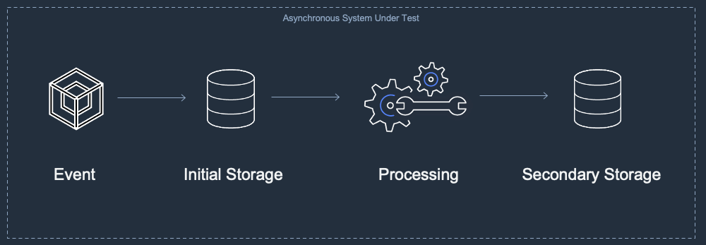
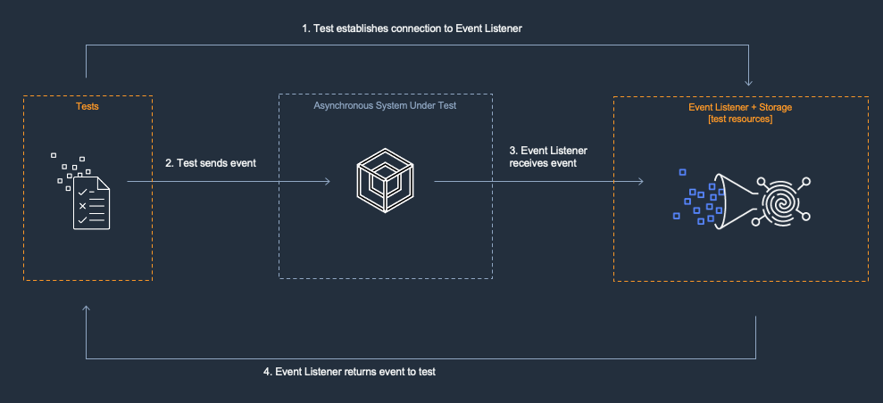
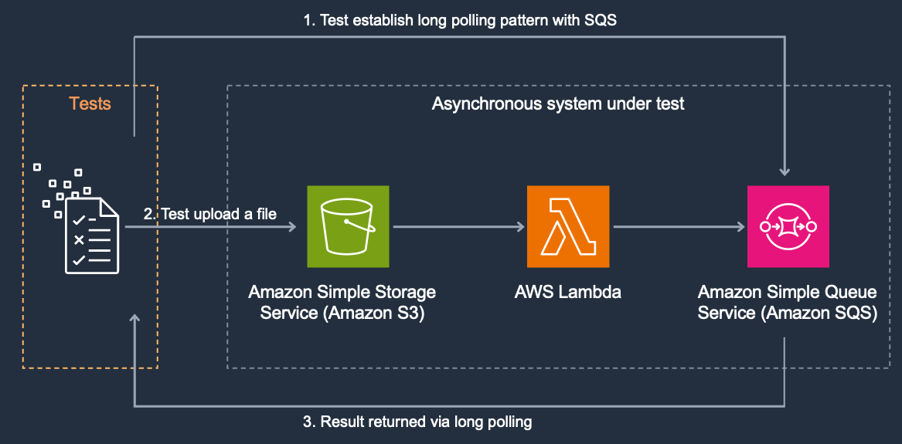

[]()
[]()
[]()
[]()
[]()
[]()

# Test Asynchronous Architectures

Automated tests are crucial components of event driven architectures. They help to ensure that your systems are developed efficiently, accurately and with high quality. This section provides some guidance for designing automated tests for event driven architectures and asynchronous systems using Python.

## View a Generic Asynchronous Pattern
Asynchronous systems typically receive messages or events and immediately store them for future processing. Later, a secondary processing service may perform operations on the stored data. Processed data may then be sent as output to additional services or placed into another storage location. Below is a diagram illustrating a generic asynchronous pattern.



## Establish Logical Boundaries
Asynchronous systems rarely exist in isolation. Typically a production system will be made up of many interconnected subsystems. In order to create a reasonable testing strategy, it is useful to break complex systems into a set of logical subsystems. A subsystem may be a group of services that work together to accomplish a single task. A subsystem should have well understood inputs and outputs. A subsystem should be small enough to be able to reason about and understand. Breaking your complex architecture into smaller subsystems makes it easier to create isolated and targeted tests.

## Create Test Harnesses
When testing asynchronous systems, it can be useful to create test harnesses. These harnesses contain resources that generate inputs for your subsystem and then receive the system’s outputs. Your tests will use the harnesses to exercise the system and determine whether it is performing as expected. These harnesses are resources that are used for testing purposes only. They are not used by production features. Test harnesses are typically deployed to pre-production environments only. However, deploying test harnesses to production environments may be useful for production systems that are tolerant of test data. In these cases you may decide to perform tests in production.

## Configure Event Producers and Event Listeners
Test harnesses are usually composed of event producers and event listeners. The producers provide input to the System Under Test (SUT) and the listeners are configured to receive output. The automated tests send configured events to the producer and then poll the listener to examine the output. If the output meets expectations the test passes.



## Define Service Level Agreements
Although your architecture may be asynchronous, it is still useful to establish reasonable expectations about the maximum duration your system may take to process before it considered to be in a failure state. These expectations may be explicitly defined as Service Level Agreements (SLAs). When you design your tests, you may set timeouts that match your SLA’s. If the system does not return results within the timeout period it can be considered to be in violation of the SLA and the tests will fail.


# Asynchronous Integration Test with Amazon Simple Queue Service (SQS)
You may use a variety of resource types to create the event listener for your asynchronous system under test ([more about event listeners](https://github.com/aws-samples/serverless-test-samples/tree/main/dotnet-test-samples/async-architectures#create-event-listeners-in-test-environments)).

In this pattern polling is used to wait for a specific message using long polling and busy loop.
## Review the System Under Test
The System Under Test (SUT) in this example is an asynchronous notification service. It contains a source S3 bucket that receives a file. A Lambda function is configured to be notified when the putObject event is executed on this bucket. the Lambda function then would queue a new notification message with the file's details in a SQS queue.


Your goal is to test this asynchronous process. Since the end result of this workflow is a message in SQS you do not need any additional resources.   
You will deploy the following resources:

* S3 Source Bucket
* Lambda function 
* SQS Destination queue

This starter project consists of:
* serverless.template - an AWS CloudFormation Serverless Application Model template file for declaring your Serverless functions and other AWS resources
* Function.cs - class file containing a class with a single function handler method
* aws-lambda-tools-defaults.json - default argument settings for use with Visual Studio and command line deployment tools for AWS

You may also have a test project depending on the options selected.

The generated function handler responds to events on an Amazon S3 bucket. The handler receives the bucket and object key details in an S3Event instance and returns the content type of the object as the function output. Replace the body of this method, and parameters, to suit your needs.

After deploying your function you must configure an Amazon S3 bucket as an event source to trigger your Lambda function.
## Prerequisites
The SAM CLI is an extension of the AWS CLI that adds functionality for building and testing serverless applications. It contains features for building your appcation locally, deploying it to AWS, and emulating AWS services locally to support automated unit tests.

To use the SAM CLI, you need the following tools.

- SAM CLI - [Install the SAM CLI](https://docs.aws.amazon.com/serverless-application-model/latest/developerguide/serverless-sam-cli-install.html)
- .NET 6 - [Install .NET 6](https://dotnet.microsoft.com/en-us/download)

## Build the project

```bash
dotnet build
```

## Deploy project resources to the cloud

```bash
sam build
sam deploy --guided
```

## Run the tests
There are three types of tests in this solution:
* S3Notification.UnitTests - unit tests that runs on local machine and do not need any environment setup
* S3Notification.IntegrationTests - require AWS account, use the aws cli to configure region and certifications
* S3Notification.E2ETests - system/end to end tests: before running tests you will need to run after deployment f the lambda function, ensure you set the two environment variables to the Stack Name and AWS Region used when deploying your resources to the cloud.

### Windows
```shell
$env:AWS_SAM_STACK_NAME = ""
$env:AWS_SAM_REGION_NAME = ""
dotnet test tests\S3Notification.E2ETests\S3Notification.E2ETests.csproj
```

### Linux
```bash
export AWS_SAM_STACK_NAME=""
export AWS_SAM_REGION_NAME=""
dotnet test tests/S3Notification.E2ETests/S3Notification.E2ETests.csproj
```

## Cleanup
```bash
sam delete
```