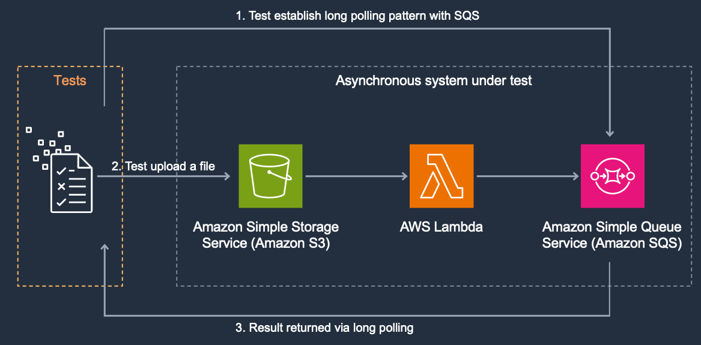

# Asynchronous Integration Test with Amazon Simple Queue Service (SQS)
You may use a variety of resource types to create the event listener for your asynchronous system under test ([more about event listeners](https://github.com/aws-samples/serverless-test-samples/tree/main/dotnet-test-samples/async-architectures#create-event-listeners-in-test-environments)).

In this pattern polling is used to wait for a specific message using long polling and busy loop  

## Review the System Under Test

The System Under Test (SUT) in this example is an asynchronous notification service. It contains a source S3 bucket that receives a file. A Lambda function is configured to be notified when the putObject event is executed on this bucket. the Lambda function then would queue a new notification message with the file's details in a SQS queue.



Your goal is to test this asynchronous process. Since the end result of this workflow is a message in SQS you do not need any additional resources.   
You will deploy the following resources:

* S3 Source Bucket
* Lambda function 
* SQS Destination queue

This starter project consists of:
* serverless.template - an AWS CloudFormation Serverless Application Model template file for declaring your Serverless functions and other AWS resources
* Function.cs - class file containing a class with a single function handler method
* aws-lambda-tools-defaults.json - default argument settings for use with Visual Studio and command line deployment tools for AWS

You may also have a test project depending on the options selected.

The generated function handler responds to events on an Amazon S3 bucket. The handler receives the bucket and object key details in an S3Event instance and returns the content type of the object as the function output. Replace the body of this method, and parameters, to suit your needs.

After deploying your function you must configure an Amazon S3 bucket as an event source to trigger your Lambda function.
## Prerequisites
The SAM CLI is an extension of the AWS CLI that adds functionality for building and testing serverless applications. It contains features for building your appcation locally, deploying it to AWS, and emulating AWS services locally to support automated unit tests.

To use the SAM CLI, you need the following tools.

- SAM CLI - [Install the SAM CLI](https://docs.aws.amazon.com/serverless-application-model/latest/developerguide/serverless-sam-cli-install.html)
- .NET 6 - [Install .NET 6](https://dotnet.microsoft.com/en-us/download)

## Build the project

```
dotnet build
```

## Deploy project resources to the cloud

```
sam build
sam deploy --guided
```

## Run the tests
There are three types of tests in this solution:
* S3Notification.UnitTests - unit tests that runs on local machine and do not need any environment setup
* S3Notification.IntegrationTests - require AWS account, use the aws cli to configure region and certifications
* S3Notification.E2ETests - system/end to end tests: before running tests you will need to run after deployment f the lambda function, ensure you set the two environment variables to the Stack Name and AWS Region used when deploying your resources to the cloud.

### Windows
```
$env:AWS_SAM_STACK_NAME = ""
$env:AWS_SAM_REGION_NAME = ""
dotnet test tests\S3Notification.E2ETests\S3Notification.E2ETests.csproj
```

### Linux
```
export AWS_SAM_STACK_NAME=""
export AWS_SAM_REGION_NAME=""
dotnet test tests/S3Notification.E2ETests/S3Notification.E2ETests.csproj
```

## Cleanup
```bash
sam delete
```