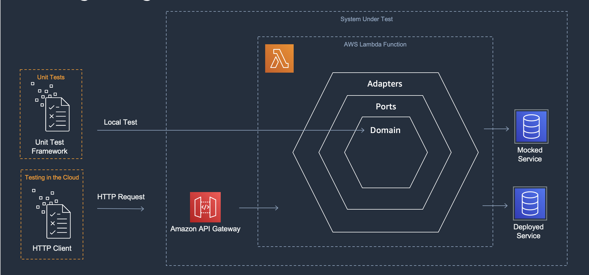

[](https://img.shields.io/badge/.NET-6.0-Green)
[](https://img.shields.io/badge/AWS-Lambda-blueviolet)
[]()
[]()
[](https://img.shields.io/badge/Test-Unit-blue)
[](https://img.shields.io/badge/Test-Integration-yellow)

# Hexagonal architecture

## Description

Hexagonal architecture is also known as the ports and adapters architecture. It is an architectural pattern used for encapsulating domain logic and decoupling it from other implementation details, such as infrastructure or client requests. 

In Lambda functions, hexagonal architecture can help you implement new business requirements and improve the agility of a workload. This approach can help create separation of concerns and separate the domain logic from the infrastructure. For development teams, it can also simplify the implementation of new features and parallelize the work across different developers.

### Terms
1. Domain logic: Represents the task that the application should perform, abstracting any interaction with the external world.
2. Ports: Provide a way for the primary actors (on the left) to interact with the application, via the domain logic. The domain logic also uses ports for interacting with secondary actors (on the right) when needed.
3. Adapters: A design pattern for transforming one interface into another interface. They wrap the logic for interacting with a primary or secondary actor.
4. Primary actors: Users of the system such as a webhook, a UI request, or a test script.
5. Secondary actors: used by the application, these services are either a Repository (for example, a database) or a Recipient (such as a message queue).

### Application description
The example application is a backend web service built using Amazon API Gateway, AWS Lambda, and Amazon DynamoDB. Business logic in the domain layer should be tested with unit tests. Responses from secondary actors via ports should be mocked during unit testing to speed up test execution. 

This pattern creates an Amazon API Gateway HTTP API, an AWS Lambda function, and a DynamoDB Table using SAM and .NET 6.

**Important: this application uses various AWS services and there are costs associated with these services after the Free Tier usage. Please see the AWS Pricing page for details. You are responsible for any AWS costs incurred.**

## Language
.NET 6

## Framework
The framework used to deploy the infrastructure is SAM

## Services used
The AWS services used in this pattern are

*API Gateway - AWS Lambda - DynamoDB*

## Topology




## Instructions

### Sign up for 3rd party service
We need a 3rd party service to retrieve real-time currencies value for this example, you can use a service like [fixer.io](https://fixer.io/), Create a free account and get the API Key used for consume the API

* In the solution folder update [serverless.template](./serverless.template) file, replace ```<INSERT API KEY>``` with the fixer.io API Key.
* In the integration test folder update [HttpClientFixtrue.cs](./tests/GetStock.IntegrationTests/Fixtures/HttpClientFixture.cs) - replace ```<INSERT API KEY>``` with the fixture.io API key.

### Deploy to AWS
The SAM template contains all the information to deploy AWS resources (an API Gateway, Lambda function and a DynamoDB table) and also the permission required by these services to communicate.
The AWS SAM CLI is used to deploy the application. When working through the `sam deploy --guided` take note of the stack name used.

```
sam build
sam deploy --guided
```

After the stack is created you can access the follow routes on the API to perform different CRUD actions:

#### GET /stock/{StockID}

Get specific stack price in multiple currencies

### Fill DynamoDB data

Create or update a product in the database, the API expects the below payload:

```json
{
    "StockId": "my-unique-id",    
    "Value": 10
}
```

## Cleanup

Run the given command to delete the resources that were created. It might take some time for the CloudFormation stack to get deleted.
```
sam delete
```

## Project Structure

The solution is split down into 3 projects:

- [GetStock](./src/GetStock/) *Contains all of the application's business/domain logic*
- [GetStock.UnitTest](./tests/GetStock.UnitTest/) *Contains unit tests that test logic without external dependencies*
- [GetStock.IntegrationTest](./tests/GetStock.IntegrationTest/) * Contains tests that require external dependencies.    

## Automated Tests
The source code for this sample includes automated unit and integration tests. [xUnit](https://xunit.net/) is the primary test framework used to write these tests. A few other libraries and frameworks are used depending on the test case pattern. Please see below.

### Unit Tests 

## [CurrencyConverterTests.cs](./tests/GetStock.UnitTest/Adapters/CurrencyConverterTests.cs)
The goal of these unit tests is to test the CurrencyConverterHttpClient adapter. 

It uses [FakeItEasy](https://fakeiteasy.github.io/) for the mocking framework. The `IHttpClient` interface is mocked.

```c#
[Fact]
public async Task GetCurrencies_returnFailure_returnEmptyList()
{
    var fakeClient = A.Fake<IHttpClient>();
    A.CallTo(() => fakeClient.GetAsync(A<string>._))
        .Returns(Task.FromResult(
    @"{
  ""base"": ""EUR"",
  ""date"": ""2023-01-24"",
  ""rates"": {    
    ""USD"": 1.2345
  },
  ""success"": false,
  ""timestamp"": 1674556804
}"
    ));

    var target = new CurrencyConverterHttpClient(fakeClient);
    var result = await target.GetCurrencies("", Array.Empty<string>());
    var expected = new Dictionary<string, double> { };

    Assert.Equal(expected, result);
}
```

## [StockLogicTests](../hexagonal-architecture/tests/GetStock.UnitTest/Domains/StockLogicTests.cs)

The goal of these unit tests is to test the application's business logic. 
It uses [FakeItEasy](https://fakeiteasy.github.io/) mocking framework with [AutoFake](https://autofac.readthedocs.io/en/latest/integration/fakeiteasy.html) as an automocking container.
Using automocking we can reduce the amount of initialization code needed to set up multiple external dependencies needed for the tests

```c#
[Fact]
public async Task RetrieveStockValuesAsync_StockNotFound_ReturnEmptyList()
{
    using var fake = new AutoFake();

    var fakeStockDb = fake.Resolve<IStockDB>();
    A.CallTo(() => fakeStockDb.GetStockValueAsync(A<string>._))
        .Throws<StockNotFoundException>();

    var target = fake.Resolve<StockLogic>();

    var result = await target.RetrieveStockValuesAsync("stock-1");

    var expected = new StockWithCurrencies("stock-1", Array.Empty<KeyValuePair<string, double>>());

    result.Should().BeEquivalentTo(expected);
}
```

## [FunctionTests.cs](./tests/GetStock.UnitTest/FunctionsTests.cs)
The goal of these unit tests is to test the lambda function entry point. 

It uses [FakeItEasy](https://fakeiteasy.github.io/) mocking framework with [AutoFake](https://autofac.readthedocs.io/en/latest/integration/fakeiteasy.html) as an automocking container.
Using automocking we can reduce the amount of initialization code needed to set up multiple external dependencies needed for the tests

A custom class following the builder pattern is used to [build the API request](./tests/GetStock.UnitTest/Builder/APIGatewayProxyRequestBuilder.cs) to be sent into the handler.

```c#
[Fact]
public void GetStockById_stockIdInPath_callFunctionHandler()
{
    using var autoFake = new AutoFake();

    autoFake.Provide<IHttpHandler, HttpHandler>();

    var target = autoFake.Resolve<Functions>();

    var testLambdaContext = new TestLambdaContext();

    var request = new ApiGatewayProxyRequestBuilder()
        .PathParamter("StockId", "stock-1")
        .Build();

    var result = target.GetStockById(request, testLambdaContext);

    var fakeLogic = autoFake.Resolve<IStockLogic>();

    Assert.Multiple(
            () => result.StatusCode.Should().Be(200),
            () => A.CallTo(() => fakeLogic.RetrieveStockValuesAsync("stock-1")).MustHaveHappened()
        );
}
```

### Integration Tests 
The goal of these tests is to test work along with external dependencies. In a hexagonal architecture these dependencies are called *adapters*. This sample has two such dependencies we need to test:
* [External http based API](./tests/GetStock.IntegrationTest/Adapters/HttpClientTests.cs)
* [DynamoDB table](./tests/GetStock.IntegrationTest/Adapters/StockDynamoDbTests.cs)

Test fixtures has been implemented to setup and teardown these dependencies and remove boilerplate code fomr the tests.
* [HttpClientFixture.cs](./tests/GetStock.IntegrationTest/Fixtures/HttpClientFixture.cs) create a client to send and receive information from 3rd party API and dispose it after test run.
* [DynamoDbTestBase.cs](./tests/GetStock.IntegrationTest/Fixtures/DynamoDbTestBase.cs) create a client to read and store data in dynamoDB, the dynamoDB integration tests can run using [DynamoDB Local](https://docs.aws.amazon.com/amazondynamodb/latest/developerguide/DynamoDBLocal.DownloadingAndRunning.html) or using a real dynamoDb table on AWS. Choosing between the two options is done by setting ```RUN_LOCAL_DB``` on [using.cs](./tests/GetStock.IntegrationTest/Usings.cs)

### 3rd party API tests
[HttpClientTests](./tests/GetStock.IntegrationTest/Adapters/HttpClientTests.cs)
The goal of this test is to demonstrate a test that runs against a 3rd party api. The test interacts with an external service directly and tests the expected responses returned by the API. Before running this test, update the api key in [HttpClientFixture](./tests/GetStock.IntegrationTest/Fixtures/HttpClientFixture.cs).

It uses the [IClassFixture](https://xunit.net/docs/shared-context) feature of [xUnit](https://xunit.net/) to perform setup and teardown logic. The setup code creates an HttpClient with the endpoint url.

### DynamoDB tests
[StockDynamoDbTests](./tests/GetStock.IntegrationTest/Adapters/StockDynamoDbTests.cs)
The goal of these tests is to demonstrate tests that runs against DynamoDB. The test interacts with DynamoDB directly either using a local emulator or the DynamoDB table hosted in AWS. 

To run this test locally you will need to install Docker on the dev machine. To run the tests using your AWS account resources will need to be deployed using the steps in the `Deployment Commands` section above.

It uses the [IClassFixture](https://xunit.net/docs/shared-context) feature of [xUnit](https://xunit.net/) to perform setup and teardown logic. The setup code creates an DynamoDB client with the endpoint url.

## Requirements

* [Create an AWS account](https://portal.aws.amazon.com/gp/aws/developer/registration/index.html) if you do not already have one and log in. The IAM user that you use must have sufficient permissions to make necessary AWS service calls and manage AWS resources.
* [AWS CLI](https://docs.aws.amazon.com/cli/latest/userguide/install-cliv2.html) installed and configured
* [Git Installed](https://git-scm.com/book/en/v2/Getting-Started-Installing-Git)
* [AWS Serverless Application Model](https://docs.aws.amazon.com/serverless-application-model/latest/developerguide/serverless-sam-cli-install.html) (AWS SAM) installed
* [.NET 6](https://dotnet.microsoft.com/en-us/download/dotnet/6.0) installed
* [Fixer.io -  3rd party service to retrieve real-time currencies value for this example](https://fixer.io/)