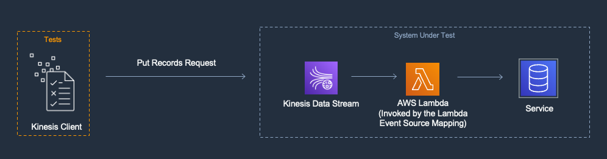

[](https://img.shields.io/badge/.NET-6.0-Green)
[]()
[]()
[]()
[]()
[]()

## Amazon Kinesis Data Streams, AWS Lambda Function & Amazon DynamoDB

### Description

This pattern creates an AWS Lambda function that consumes messages from an Amazon Kinesis Data Streams and dumps them to Amazon DynamoDB using SAM and .NET.

> **Important:** *This application uses various AWS services and there are costs associated with these services after the Free Tier usage. Please see the AWS Pricing page for details. You are responsible for any AWS costs incurred.*

## Language
.NET 8

## Framework
The framework used to deploy the infrastructure is [SAM](https://aws.amazon.com/serverless/sam)

## Services used
The AWS services used in this pattern are

*Amazon Kinesis  &rarr;  AWS Lambda &rarr; Amazon DynamoDB*

> Amazon DynamoDB is not part of SUT in this pattern

## Topology

### System Under Test (SUT)

The SUT is a streaming data processing system. A Lambda function has an Event Source Mapping to a Kinesis Data Stream. The Lambda Event Source Mapping(ESM) polls the Kinesis Data Stream and then synchronously invokes the Lambda function with a batch of messages. The Lambda function processes batches of messages and writes results to a DynamoDB Table.


### Goal

The goal of this example is to show how to test Lambda functions that are part of a streaming data processing application. In streaming workloads the number of messages that are sent to Lambda in a batch can change with the rate of messages being published to the stream, so we show testing with different sized batches.

### Description

In this pattern you will deploy a streaming workload where a Lambda function is triggered by messages in a Kinesis Data Stream. This project demonstrates several techniques for executing tests including running Lambda function locally with a simulated payload as well integration tests in the cloud.



This example contains an [Amazon Kinesis Data Stream](https://aws.amazon.com/kinesis/data-streams/), [AWS Lambda](https://aws.amazon.com/lambda/) and [Amazon DynamoDB](https://aws.amazon.com/dynamodb/) table core resources.

The Amazon Kinesis Data Stream can stream data but the AWS Lambda function in this example expects Kinesis Stream Event data to contain a JSON object with 6 properties:

```json
{
    "employee_id": "string",
    "email": "string",
    "first_name": "string",
    "last_name": "string",
    "dob": "DateTime",
    "doh": "DateTime"
}
```

- `employee_id`: unique identifier for each individual record. Each record should have a unique `id` property value
- `email`: email address of the employee
- `first_name`: first name of the employee
- `last_name`: last name of the employee
- `dob`: date of birth of the employee
- `doh`: date of hire of the employee

The AWS Lambda function converts the incoming event data into the processed record JSON, setting the `employee_id` to be the DynamoDB Partition Key.

> The SAM template contains all the information to deploy AWS resources (An Amazon Kinesis Data Stream, an AWS Lambda function and an Amazon DynamoDB) and also the permissions required by these services to communicate.

You will be able to create and delete the CloudFormation stack using the SAM CLI.

## Project Structure

The solution is split down into two projects:

- [KinesisEventHandler.Infrastructure](./src/KinesisEventHandler.Infrastructure/KinesisEventHandler.Infrastructure.csproj) _Contains code for bootstrapping the ServiceProvider and extensions._
- [KinesisEventHandler.Repositories](./src/KinesisEventHandler.Repositories/KinesisEventHandler.Repositories.csproj) _Contains code for any persistence layer, in this case DynamoDB._
- Function project(s):
  - [KinesisEventHandler](./src/KinesisEventHandler/KinesisEventHandler.csproj)

- Test project(s):
  - [KinesisEventHandler.UnitTests](./tests/KinesisEventHandler.UnitTests/KinesisEventHandler.UnitTests.csproj)
  - [KinesisEventHandler.IntegrationTests](./tests/KinesisEventHandler.IntegrationTests/KinesisEventHandler.IntegrationTests.csproj)

## Deployment commands

The AWS SAM CLI is used to deploy the application. When working through the `sam deploy --guided` take note of the stack name used.

```
sam build
sam deploy --guided
```

## Testing

To test the application, you need to write a record to the Kinesis Data Stream. This can be done in following ways:

- [AWS SDK for .Net](https://docs.aws.amazon.com/sdkfornet/v3/apidocs/items/Kinesis/MKinesisPutRecordPutRecordRequest.html)

- Put Record API: refer [Amazon Kinesis Streams API Reference](https://docs.aws.amazon.com/kinesis/latest/APIReference/API_PutRecord.html)

  Sample Request:
  ```http request
  POST / HTTP/1.1
    Host: kinesis.<region>.<domain>
    Content-Length: <PayloadSizeBytes>
    User-Agent: <UserAgentString>
    Content-Type: application/x-amz-json-1.1
    Authorization: <AuthParams>
    Connection: Keep-Alive
    X-Amz-Date: <Date>
    X-Amz-Target: Kinesis_20131202.PutRecord
    {
      "StreamName": "exampleStreamName",
      "Data": "XzxkYXRhPl8x",
      "PartitionKey": "partitionKey"
    }
  ```

## Automated Tests
The source code for this sample includes automated unit and integration tests. [xUnit](https://xunit.net/) is the primary test framework used to write these tests. A few other libraries and frameworks are used depending on the test case pattern. Please see below.

### Unit Tests

#### [ProcessEmployeeFunctionTests.cs](./tests/KinesisEventHandler.UnitTests/Functions/ProcessEmployeeFunctionTests.cs)
The goal of these tests is to run a unit test on the `ProcessKinesisRecord` method which is called by the handler method of the Lambda function.
The system under test here is completely abstracted from any cloud resources.

```c#
[Fact]
public async Task ProcessEmployeeFunction_With_ValidEmployeeRecord_Should_ProcessKinesisRecordSuccessfully()
{
    //Arrange
    var fakeRepository = A.Fake<IDynamoDbRepository<EmployeeDto>>();

    A.CallTo(() => fakeRepository.PutItemAsync(A<EmployeeDto>._, A<CancellationToken>._))
        .Returns(Task.FromResult(UpsertResult.Inserted));

    var sut = new ProcessEmployeeFunction(fakeRepository);
    var employee = new EmployeeBuilder().Build();
    var context = new TestLambdaContext();

    //Act
    var taskResult = await sut.ProcessKinesisRecord(employee, context);

    //Assert
    Assert.True(taskResult.IsCompleted);
}
```

#### [KinesisEventHandlerTests.cs](./tests/KinesisEventHandler.UnitTests/Handlers/KinesisEventHandlerTests.cs)
The goal of these tests is to run a unit test on the KinesisEventHandler which implements the handler method of the Lambda function.
It uses [FakeItEasy](https://github.com/FakeItEasy/FakeItEasy) for the mocking framework. The `PutItemAsync` method in `IDynamoDbRepository` is faked.

```c#
[Fact]
public async Task KinesisEventHandler_With_N_Records_Should_CallProcessKinesisRecord_N_Times()
{
    //Arrange
    var randomNumber = (new Random()).Next(2, 20);
    var employees = new List<Employee>();

    for (var i = 0; i < randomNumber; i++)
    {
        employees.Add(new EmployeeBuilder().Build());
    }

    var kinesisEvent = new KinesisEventBuilder().WithEmployees(employees);
    var lambdaContext = new TestLambdaContext();

    //Act
    var result = await _mockKinesisEventTrigger.Object.Handler(kinesisEvent, lambdaContext);

    //Assert
    result.BatchItemFailures.Should().BeEmpty();

    A.CallTo(() => _mockKinesisEventTrigger.ProcessKinesisRecord(
                A<Employee>._,
                A<ILambdaContext>._))
        .MustHaveHappened
        Times.Exactly(randomNumber, Times.Exactly);
}
```

To execute the tests:

**Powershell**
```shell
dotnet test tests\KinesisEventHandler.UnitTests\KinesisEventHandler.UnitTests.csproj
```
**Bash**
```shell
dotnet test tests/KinesisEventHandler.UnitTests/KinesisEventHandler.UnitTests.csproj
```

### Integration Tests 

#### [ProcessEmployeeTests.cs](./tests/KinesisEventHandler.IntegrationTests/ProcessEmployeeTests.cs)

The goal of this test is to demonstrate a test that runs the Lambda function's code against deployed resources.
The tests interact with the Kinesis Data Stream directly using [AmazonKinesisClient](https://docs.aws.amazon.com/sdkfornet1/latest/apidocs/html/T_Amazon_Kinesis_AmazonKinesisClient.htm) 
and tests the expected responses returned.

```c#
[Fact]
public async Task WriteToEmployeeRecordsStream_Should_Return_HTTP_OK()
{
    //Arrange
    var employee = new EmployeeBuilder().Build();

    //Act
    var response = await _processEmployeeFixture.StreamRecordAsync(employee);

    //Assert
    response.Should().NotBeNull();
    response.HttpStatusCode.Should().Be(HttpStatusCode.OK);

    //Dispose
    _processEmployeeFixture.CreatedEmployeeIds.Add(employee.EmployeeId);
}

[Fact]
public async Task WriteToEmployeeRecordsStream_Should_Upsert_To_EmployeeStreamTable()
{
    //Arrange
    var employee = new EmployeeBuilder().Build();

    //Act
    using var cts = new CancellationTokenSource();
    await _processEmployeeFixture.StreamRecordAsync(employee);
    var response = await _processEmployeeFixture.PollForProcessedMessage(employee, cts.Token);

    //Assert
    response.Should().NotBeNull().And.BeEquivalentTo(employee);

    //Dispose
    _processEmployeeFixture.CreatedEmployeeIds.Add(employee.EmployeeId);
}
```

> Before running these tests, resources will need to be deployed using the steps in the `Deployment Commands` section above. Tests are there for both happy and sad paths.

To execute the tests:

**Powershell**
```shell
$env:AWS_SAM_STACK_NAME = <STACK_NAME_USED_IN_SAM_DEPLOY>
$env:AWS_SAM_REGION_NAME = <REGION_NAME_USED_IN_SAM_DEPLOY>
dotnet test ./tests/KinesisEventHandler.IntegrationTests/KinesisEventHandler.IntegrationTests.csproj
```

**Bash**
```shell
AWS_SAM_STACK_NAME=<STACK_NAME_USED_IN_SAM_DEPLOY>
AWS_SAM_REGION_NAME=<REGION_NAME_USED_IN_SAM_DEPLOY>
dotnet test ./tests/KinesisEventHandler.IntegrationTests/KinesisEventHandler.IntegrationTests.csproj 
```

## Cleanup

Run the given command to delete the resources that were created. It might take some time for the CloudFormation stack to get deleted.
```
sam delete
```

## Requirements

* [Create an AWS account](https://portal.aws.amazon.com/gp/aws/developer/registration/index.html) if you do not already have one and log in. The IAM user that you use must have sufficient permissions to make necessary AWS service calls and manage AWS resources.
* [AWS CLI](https://docs.aws.amazon.com/cli/latest/userguide/install-cliv2.html) installed and configured
* [Git Installed](https://git-scm.com/book/en/v2/Getting-Started-Installing-Git)
* [AWS Serverless Application Model](https://docs.aws.amazon.com/serverless-application-model/latest/developerguide/serverless-sam-cli-install.html) (AWS SAM) installed
* [.NET 8](https://dotnet.microsoft.com/en-us/download/dotnet) installed