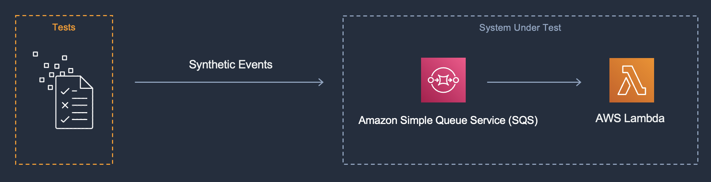
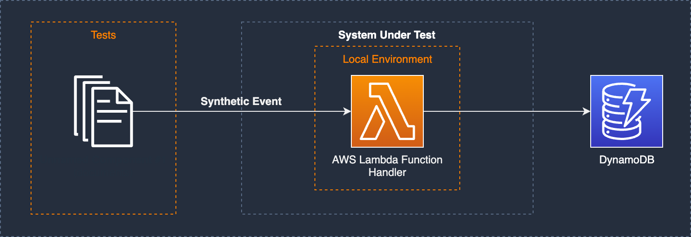
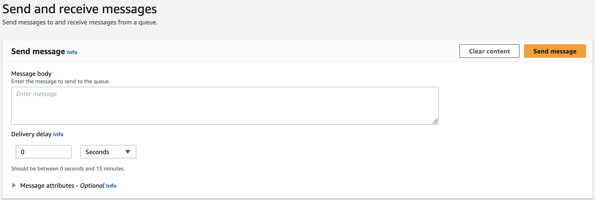

[](https://learn.microsoft.com/en-us/dotnet/core/introduction)
[]()
[]()
[]()
[]()
[]()

## Amazon Simple Queue Service (SQS), AWS Lambda Function & Amazon DynamoDB

### Description

This pattern creates an AWS Lambda function that consumes messages from an Amazon Simple Queue Service (Amazon SQS) queue using SAM and .NET 6.

> **Important:** *This application uses various AWS services and there are costs associated with these services after the Free Tier usage. Please see the AWS Pricing page for details. You are responsible for any AWS costs incurred.*

## Language
.NET 6

## Framework
The framework used to deploy the infrastructure is [SAM](https://aws.amazon.com/serverless/sam)

## Services used
The AWS services used in this pattern are

*Amazon SQS  &rarr;  AWS Lambda &rarr; Amazon DynamoDB*

> Amazon DynamoDB is not part of SUT in this pattern

## Topology

### System Under Test (SUT)

The SUT in this pattern is a Lambda function invoked by the presence of messages in an SQS queue as the event source.



### Goal

This pattern is intended to perform rapid functional testing without affecting cloud resources.  Testing is conducted in a self-contained local environment.  The test goal is to validate that the Lambda function exhibits proper message handling with both singleton messages and batch messages.

### Description

In this pattern the Lambda function processes SQS messages without interacting directly with the SQS queue itself, instead relying on the [default visibility and deletion behaviors](https://docs.aws.amazon.com/lambda/latest/dg/with-sqs.html) of the SQS event. This project demonstrates several techniques for executing tests including running Lambda function locally with a simulated payload as well integration tests in the cloud.



This example contains an [Amazon SQS](https://aws.amazon.com/sqs/), [AWS Lambda](https://aws.amazon.com/lambda/) and [Amazon DynamoDB](https://aws.amazon.com/dynamodb/) table core resources.

The AWS Lambda function in this example expects SQS Queue Event data to contain a JSON object with 6 properties:

```json
{
    "employee_id": "string",
    "email": "string",
    "first_name": "string",
    "last_name": "string",
    "dob": "DateTime",
    "doh": "DateTime"
}
```

- `employee_id`: unique identifier for each individual record. Each record should have a unique `id` property value
- `email`: email address of the employee
- `first_name`: first name of the employee
- `last_name`: last name of the employee
- `dob`: date of birth of the employee
- `doh`: date of hire of the employee

The AWS Lambda function converts the incoming event data into the processed record JSON, setting the `employee_id` to be the DynamoDB Partition Key.

> The SAM template contains all the information to deploy AWS resources (An Amazon SQS queue and an AWS Lambda function) and also the permissions required by these services to communicate.

You will be able to create and delete the CloudFormation stack using the SAM CLI.

## Project Structure

The solution is split down into two projects:

- [SqsEventHandler.Infrastructure](./src/SqsEventHandler.Infrastructure/SqsEventHandler.Infrastructure.csproj) _Contains code for bootstrapping the ServiceProvider and extensions._
- [SqsEventHandler.Repositories](./src/SqsEventHandler.Repositories/SqsEventHandler.Repositories.csproj) _Contains code for any persistence layer, in this case DynamoDB._
- Function project(s):
  - [SqsEventHandler](./src/SqsEventHandler/SqsEventHandler.csproj)

- Test project(s):
  - [SqsEventHandler.UnitTests](./tests/SqsEventHandler.UnitTests/SqsEventHandler.UnitTests.csproj)
  - [SqsEventHandler.IntegrationTests](./tests/SqsEventHandler.IntegrationTests/SqsEventHandler.IntegrationTests.csproj)

## Deployment commands

The AWS SAM CLI is used to deploy the application. When working through the `sam deploy --guided` take note of the stack name used.

```
sam build
sam deploy --guided
```

## Testing

To test the application, you need to publish a message to the SQS Queue. This can be done in following ways:

- AWS Console
  
  

- Send Message API: refer [SQS API Reference](https://docs.aws.amazon.com/AWSSimpleQueueService/latest/APIReference/API_SendMessage.html)
  
  Sample Request:
  ```
  https://sqs.us-east-2.amazonaws.com/123456789012/MyQueue/
    ?Action=SendMessage
    &MessageBody=This+is+a+test+message
    &DelaySeconds=45
    &Expires=2020-12-18T22%3A52%3A43PST
    &Version=2012-11-05
    &AUTHPARAMS
  ```

## Automated Tests
The source code for this sample includes automated unit and integration tests. [xUnit](https://xunit.net/) is the primary test framework used to write these tests. A few other libraries and frameworks are used depending on the test case pattern. Please see below.

### Unit Tests

#### [ProcessEmployeeFunctionTests.cs](./tests/SqsEventHandler.UnitTests/Functions/ProcessEmployeeFunctionTests.cs)
The goal of these tests is to run a unit test on the ProcessSqsMessage method which is called by the handler method of the Lambda function.
The system under test here is completely abstracted from any cloud resources.

```c#
[Fact]
public Task ProcessEmployeeFunction_Should_ExecuteSuccessfully()
{
    //Arrange
    var repository = new Mock<IDynamoDbRepository<EmployeeDto>>();

    repository.Setup(x =>
            x.PutItemAsync(It.IsAny<EmployeeDto>(), It.IsAny<CancellationToken>()))
        .ReturnsAsync(UpsertResult.Inserted);

    var sut = new ProcessEmployeeFunction(repository.Object);
    var employee = new EmployeeBuilder().Build();
    var context = new TestLambdaContext();

    //Act
    var taskResult = sut.ProcessSqsMessage(employee, context);

    //Assert
    Assert.True(taskResult.IsCompleted);
    return Task.CompletedTask;
}
```

#### [SqsEventHandlerTests.cs](./tests/SqsEventHandler.UnitTests/Handlers/SqsEventHandlerTests.cs)
The goal of these tests is to run a unit test on the SqsEventTrigger which implements the handler method of the Lambda function.
It uses [Moq](https://github.com/moq/moq4) for the mocking framework. The `ProcessSqsMessage` method is mocked.

```c#
[Fact]
public async Task SqsEventHandler_Should_CallProcessSqsMessageOnce()
{
    //Arrange
    var expected = new EmployeeBuilder().Build();
    var sqsEvent = new SqsEventBuilder().WithEmployees(new[] { expected });
    var lambdaContext = new TestLambdaContext();

    //Act
    var result = await _mockSqsEventTrigger.Object.Handler(sqsEvent, lambdaContext);

    //Assert
    result.BatchItemFailures.Should().BeEmpty();
    _mockSqsEventTrigger.Verify(x =>
            x.ProcessSqsMessage(
                It.Is<Employee>(employee => employee.Equals(expected)),
                It.IsAny<ILambdaContext>()),
        Times.Once);
}
```

To execute the tests:

**Powershell**
```shell
dotnet test tests\SQSEventHandler.UnitTests\SQSEventHandler.UnitTests.csproj
```
**Bash**
```shell
dotnet test tests/SQSEventHandler.UnitTests/SQSEventHandler.UnitTests.csproj
```

### Integration Tests 

#### [ProcessEmployeeTests.cs](./tests/SqsEventHandler.IntegrationTests/ProcessEmployeeTests.cs)

The goal of this test is to demonstrate a test that runs the Lambda function's code against deployed resources.
The tests interact with the SQS Queue directly using [AmazonSQSClient](https://docs.aws.amazon.com/sdkfornet1/latest/apidocs/html/T_Amazon_SQS_AmazonSQSClient.htm) 
and tests the expected responses returned.

```c#
[Fact, TestPriority(1)]
public async Task PublishToProcessEmployeeQueue_Should_ReturnSuccess()
{
    //Arrange
    var sqsMessage = new EmployeeBuilder().WithEmployeeId(EmployeeId);

    //Act
    var response = await _processEmployeeFixture.SendMessageAsync(
        _processEmployeeFixture.SqsEventQueueUrl,
        JsonSerializer.Serialize(sqsMessage)
    );

    //Assert
    response.Should().NotBeNull();
    response.HttpStatusCode.Should().Be(HttpStatusCode.OK);
}

[RetryFact(3, 5000), TestPriority(2)]
public async Task PublishToProcessEmployeeQueue_Should_UpsertEmployee()
{
    //Act
    using var cts = new CancellationTokenSource();
    var response = await _processEmployeeFixture.TestEmployeeRepository!.GetItemAsync(EmployeeId, cts.Token);

    //Assert
    response.Should().NotBeNull();
    response!.EmployeeId.Should().Be(EmployeeId);
    _testOutputHelper.WriteLine(response.ToString());

    //Dispose
    _processEmployeeFixture.CreatedEmployeeIds.Add(EmployeeId);
}
```

> Before running these tests, resources will need to be deployed using the steps in the `Deployment Commands` section above. Tests are there for both happy and sad paths.

To execute the tests:

**Powershell**
```shell
$env:AWS_SAM_STACK_NAME = <STACK_NAME_USED_IN_SAM_DEPLOY>
$env:AWS_SAM_REGION_NAME = <REGION_NAME_USED_IN_SAM_DEPLOY>
dotnet test ./tests/SqsEventHandler.IntegrationTests/SqsEventHandler.IntegrationTests.csproj
```

**Bash**
```shell
AWS_SAM_STACK_NAME=<STACK_NAME_USED_IN_SAM_DEPLOY>
AWS_SAM_REGION_NAME=<REGION_NAME_USED_IN_SAM_DEPLOY>
dotnet test ./tests/SqsEventHandler.IntegrationTests/SqsEventHandler.IntegrationTests.csproj 
```

## Cleanup

Run the given command to delete the resources that were created. It might take some time for the CloudFormation stack to get deleted.
```
sam delete
```

## Requirements

* [Create an AWS account](https://portal.aws.amazon.com/gp/aws/developer/registration/index.html) if you do not already have one and log in. The IAM user that you use must have sufficient permissions to make necessary AWS service calls and manage AWS resources.
* [AWS CLI](https://docs.aws.amazon.com/cli/latest/userguide/install-cliv2.html) installed and configured
* [Git Installed](https://git-scm.com/book/en/v2/Getting-Started-Installing-Git)
* [AWS Serverless Application Model](https://docs.aws.amazon.com/serverless-application-model/latest/developerguide/serverless-sam-cli-install.html) (AWS SAM) installed
* [.NET 6](https://dotnet.microsoft.com/en-us/download/dotnet/6.0) installed