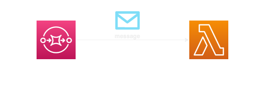

## Amazon Simple Queue Service (SQS) & AWS Lambda Function

### Description

This pattern creates an AWS Lambda function that consumes messages from an Amazon Simple Queue Service (Amazon SQS) queue using SAM and .NET 6.

> **Important:** *This application uses various AWS services and there are costs associated with these services after the Free Tier usage. Please see the AWS Pricing page for details. You are responsible for any AWS costs incurred.*

## Language
.NET 6

## Framework
The framework used to deploy the infrastructure is [SAM](https://aws.amazon.com/serverless/sam)

## Services used
The AWS services used in this pattern are

*Amazon SQS  &rarr;  AWS Lambda*

## Topology



## Description
The SAM template contains all the information to deploy AWS resources (An Amazon SQS queue and an AWS Lambda function) and also the permissions required by these services to communicate.

You will be able to create and delete the CloudFormation stack using the SAM CLI.

## Project Structure

The serverless application was created with an AWS SAM Template.

```
sam init -r dotnet6
```

The solution is split down into two projects:

- Function project(s):
  - [SQSEventHandler](./src/SQSEventHandler/)

- Test project(s):
  - [SQSEventHandler.UnitTests](./src/SQSEventHandler.UnitTests/)
  - [SQSEventHandler.IntegrationTests](./src/SQSEventHandler.IntegrationTests/)

## Deployment commands

The AWS SAM CLI is used to deploy the application. When working through the `sam deploy --guided` take note of the stack name used.

```
sam init
sam build
sam deploy --guided
```

## Testing

To test the application, you need to publish a message to the SQS Queue. This can be done in following ways:

- AWS Console
  
  

- Send Message API: refer [SQS API Reference](https://docs.aws.amazon.com/AWSSimpleQueueService/latest/APIReference/API_SendMessage.html)
  
  Sample Request:
  ```
  https://sqs.us-east-2.amazonaws.com/123456789012/MyQueue/
    ?Action=SendMessage
    &MessageBody=This+is+a+test+message
    &DelaySeconds=45
    &Expires=2020-12-18T22%3A52%3A43PST
    &Version=2012-11-05
    &AUTHPARAMS
  ```
- SAM Local Invoke: A sample SQSEvent is added here [sqs-event.json](../src/SqsEventHandler/sqs-event.json)
  ```
  cd src
  sam local invoke -e ./SQSEventHandler/sqs-event.json
  ```

## Automated Tests
The source code for this sample includes automated unit and integration tests. [xUnit](https://xunit.net/) is the primary test framework used to write these tests. A few other libraries and frameworks are used depending on the test case pattern. Please see below.

### Unit Tests [ProcessEmployeeFunctionTests.cs]()
The goal of these tests is to run a unit test on the handler method of the Lambda functions. It uses [Moq](https://github.com/moq/moq4) for the mocking framework. The `ProductsDAO` interface is mocked.

```c#
[Fact]
//TBD
```

To execute the tests:

**Powershell**
```powershell
dotnet test tests\SQSEventHandler.UnitTests\SQSEventHandler.UnitTests.csproj
```
**Bash**
```powershell
dotnet test tests/SQSEventHandler.UnitTests/SQSEventHandler.UnitTests.csproj
```

### Integration Tests ([IntegrationTest.cs](./tests/SQSEventHandler.IntegrationTest/IntegrationTest.cs))
The goal of this test is to demonstrate a test that runs the Lambda function's code against deployed resources. The tests interact with the API endpoints directly and tests the expected responses returned by the API. Before running these tests, resources will need to be deployed using the steps in the `Deployment Commands` section above. Tests are there for both happy and sad paths.

To execute the tests:

**Powershell**
```powershell
$env:AWS_SAM_STACK_NAME = <STACK_NAME_USED_IN_SAM_DEPLOY>
$env:AWS_SAM_REGION_NAME = <REGION_NAME_USED_IN_SAM_DEPLOY>
dotnet test .\tests\ApiTests.IntegrationTest\ApiTests.IntegrationTest.csproj
```

**Bash**
```bash
AWS_SAM_STACK_NAME=<STACK_NAME_USED_IN_SAM_DEPLOY>
AWS_SAM_REGION_NAME=<REGION_NAME_USED_IN_SAM_DEPLOY>
dotnet test ./tests/ApiTests.IntegrationTest/ApiTests.IntegrationTest.csproj
```

## Cleanup

Run the given command to delete the resources that were created. It might take some time for the CloudFormation stack to get deleted.
```
sam delete
```

## Requirements

* [Create an AWS account](https://portal.aws.amazon.com/gp/aws/developer/registration/index.html) if you do not already have one and log in. The IAM user that you use must have sufficient permissions to make necessary AWS service calls and manage AWS resources.
* [AWS CLI](https://docs.aws.amazon.com/cli/latest/userguide/install-cliv2.html) installed and configured
* [Git Installed](https://git-scm.com/book/en/v2/Getting-Started-Installing-Git)
* [AWS Serverless Application Model](https://docs.aws.amazon.com/serverless-application-model/latest/developerguide/serverless-sam-cli-install.html) (AWS SAM) installed
* [.NET 6](https://dotnet.microsoft.com/en-us/download/dotnet/6.0) installed