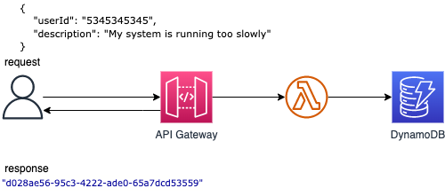

## Microservice: API Gateway, Lambda Function and Dynamodb Table

### Description

This pattern creates an Amazon API Gateway HTTP API, a AWS Lambda function and a DynamoDB Table using SAM and Java 11.

Important: this application uses various AWS services and there are costs associated with these services after the Free Tier usage - please see the AWS [Pricing page](https://aws.amazon.com/pricing/) for details. You are responsible for any AWS costs incurred.

## Language
This is a Maven project which uses Java 11 and AWS SDK

## Framework
The framework used to deploy the infrastructure is [SAM](https://aws.amazon.com/serverless/sam/)

## Services used
The AWS services used in this pattern are

#### API Gateway - AWS Lambda - DynamoDB

Topology




## Description
The SAM template contains all the information to deploy AWS resources(an API Gateway, a Lambda function and a DynamoDB table) and also the permission required by these service to communicate.

You will be able to create and delete the CloudFormation stack using the CLI commands.

After the stack is created you can send an JSON object using curl or Postman to the URL provided by the API Gateway,
the request will be intercepted by the Lambda function which will persist the object into a DynamoDB table.

The lambda function will return the ID of the inserted object.

## Requirements

* Java 11
* [Maven](https://maven.apache.org/)
* [Create an AWS account](https://portal.aws.amazon.com/gp/aws/developer/registration/index.html) if you do not already have one and log in. The IAM user that you use must have sufficient permissions to make necessary AWS service calls and manage AWS resources.
* [AWS CLI](https://docs.aws.amazon.com/cli/latest/userguide/install-cliv2.html) installed and configured
* [Git Installed](https://git-scm.com/book/en/v2/Getting-Started-Installing-Git)
* [AWS Serverless Application Model](https://docs.aws.amazon.com/serverless-application-model/latest/developerguide/serverless-sam-cli-install.html) (AWS SAM) installed

## Deployment commands

````
# BUILD the project
sam build

# DEPLOY the stack to AWS
sam deploy --guided

# DELETE the stack
sam delete --stack-name <STACK_NAME>
````

## Manual Testing

To test the endpoint first send data using the following command. Be sure to update the endpoint with endpoint of your stack.

```
curl -X POST https://<API_GATEWAY_URL>/dev/ticket -H "Content-Type: application/json" -d '{"userId": "231deb432f3dd","description": "My monitor is broken."}' 
```

## Automated Tests
The source code for this sample includes automated tests.
### Running Automated Tests
These tests are run while packaging the lambda function using `mvn clean package` or can be run standalone using `mvn test`.
### Automated Test Framework
[Junit 5](https://junit.org/junit5/) is the primary test framework used to write these tests. A few other libraries and frameworks are used depending on the test case pattern. Please see below. 
### Types of Automated Tests
The sample includes the following tests:

#### Unit Test ([TicketFunctionMockTest.java](TicketsFunction/src/test/java/com/example/TicketFunctionMockTest.java))
The goal of this test is to validate the handler method of the Lambda function independently of external dependencies (DynamoDB). It uses [Mockito](https://site.mockito.org/) as a mocking framework. All the calls to the Amazon DynamoDB service are mocked using Mockito. 
It also uses [aws-lambda-java-test](https://github.com/aws/aws-lambda-java-libs/tree/master/aws-lambda-java-tests) library. This library helps 
to easily inject `APIGatewayProxyRequestEvent` into the Lambda function's handler method. To know more about how to leverage `aws-lambda-java-test` you can refer to [this](https://aws.amazon.com/blogs/opensource/testing-aws-lambda-functions-written-in-java/) blog.

#### Local Test using containers ([TicketFunctionContainerTest.java](TicketsFunction/src/test/java/com/example/TicketFunctionContainerTest.java))
This test is an extension of the previous one, except that we don't rely on a Java mocking framework but on a mock of the cloud environment. We use [localstack](https://github.com/localstack/localstack) to simulate AWS services locally.  This test uses containers and requires [Docker](https://docs.docker.com/get-docker/) installed locally.

#### Integration Test ([TicketFunctionIntegrationTest.java](TicketsFunction/src/test/java/com/example/TicketFunctionIntegrationTest.java))
The goal of this test is to validate the Lambda function code without mocking any calls to the Amazon DynamoDB service. It assumes that the DynamoDB table is provisioned in your AWS account (using `sam deploy`) and you have the [appropriate  credentials](https://docs.aws.amazon.com/sdk-for-java/latest/developer-guide/credentials.html) locally to access this account (for example in ~/.aws/credentials).

#### End-to-End Test ([TicketEnd2EndTest.java](TicketsFunction/src/test/java/com/example/TicketEnd2EndTest.java))
The goal of this test is to validate the whole application end-to-end on AWS, to ensure API Gateway / Lambda / DynamoDB are correctly configured (ARNs, permissions) and communicate properly together. This test assumes the application stack provided in the sample is deployed to AWS. The stack name is referred in the test class as a String constant.

```
private static final String STACK_NAME = "APIGW-Lambda-DDB-Sample";
```
Please make sure to replace the above with your stack name. This test submits an HTTP request to the API Gateway endpoint and verifies that the results are reflected in the DynamoDB database table.


#### Load Test (using [Artillery](https://www.artillery.io/))
Load tests should be executed in the cloud prior to any initial deployment to production environments. Load tests can be useful to discover performance bottlenecks and quota limits.  Load tests should simulate your application's expected peak load + 10% or more.

There are several tools available for serverless developers to perform load testing. One of the most popular is `Artillery Community Edition`, which is an open-source tool for testing serverless APIs. You configure the number of requests per second and overall test duration, and it uses a headless Chromium browser to run its test flows.

This project uses an open source performance testing tool called `Serverless Artillery`. 

The load test in this repo assumes the application stack provided in this sample is deployed using [sam build and deploy](#deployment-commands) on AWS as we need the endpoint details form the deployed api to run our load test against.

Steps:
1. #### Install Artillery library
``` npm install artillery@latest ```
2. #### Install Faker library (_Optional. Only required to run sample load tests in this repo. Not a requirement to use Artillery library_)
``` npm install faker ```
3. #### Review ```load-test-static-data.yml```, which is the config file to show how to use pre-defined test data from a csv file to run your tests against, whereas ```load-test-dynamic-data.yml``` shows how you can have your own custom logic to generate random test data everytime.
4. #### Run the load test using bash script ````./run-load-tests-static-data.sh```` OR ```./run-load-tests-dynamic-data.sh``` respectively, which gets the deployed api endpoint details from the cloudformation stack and passes it over to the artillery run command. Make sure the STACK_NAME in the bash script matches with the one deployed using ```sam deploy``` command earlier. You can also find the stack name from ```samconfig.toml``` file.
5. #### Generating an HTML report
   6.1 First, run a test and create a JSON report with the --output flag ```artillery run --output test-run-report.json load-test-dynamic-data.yaml``` <br><br>
   6.2 You can then use the generated JSON report to create an HTML report: ```artillery report test-run-report.json```. This will create a test-run-report.json.html file in the current directory which you can open in a browser.

For more information, please refer to the artillery [documentation](https://www.artillery.io/docs/)

## Cleanup

Run the given command to delete the resources that were created. It might take some time for the CloudFormation stack to get deleted.
```
sam delete --stack-name <STACK_NAME>
```