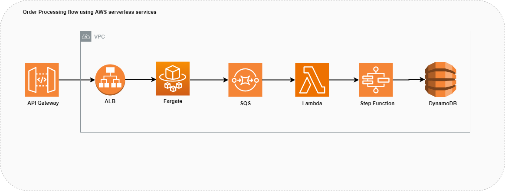

## Async-sqs-lambda-stepfunction-dynamodb
A Simple DynamoDB & SQS integration with Spring Boot application and deployed on Fargate.

### Description:
The sample Spring boot application written in Java which performs Order Processing operations. AWS serverless services like Amazon API Gateway, ALB, Fargate, DynamoDB, Step Function & SQS being used to host and test the application flow.

### Application
This project contains a Java17 maven application with Springboot 3.2.2 and AWS Java SDK 2.17.56 dependencies.

### Pre-requisites
1) SQS Queue with invoke lambda permission
2) SQS trigger set for Lambda function
3) Step function with Dynamodb access
4) DynamoDB tables
5) Table Attributes
   1) order_details ref: src/test/resources/order_details.json
   2) product_details ref: src/test/resources/product_details.json

### Steps:
1) API endpoints are set in API Gateway
2) Containerized application is deployed on ECS cluster as AWS Fargate
3) * Scenario-1:
    1) Create order invocation message placed into SQS
    2) SQS message received from lambda which triggers the step function to create order
    3) Product quantity availability check happens in step function and based on this order creation will be stored into DynamoDB.
   * Scenario-2:
    1) Order Status API request sent to application.
    2) Application backend code connects to DynamoDB and displays status of order.

### Steps for deploying the docker images on ECS with Fargate
1) Create a Docker Image ensuring that you have a 'Dockerfile' in your application code.
2) Push Docker Image to Amazon ECR
3) Create ECS Task Definition through the AWS Management Console or use the AWS CLI. 
   
4) Create ECS Cluster and configure ECS Service specifying the task definition and other configurations.
   
5) Set the launch type to Fargate, which means ECS manages the underlying infrastructure.
6) Deploy ECS Service through the AWS Management Console or using the AWS CLI.

### How to run?
1) Update application.properties with your AWS SQS queue name. If not already created, code will auto create it.
2) Run these commands in the terminal 
   1) mvn clean install
   2) mvn spring-boot:run

### APIs
1) POST: Place Order
   curl --location 'http://<HOST>/orders/place' \
   --header 'Content-Type: application/json' \
   --data '{
   "productId":"P102",
   "company":"Apple",
   "model": "iPhone XR",
   "customerId": "C199",
   "quantity": 1,
   "productName": "iPhone",
   "deliveryAddressCode": "234234"
   }'
2) GET: Get status by UUID
   curl --location 'http://<HOST>/orders/getStatus/2a8060ee-72ba-4ad2-8829-12f9658b9c2d'
