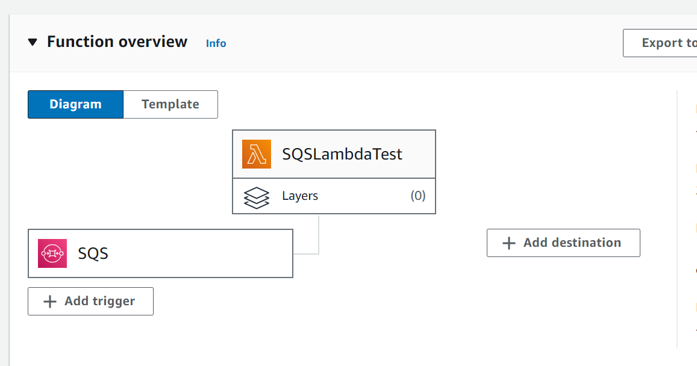

## Description 

SQS->Lambda->Step Functions->DynamoDB

Incoming message is received in SQS queue which internally triggers the lambda for processing. Step function is integrated in lambda and is executed. Based on the request step function flow executed and data will be stored into DynamoDB tables.

### Java Version
Java-21

### Pre-requisites
1. SQS Queue with invoke lambda permission
2. SQS trigger set for Lambda function
3. Step function with Dynamodb access
4. DynamoDB tables

### Deploying Lambda & Step Function:
1.Lambda :  
  - Application code is deployed as Zip file or executable in the Lambda function code with updated runtime and Handler (Ex: Runtime: Java 21, Handler: com.amazon.aws.sample.lambda.SqsLambdaStepFunctionHandler::handleRequest)

2.Step Function : 
  - Place the step function yaml code under step function code section.

### Application Flow Steps:
1. SQS queue is to receive messages from the application hosted on AWS Fargate.
2. Message placed in SQS triggers the Lambda function
3. Lambda will invoke the pre-defined Step function(refer config.properties)
4. Step function will check for product availability in DynamoDB prodcut_details table, In case product quantity available order status will be set as order placed, Otherwise order rejected will be executed.