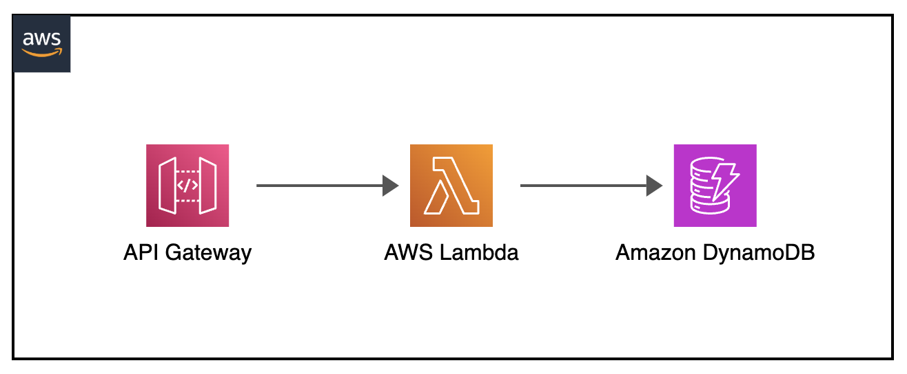

[](https://img.shields.io/badge/Python-3.9-green)
[](https://img.shields.io/badge/AWS-DynamoDB-blueviolet)
[](https://img.shields.io/badge/AWS-Lambda-orange)
[](https://img.shields.io/badge/AWS-API%20Gateway-blue)
[](https://img.shields.io/badge/Test-Local-red)

# Local: Amazon Api Gateway, AWS Lambda, Amazon DynamoDB CRUD Operations

## Introduction
This project demonstrates how to perform local testing of AWS serverless applications using SAM CLI and Docker. It implements a complete CRUD operation cycle through API Gateway, with Lambda functions processing the requests and DynamoDB storing the data.

---

## Contents
- [Local: Amazon Api Gateway, AWS Lambda, Amazon DynamoDB CRUD Operations](#local-amazon-api-gateway-aws-lambda-amazon-dynamodb-crud-operations)
  - [Introduction](#introduction)
  - [Contents](#contents)
  - [Project Structure](#project-structure)
  - [Architecture Overview](#architecture-overview)
  - [Local Setup Requirements](#local-setup-requirements)
  - [Running the Tests](#running-the-tests)
  - [API Endpoints](#api-endpoints)
  - [Test Sequence](#test-sequence)
  - [Additional Resources](#additional-resources)

---

## Project Structure
```
├── apigateway-crud-lambda-dynamodb     _# folder containing necessary code and template for CRUD operations with API Gateway, Lambda Functions and DynamoDB_
│   ├── events                          _# folder containing json files for API Gateway CRUD input events_
│   ├── img/apigateway-crud-lambda-dynamodb.png _# Architecture diagram_
│   ├── lambda_crud_src                 _# folder containing code for different CRUD Lambda functions_
│   ├── README.md                       _# instructions file_
│   └── template.yaml                   _# sam yaml template file for necessary components test_

```

[Top](#contents)

---

## Architecture Overview

<p align="center">
  
</p>

The application consists of:
- API Gateway (emulated locally by SAM)
- Lambda functions (Python 3.9) (emulated locally by SAM)
- DynamoDB table (running locally via Docker)

[Top](#contents)

---

## Local Setup Requirements
- Docker (SAM emulation)
- AWS SAM CLI
- Python 3.9
- curl (for testing)

[Top](#contents)

---

## Running the Tests

1. Start DynamoDB locally:
```sh
docker run --rm -d --network host -p 8000:8000 amazon/dynamodb-local
```

2. Start the API Gateway emulator:
```sh
sam local start-api --docker-network host &
```

3. Initialize the DynamoDB table (though Api Gateway -> Lambda crud init function):
```sh
curl -X GET http://127.0.0.1:3000/init
```

[Top](#contents)

---

## API Endpoints

| Endpoint | Method | Description |
|----------|--------|-------------|
| /init | GET | Creates DynamoDB CRUDLocalTable table |
| /create | POST | Creates new item |
| /read | GET | Retrieves an item |
| /update | POST | Updates existing item |
| /delete | GET | Deletes an item |

[Top](#contents)

---

## Test Sequence

1. Create initial item:
```sh
curl -X POST http://127.0.0.1:3000/create \
  -H 'Content-Type: application/json' \
  -d '{"Id": "123", "name": "Batman"}'
```

2. Read item:
```sh
curl -X GET http://127.0.0.1:3000/read \
  -H 'Content-Type: application/json' \
  -d '{"Id": "123"}'
```

3. Update initial item:
```sh
curl -X POST http://127.0.0.1:3000/update \
  -H 'Content-Type: application/json' \
  -d '{"Id": "123", "name": "Robin"}'
```

4. Check updated item:
```sh
curl -X GET http://127.0.0.1:3000/read \
  -H 'Content-Type: application/json' \
  -d '{"Id": "123"}'
```

5. Delete item:
```sh
curl -X GET http://127.0.0.1:3000/delete \
  -H 'Content-Type: application/json' \
  -d '{"Id": "123"}'
```

6. Checking item does not exist:
```sh
curl -X GET http://127.0.0.1:3000/read \
  -H 'Content-Type: application/json' \
  -d '{"Id": "123"}'
```

[Top](#contents)

---

## Additional Resources
- [API Gateway Docs SAM] [AWS Serverless Application Model - Developer Guide - Locally run API Gateway with AWS SAM](https://docs.aws.amazon.com/serverless-application-model/latest/developerguide/serverless-sam-cli-using-start-api.html)
- [Lambda Docs SAM] [AWS Serverless Application Model - Developer Guide - Locally invoke Lambda functions with AWS SAM](https://docs.aws.amazon.com/serverless-application-model/latest/developerguide/serverless-sam-cli-using-invoke.html)
- [Amazon DynamoDB Developer Guide] [Amazon DynamoDB - Developer Guide - Deploying DynamoDB locally on your computer](https://docs.aws.amazon.com/amazondynamodb/latest/developerguide/DynamoDBLocal.DownloadingAndRunning.html)


[Top](#contents)

---