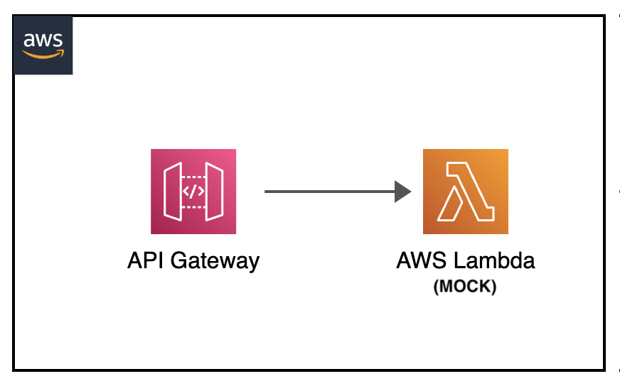

[](https://img.shields.io/badge/NodeJS-18-green)
[](https://img.shields.io/badge/AWS-API%20Gateway-blue)
[](https://img.shields.io/badge/AWS-Lambda-orange)
[](https://img.shields.io/badge/Test-Local-red)

# Local: Amazon API Gateway Mock Testing

## Introduction
This project demonstrates local testing of AWS API Gateway using the SAM CLI emulator. It provides a simple example of mocking API responses without requiring AWS credentials.

---

## Contents
- [Local: Amazon API Gateway Mock Testing](#local-amazon-api-gateway-mock-testing)
  - [Introduction](#introduction)
  - [Contents](#contents)
  - [Project Structure](#project-structure)
  - [Test Features](#test-features)
  - [Prerequisites](#prerequisites)
  - [Architecture Overview](#architecture-overview)
  - [Local Testing Steps](#local-testing-steps)
  - [API Documentation](#api-documentation)
  - [Additional Resources](#additional-resources)

---

## Project Structure
```
├── apigateway-mock                     _# folder containing necessary code and template for mocking API Gateway with Lambda funcions_
│   ├── lambda_mock_src                 _# folder containing code for the MOCK Lambda function_
│   ├── img/apigateway-mock.png         _# Architecture diagram_
│   ├── README.md                       _# instructions file_
│   └── template.yaml                   _# sam yaml template file for necessary components test_
```

---

## Test Features
- **API Code**: JSON mock responses
- **Runtime**: Node.js 18
- **Services**: API Gateway + AWS Lambda
- **AWS Credentials**: Not required
- **Testing Type**: Local emulation

---

## Prerequisites
- AWS SAM CLI
- Node.js 18
- Docker
- curl (for testing)

---

## Architecture Overview
<p align="center">
  
</p>

Components:
- API Gateway emulator (local)
- Lambda function returning mock response
- No external service dependencies

---

## Local Testing Steps

1. Navigate to project directory:
```sh
cd apigateway-mock
```

2. Start API Gateway emulator:
```sh
sam local start-api &
```

Expected output:
```
Mounting LambdaMockFunction at http://127.0.0.1:3000/MOCK [GET]
Running on http://127.0.0.1:3000
```

3. Test the endpoint:
```sh
curl http://127.0.0.1:3000/MOCK
```

Expected response:
```json
"This is mock response"
```

---

## API Documentation

| Endpoint | Method | Response Type | Description |
|----------|---------|---------------|-------------|
| /MOCK | GET | JSON | Returns a mock response string |

**Sample Response:**
```json
"This is mock response"
```

---

## Additional Resources
- [AWS SAM API Gateway Local Testing Guide](https://docs.aws.amazon.com/serverless-application-model/latest/developerguide/serverless-sam-cli-using-start-api.html)
- [SAM Local API Testing Introduction](https://docs.aws.amazon.com/serverless-application-model/latest/developerguide/using-sam-cli-local-start-api.html)

[Top](#contents)

---