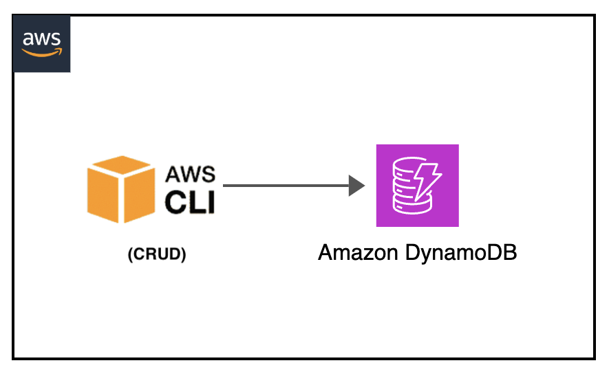

[](https://img.shields.io/badge/AWS-DynamoDB-blueviolet)
[](https://img.shields.io/badge/AWS-CLI-yellow)
[](https://img.shields.io/badge/Test-Local-red)

# Local: Amazon DynamoDB CRUD Operations with AWS CLI

## Introduction
This project demonstrates how to perform local testing of Amazon DynamoDB using Docker and AWS CLI. It provides examples of complete CRUD (Create, Read, Update, Delete) operations without requiring actual AWS infrastructure.

---

## Contents
- [Local: Amazon DynamoDB CRUD Operations with AWS CLI](#local-amazon-dynamodb-crud-operations-with-aws-cli)
  - [Introduction](#introduction)
  - [Contents](#contents)
  - [Project Structure](#project-structure)
  - [Prerequisites](#prerequisites)
  - [Architecture Overview](#architecture-overview)
  - [Setup Steps](#setup-steps)
  - [CRUD Operations](#crud-operations)
  - [Additional Resources](#additional-resources)

---

## Project Structure
```
├── dynamodb-crud-cli                   _# folder containing json files for aws cli DynamoDB CRUD operations_
│   ├── create-item.json                _# json file containing create item aws cli input_
│   ├── delete-item.json                _# json file containing delete item aws cli input_
│   ├── img/dynamodb-crud-cli.png       _# Architecture diagram_
│   ├── README.md                       _# instructions file_
│   └── update-item.json                _# json file containing update item aws cli input_
```

---

## Prerequisites
- Docker
- AWS CLI v2
- Basic understanding of DynamoDB operations
- JSON files for sample data

---

## Architecture Overview
<p align="center">
  
</p>

Components:
- Local DynamoDB instance (Docker)
- AWS CLI for operations
- JSON files for data manipulation

---

## Setup Steps

1. Navigate to project directory:
```sh
cd dynamodb-crud-cli
```

2. Start DynamoDB locally:
```sh
docker run --rm -d --network host -p 8000:8000 amazon/dynamodb-local
```

3. Configure dummy credentials:
```sh
export AWS_ACCESS_KEY_ID='DUMMYIDEXAMPLE'
export AWS_SECRET_ACCESS_KEY='DUMMYEXAMPLEKEY'
export REGION='eu-west-1'
```

4. Create table (CRUDLocalTable):
```sh
aws dynamodb create-table --endpoint-url http://localhost:8000 \
    --table-name CRUDLocalTable \
    --attribute-definitions AttributeName=Id,AttributeType=S \
    --key-schema AttributeName=Id,KeyType=HASH \
    --billing-mode PAY_PER_REQUEST
```

---

## CRUD Operations

### Create item
```sh
aws dynamodb put-item --endpoint-url http://localhost:8000  \
    --table-name CRUDLocalTable                             \
    --item file://create-item.json                          \
    --return-consumed-capacity TOTAL                        \
    --return-item-collection-metrics SIZE
```

### Read table items
```sh
aws dynamodb scan --endpoint-url http://localhost:8000 \
    --table-name CRUDLocalTable
```

### Update initial item
```sh
aws dynamodb update-item --endpoint-url http://localhost:8000   \
    --table-name CRUDLocalTable                                 \
    --key '{"Id": {"S": "123"}}'                                \
    --update-expression "SET #name = :n, age = :a"              \
    --expression-attribute-names '{"#name": "name"}'            \
    --expression-attribute-values file://update-item.json       \
    --return-values ALL_NEW
```

### Delete item
```sh
aws dynamodb delete-item --endpoint-url http://localhost:8000 \
    --table-name CRUDLocalTable \
    --key file://delete-item.json
```


---

## Additional Resources
- [DynamoDB Local Guide](https://docs.aws.amazon.com/amazondynamodb/latest/developerguide/DynamoDBLocal.html)
- [AWS CLI DynamoDB Reference](https://awscli.amazonaws.com/v2/documentation/api/latest/reference/dynamodb/index.html)
- [Docker Container Documentation](https://docs.docker.com/reference/cli/docker/container/run/)

[Top](#contents)

---
