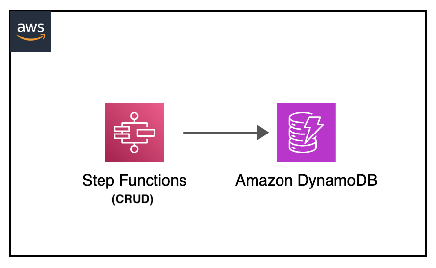

[](https://img.shields.io/badge/AWS-DynamoDB-blueviolet)
[](https://img.shields.io/badge/AWS-Step%20Functions-orange)
[](https://img.shields.io/badge/Test-Local-red)

# Local: AWS Step Functions with DynamoDB CRUD Operations

## Introduction

This project demonstrates how to test AWS Step Functions state machines that perform DynamoDB CRUD operations locally. It uses Docker containers to emulate both Step Functions and DynamoDB services.

---

## Contents
- [Local: AWS Step Functions with DynamoDB CRUD Operations](#local-aws-step-functions-with-dynamodb-crud-operations)
  - [Introduction](#introduction)
  - [Contents](#contents)
  - [Architecture Overview](#architecture-overview)
  - [Project Structure](#project-structure)
  - [Prerequisites](#prerequisites)
  - [Local Setup](#local-setup)
  - [State Machine Operations](#state-machine-operations)
  - [Additional Resources](#additional-resources)

---

## Architecture Overview
<p align="center">
  
</p>

Components:
- Step Functions state machine for orchestration
- DynamoDB table for data storage
- CRUD operations implemented as state machine tasks

---

## Project Structure
```
├── dynamodb-crud-stepfunctions                     _# folder containing environment variables file and json file defining state machine implementing DynamoDB CRUD operations_
│   ├── img/dynamodb-crud-stepfunctions.png         _# Architecture diagram_
│   ├── aws-stepfunctions-local-credentials.txt     _# file containing environment variables for Step Functions with Lambda integration_
│   ├── README.md                                   _# instructions file_
│   └── state-machine.json                          _# json file containing State machine definition_
```

---

## Prerequisites
- Docker
- AWS CLI v2
- Basic understanding of Step Functions and DynamoDB
- JSON for state machine definition

---

## Local Setup

1. Start DynamoDB:
```sh
docker run -d --network host                \
    --name dynamodb -p 8000:8000            \
    amazon/dynamodb-local -jar DynamoDBLocal.jar -sharedDb
```

2. Start Step Functions Local:
```sh
docker run -d --network host                \
    --name stepfunctions -p 8083:8083       \
    --env-file aws-stepfunctions-local-credentials.txt \
    amazon/aws-stepfunctions-local
```

3. Configure environment:
```sh
export AWS_ACCESS_KEY_ID='DUMMYIDEXAMPLE'
export AWS_SECRET_ACCESS_KEY='DUMMYEXAMPLEKEY'
export REGION='us-east-1'
```

4. Create state machine:
```sh
aws stepfunctions create-state-machine --endpoint-url http://localhost:8083             \
  --name "CRUDDynamoDB" --role-arn "arn:aws:iam::012345678901:role/DummyRole"           \
  --region us-east-1                                                                    \
  --definition file://state-machine.json
```

---

## State Machine Operations

### Initialize Table
```sh
aws stepfunctions start-execution --endpoint-url http://localhost:8083                  \
  --state-machine-arn "arn:aws:states:us-east-1:123456789012:stateMachine:CRUDDynamoDB" \
  --input '{"TableName": "CRUDStepFunctions", "Operation": "Init"}'
```

### Create Item
```sh
aws stepfunctions start-execution --endpoint-url http://localhost:8083                  \
  --state-machine-arn "arn:aws:states:us-east-1:123456789012:stateMachine:CRUDDynamoDB" \
  --input '{"TableName": "CRUDStepFunctions", "Operation": "Create", "ItemId": "125", "ItemName": "RobinOriginal"}'
```

### Read Item
```sh
aws stepfunctions start-execution --endpoint-url http://localhost:8083                  \
  --state-machine-arn "arn:aws:states:us-east-1:123456789012:stateMachine:CRUDDynamoDB" \
  --input '{"TableName": "CRUDStepFunctions", "Operation": "Read", "ItemId": "125"}'
```

### Update Item
```sh
aws stepfunctions start-execution --endpoint-url http://localhost:8083                  \
  --state-machine-arn "arn:aws:states:us-east-1:123456789012:stateMachine:CRUDDynamoDB" \
  --input '{"TableName": "CRUDStepFunctions", "Operation": "Update", "ItemId": "125", "ItemName": "RobinNew", "ItemAge": "56"}'
```

### Delete Item
```sh
aws stepfunctions start-execution --endpoint-url http://localhost:8083                  \
  --state-machine-arn "arn:aws:states:us-east-1:123456789012:stateMachine:CRUDDynamoDB" \
  --input '{"TableName": "CRUDStepFunctions", "Operation": "Delete", "ItemId": "125"}'
```

To check execution status:
```sh
aws stepfunctions describe-execution \
    --endpoint http://localhost:8083 \
    --execution-arn "<execution-arn>"
```

---

## Additional Resources
- [Step Functions Local Guide](https://docs.aws.amazon.com/step-functions/latest/dg/sfn-local.html)
- [DynamoDB Local Documentation](https://docs.aws.amazon.com/amazondynamodb/latest/developerguide/DynamoDBLocal.html)
- [AWS Step Functions Developer Guide](https://docs.aws.amazon.com/step-functions/latest/dg/welcome.html)

[Top](#contents)

