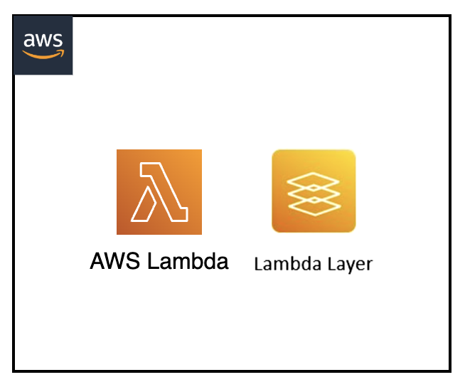

[](https://img.shields.io/badge/Python-3.9-green)
[](https://img.shields.io/badge/AWS-Lambda-orange)
[](https://img.shields.io/badge/AWS-Lambda%20Layers-yellow)
[](https://img.shields.io/badge/Test-Local-red)

# Local: AWS Lambda with Custom Layers

## Introduction

This project demonstrates how to test AWS Lambda functions with custom layers locally using SAM CLI. It showcases the process of building and testing Lambda layers without requiring actual AWS infrastructure.

---

## Contents
- [Local: AWS Lambda with Custom Layers](#local-aws-lambda-with-custom-layers)
  - [Introduction](#introduction)
  - [Contents](#contents)
  - [Architecture Overview](#architecture-overview)
  - [Project Structure](#project-structure)
  - [Prerequisites](#prerequisites)
  - [Build and Test Process](#build-and-test-process)
  - [Understanding Lambda Layers](#understanding-lambda-layers)
  - [Additional Resources](#additional-resources)

---

## Architecture Overview
<p align="center">
  
</p>

Components:
- Python Lambda function
- Custom Lambda layer with dependencies
- SAM CLI for local building and execution

---

## Project Structure
```
├── lambda-sam-layers                   _# folder containing necessary code and template for Lambda Layers implementation_
│   ├── custom-lambda-layer             _# folder containing python dependencies (requirements.txt)_
│   ├── events                          _# folder containing json files for Lambda Layers input events_
│   ├── img/lambda-sam-layers.png       _# Architecture diagram_
│   ├── lambda_layers_src               _# folder containing source code for Lambda Layers function_
│   ├── README.md                       _# instructions file_
│   └── template.yaml                   _# sam yaml template file for necessary components test_
```

---

## Prerequisites
- AWS SAM CLI
- Python 3.9
- pip package manager
- Docker
- zip utilities

---

## Build and Test Process

1. Navigate to project directory:
```sh
cd lambda-sam-layers
```

2. Build the Lambda layer:
```sh
sam build LambdaLayersLayer \
    --use-container \
    --build-image amazon/aws-sam-cli-build-image-python3.9
```

3. Test the function with layer:
```sh
sam local invoke LambdaLayersFunction \
    --event events/lambda-layers-event.json
```

Expected output will include:
```
Version of requests library: 2.31.0
...
[Function response with GitHub API endpoints]
```

---

## Understanding Lambda Layers

Lambda layers provide:
- Shared code and dependencies across functions
- Reduced deployment package size
- Simplified dependency management
- Consistent runtime environment

Layer structure:
```
python/           # Python runtime directory
  └── lib/       # Python packages
      └── python3.9/
          └── site-packages/
              └── [dependencies]
```

Build process:
1. Resolves layer dependencies
2. Packages dependencies in correct structure
3. Makes layer available to local Lambda function

---

## Additional Resources
- [SAM CLI Layer Documentation](https://docs.aws.amazon.com/serverless-application-model/latest/developerguide/building-layers.html)
- [AWS Lambda Layers Guide](https://docs.aws.amazon.com/lambda/latest/dg/configuration-layers.html)
- [SAM Local Testing Documentation](https://docs.aws.amazon.com/serverless-application-model/latest/developerguide/serverless-sam-cli-using-invoke.html)

[Top](#contents)

