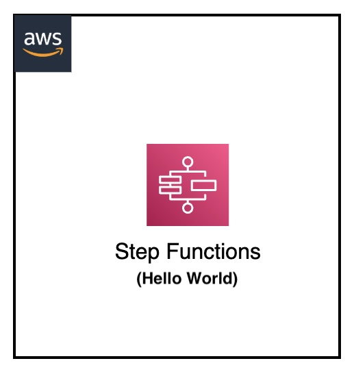

[](https://img.shields.io/badge/AWS-Step%20Functions-orange)
[](https://img.shields.io/badge/Language-ASL-blue)
[](https://img.shields.io/badge/Test-Local-red)

# Local: AWS Step Functions Hello World

## Introduction

This project demonstrates how to test AWS Step Functions state machines locally using Docker. It provides a simple Hello World example that can be tested without requiring actual AWS infrastructure.

---

## Contents
- [Local: AWS Step Functions Hello World](#local-aws-step-functions-hello-world)
  - [Introduction](#introduction)
  - [Contents](#contents)
  - [Architecture Overview](#architecture-overview)
  - [Project Structure](#project-structure)
  - [Prerequisites](#prerequisites)
  - [Local Setup](#local-setup)
  - [Testing Process](#testing-process)
  - [Debug](#debug)
  - [Additional Resources](#additional-resources)

---

## Architecture Overview
<p align="center">
  
</p>

Components:
- Simple Step Functions state machine
- Local Step Functions endpoint
- Basic Pass state workflow

---

## Project Structure
```
├── stepfunctions-helloworld                      _# folder containing environment variables file for Hello World Step Functions_
│   ├── img/stepfunctions-helloworld.png          _# Architecture diagram_
│   ├── aws-stepfunctions-local-credentials.txt   _# file containing environment variables for Step Functions with Lambda integration_
│   └── README.md                                 _# instructions file_
```

---

## Prerequisites
- Docker
- AWS CLI v2
- Basic understanding of Step Functions
- Basic understanding of Amazon States Language (ASL)

---

## Local Setup

1. Navigate to project directory:
```sh
cd stepfunctions-helloworld
```

2. Start Step Functions locally:
```sh
docker run -d --network host            \
    --name stepfunctions -p 8083:8083   \
    --env-file aws-stepfunctions-local-credentials.txt amazon/aws-stepfunctions-local
```


3. Configure environment:
```sh
export AWS_ACCESS_KEY_ID='DUMMYIDEXAMPLE'
export AWS_SECRET_ACCESS_KEY='DUMMYEXAMPLEKEY'
export REGION='eu-west-1'
```

---

## Testing Process

### 1. Create State Machine
```sh
aws stepfunctions create-state-machine --endpoint-url http://localhost:8083 \
    --definition "{                   \
      \"Comment\": \"Hello World State Machine of the Amazon States Language using a Pass state\",\
      \"StartAt\": \"HelloWorld\",    \
      \"States\": {                   \
        \"HelloWorld\": {             \
          \"Type\": \"Pass\",         \
          \"End\": true               \
        }                             \
      }}" --name "HelloWorld" --role-arn "arn:aws:iam::012345678901:role/DummyRole"
```


### 2. Start Execution
```sh
aws stepfunctions start-execution --endpoint-url http://localhost:8083                  \
    --state-machine-arn "arn:aws:states:eu-west-1:123456789012:stateMachine:HelloWorld"
```

### 3. Check Execution Status
```sh
aws stepfunctions describe-execution \
    --endpoint http://localhost:8083 \
    --execution-arn "<execution-arn>"
```

Expected output:
```json
{
    "status": "SUCCEEDED",
    "startDate": "2024-12-21T14:01:55.670000+00:00",
    "stopDate": "2024-12-21T14:01:55.775000+00:00"
}
```

---

## Debug

Checking state machine definition
```sh
aws stepfunctions describe-state-machine    --endpoint-url http://localhost:8083     \
    --state-machine-arn [STATE-MACHINE-ARN]
```

Checking state machine execution flow, execution and state variables
```sh
aws stepfunctions describe-execution        --endpoint http://localhost:8083       \
    --execution-arn [STATE-MACHINE-EXECUTION-ARN]
```

Checking state machine states execution variables
```sh
aws stepfunctions get-execution-history     --endpoint http://localhost:8083    \
  --execution-arn [STATE-MACHINE-EXECUTION-ARN]
```

---

## Additional Resources
- [Step Functions Local Guide](https://docs.aws.amazon.com/step-functions/latest/dg/sfn-local.html)
- [Amazon States Language Documentation](https://docs.aws.amazon.com/step-functions/latest/dg/concepts-amazon-states-language.html)
- [AWS Step Functions Developer Guide](https://docs.aws.amazon.com/step-functions/latest/dg/welcome.html)

[Top](#contents)

