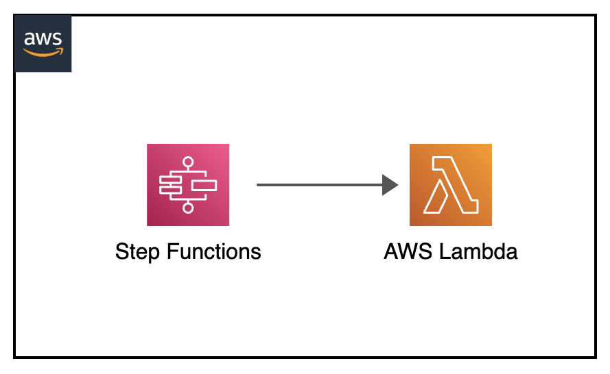

[](https://img.shields.io/badge/NodeJS-22-green)
[](https://img.shields.io/badge/AWS-Step%20Functions-orange)
[](https://img.shields.io/badge/AWS-Lambda-yellow)
[](https://img.shields.io/badge/Test-Local-red)

# Local: AWS Step Functions with Lambda Integration

## Introduction

This project demonstrates how to test AWS Step Functions state machines that integrate with Lambda functions locally. It showcases a mathematical workflow that performs sum and square operations using separate Lambda functions.

---

## Contents
- [Local: AWS Step Functions with Lambda Integration](#local-aws-step-functions-with-lambda-integration)
  - [Introduction](#introduction)
  - [Contents](#contents)
  - [Architecture Overview](#architecture-overview)
  - [Project Structure](#project-structure)
  - [Prerequisites](#prerequisites)
  - [Local Setup](#local-setup)
  - [Testing Process](#testing-process)
  - [State Machine Workflow](#state-machine-workflow)
  - [Debug](#debug)
  - [Additional Resources](#additional-resources)

---

## Architecture Overview
<p align="center">
  
</p>

Components:
- Step Functions state machine for orchestration
- Two Node.js Lambda functions
  - Sum function: adds three numbers
  - Square function: squares a number
- Wait state for demonstration

---

## Project Structure
```
├── stepfunctions-lambda                            _# folder containing necessary code and template for Step Functions with Lambda integration_
│   ├── img/stepfunctions-lambda.png                _# Architecture diagram_
│   ├── lambda_stepfunctions_src                    _# folder containing source code for Step Functions Lambda functions_
│   ├── aws-stepfunctions-local-credentials.txt     _# file containing environment variables for Step Functions with Lambda integration_
│   ├── README.md                                   _# instructions file_
│   └── template.yaml                               _# sam yaml template file for necessary components test_
```

---

## Prerequisites
- AWS SAM CLI
- Docker
- Node.js 22

---

## Local Setup

1. Configure environment:
```sh
export AWS_ACCESS_KEY_ID='DUMMYIDEXAMPLE'
export AWS_SECRET_ACCESS_KEY='DUMMYEXAMPLEKEY'
export REGION='us-east-1'
```

2. Start Lambda emulator:
```sh
sam local start-lambda -p 3001 --docker-network host &
```

3. Start Step Functions local:
```sh
docker run -d --network host            \
    --name stepfunctions -p 8083:8083   \
    --env-file aws-stepfunctions-local-credentials.txt amazon/aws-stepfunctions-local
```

---

## Testing Process

### 1. Test Individual Lambda Functions
```sh
# Test Sum Lambda
aws lambda invoke \
    --function-name StepFunctionExampleSumLambda \
    --endpoint-url http://127.0.0.1:3001 \
    --payload '{ "x": 6, "y": 4, "z": 9 }' \
    output.txt

# Test Square Lambda
aws lambda invoke \
    --function-name StepFunctionExampleSquareLambda \
    --endpoint-url http://127.0.0.1:3001 \
    --payload '{ "sum": 6 }' \
    output.txt
```

### 2. Create State Machine
```sh
aws stepfunctions create-state-machine --endpoint http://localhost:8083 \
  --definition "{                                       \
  \"StartAt\": \"Lambda Sum State\",                    \
  \"States\": {                                         \
    \"Lambda Sum State\": {                             \
      \"Next\": \"Wait State\",                         \
      \"Type\": \"Task\",                               \
      \"InputPath\": \"$\",                             \
      \"OutputPath\": \"$.Payload\",                    \
      \"Resource\": \"arn:aws:states:::lambda:invoke\", \
      \"Parameters\": {                                 \
        \"FunctionName\": \"arn:aws:lambda:us-east-1:123456789012:function:StepFunctionExampleSumLambda\",\
        \"Payload.$\": \"$\"                            \
      }                                                 \
    },                                                  \
    \"Wait State\": {                                   \
      \"Type\": \"Wait\",                               \
      \"Seconds\": 3,                                   \
      \"Next\": \"Lambda Square State\"                 \
    },                                                  \
    \"Lambda Square State\": {                          \
      \"End\": true,                                    \
      \"Type\": \"Task\",                               \
      \"InputPath\": \"$.Payload\",                     \
      \"OutputPath\": \"$.Payload\",                    \
      \"Resource\": \"arn:aws:states:::lambda:invoke\", \
      \"Parameters\": {                                 \
        \"FunctionName\": \"arn:aws:lambda:us-east-1:123456789012:function:StepFunctionExampleSquareLambda\",\
        \"Payload.$\": \"$\"                            \
      }                                                 \
    }                                                   \
  },                                                    \
  \"TimeoutSeconds\": 300                               \
  }" --name "StepFunctionsLambdaStateMachine" --role-arn "arn:aws:iam::123456789012:role/DummyRole"
```

### 3. Execute State Machine
```sh
aws stepfunctions start-execution \
    --endpoint http://localhost:8083 \
    --state-machine [STATE-MACHINE-ARN] \
    --input '{"x": 2s "y": 8, "z": 7}'
```

---

## State Machine Workflow

1. **Sum State**: Adds three input numbers
2. **Wait State**: Pauses for 3 seconds
3. **Square State**: Squares the sum result

Example execution:
```json
Input: {"x": 2, "y": 8, "z": 7}
Sum Result: 17
Final Result: 289
```

---

## Debug

Checking state machine definition
```sh
aws stepfunctions describe-state-machine    --endpoint-url http://localhost:8083     \
    --state-machine-arn [STATE-MACHINE-ARN]
```

Checking state machine execution flow, execution and state variables
```sh
aws stepfunctions describe-execution        --endpoint http://localhost:8083       \
    --execution-arn [STATE-MACHINE-EXECUTION-ARN]
```

Checking state machine states execution variables
```sh
aws stepfunctions get-execution-history     --endpoint http://localhost:8083    \
  --execution-arn [STATE-MACHINE-EXECUTION-ARN]
```

---

## Additional Resources
- [Step Functions Local Guide](https://docs.aws.amazon.com/step-functions/latest/dg/sfn-local.html)
- [SAM CLI Documentation](https://docs.aws.amazon.com/serverless-application-model/latest/developerguide/serverless-sam-cli-command-reference.html)
- [AWS Lambda Developer Guide](https://docs.aws.amazon.com/lambda/latest/dg/welcome.html)

[Top](#contents)

