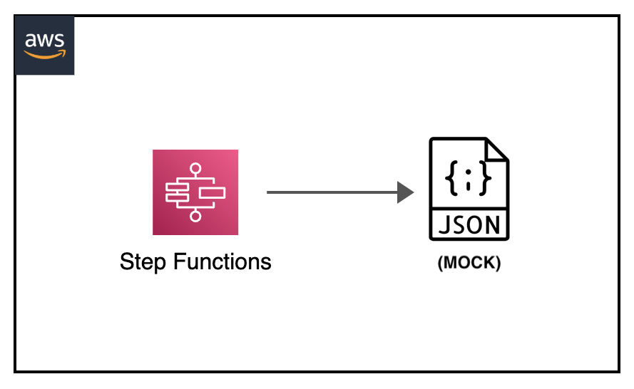

[](https://img.shields.io/badge/AWS-Step%20Functions-orange)
[](https://img.shields.io/badge/AWS-Lambda-yellow)
[](https://img.shields.io/badge/AWS-SQS-green)
[](https://img.shields.io/badge/Test-Local-red)

# Local: AWS Step Functions with Service Mocking

## Introduction

This project demonstrates how to test AWS Step Functions workflows locally using service mocks. It showcases different testing scenarios including happy path, retry path, and hybrid testing approaches.

---

## Contents
- [Local: AWS Step Functions with Service Mocking](#local-aws-step-functions-with-service-mocking)
  - [Introduction](#introduction)
  - [Contents](#contents)
  - [Architecture Overview](#architecture-overview)
  - [Project Structure](#project-structure)
  - [Test Scenarios](#test-scenarios)
  - [Project Structure](#project-structure)
  - [Prerequisites](#prerequisites)
  - [Local Setup](#local-setup)
  - [Testing Workflows](#testing-workflows)
  - [Debug](#debug)
  - [Additional Resources](#additional-resources)

---


## Architecture Overview
<p align="center">
  
</p>

Components:
- Step Functions state machine
- Lambda function integration
- SQS message publishing
- Mock service responses

---

## Project Structure
```
└── stepfunctions-mock                              _# folder containing necessary files for mocking Step Functions_
│   ├── img/stepfunctions-mock.png                  _# Architecture diagram_
│   ├── MockConfigFile.json                         _# json file defining state machine implementing MOCK Step Functions_
│   ├── aws-stepfunctions-local-credentials.txt     _# file containing environment variables for mocking Step Functions_
│   ├── README.md                                   _# instructions file_
│   └── statemachine.json                           _# json configuration file containing step machines definition for Step Functions MOCK testing_
```

---

## Test Scenarios

### 1. Happy Path
- Mocks both Lambda and SQS services
- All operations succeed
- Tests basic workflow flow

### 2. Retry Path
- Tests Lambda function retry logic
- Simulates Lambda failures followed by success
- Verifies retry policy effectiveness

### 3. Hybrid Path
- Mocks Lambda service
- Uses actual SQS service
- Tests integration with real AWS services

---

## Project Structure
```
stepfunctions-mock/
├── MockConfigFile.json           # Mock service configurations
├── aws-stepfunctions-local-credentials.txt
└── README.md
```

---

## Prerequisites
- Docker
- AWS CLI v2
- Basic understanding of Step Functions
- Mock configuration file

---

## Local Setup

1. Start Step Functions local with mocks:
```sh
docker run -d -p 8083:8083 \
    --mount type=bind,readonly,source=$(pwd)/MockConfigFile.json,destination=/home/StepFunctionsLocal/MockConfigFile.json \
    --env-file aws-stepfunctions-local-credentials.txt \
    amazon/aws-stepfunctions-local
```

2. Configure environment:
```sh
export AWS_ACCESS_KEY_ID='DUMMYIDEXAMPLE'
export AWS_SECRET_ACCESS_KEY='DUMMYEXAMPLEKEY'
export REGION='us-east-1'
```

---

## Testing Workflows

### Happy Path Testing
```sh
aws stepfunctions start-execution \
    --endpoint http://localhost:8083 \
    --state-machine "arn:aws:states:us-east-1:123456789012:stateMachine:LambdaSQSIntegration#HappyPath"
```

### Retry Path Testing
```sh
aws stepfunctions start-execution \
    --endpoint http://localhost:8083 \
    --state-machine "arn:aws:states:us-east-1:123456789012:stateMachine:LambdaSQSIntegration#RetryPath"
```

### Hybrid Path Testing
```sh
aws stepfunctions start-execution \
    --endpoint http://localhost:8083 \
    --state-machine "arn:aws:states:us-east-1:123456789012:stateMachine:LambdaSQSIntegration#HybridPath"
```

Check execution results:
```sh
aws stepfunctions describe-execution \
    --endpoint http://localhost:8083 \
    --execution-arn "<execution-arn>"
```

---

## Debug

Checking state machine definition
```sh
aws stepfunctions describe-state-machine    --endpoint-url http://localhost:8083     \
    --state-machine-arn [STATE-MACHINE-ARN]
```

Checking state machine execution flow, execution and state variables
```sh
aws stepfunctions describe-execution        --endpoint http://localhost:8083       \
    --execution-arn [STATE-MACHINE-EXECUTION-ARN]
```

Checking state machine states execution variables
```sh
aws stepfunctions get-execution-history     --endpoint http://localhost:8083    \
  --execution-arn [STATE-MACHINE-EXECUTION-ARN]
```

---

## Additional Resources
- [Step Functions Local Testing Guide](https://docs.aws.amazon.com/step-functions/latest/dg/sfn-local-test-sm-exec.html)
- [Service Mocking Documentation](https://docs.aws.amazon.com/step-functions/latest/dg/sfn-local-mock-cfg-file.html)
- [AWS Step Functions Developer Guide](https://docs.aws.amazon.com/step-functions/latest/dg/welcome.html)

[Top](#contents)

