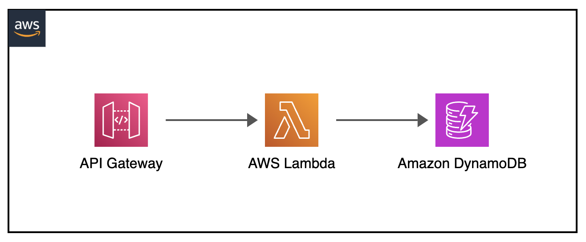

[](https://img.shields.io/badge/Python-3.10-green)
[](https://img.shields.io/badge/AWS-DynamoDB-blueviolet)
[](https://img.shields.io/badge/AWS-Lambda-orange)
[](https://img.shields.io/badge/AWS-API%20Gateway-blue)
[](https://img.shields.io/badge/Test-Pytest-red)
[](https://img.shields.io/badge/Test-Local-red)

# Local: AWS API Gateway, Lambda, and DynamoDB Integration Testing

## Introduction

This project demonstrates how to test AWS serverless applications locally on Docker using PyTest. It implements comprehensive testing for a CRUD API built with API Gateway, Lambda, and DynamoDB, showcasing integration testing patterns and local service emulation, all tested through SAM Emulation and PyTest.

---

## Contents
- [Local: AWS API Gateway, Lambda, and DynamoDB Integration Testing](#local-aws-api-gateway-lambda-and-dynamodb-integration-testing)
  - [Introduction](#introduction)
  - [Contents](#contents)
  - [Architecture Overview](#architecture-overview)
  - [Project Structure](#project-structure)
  - [Prerequisites](#prerequisites)
  - [Test Scenarios](#test-scenarios)
  - [About the Test Process](#about-the-test-process)
  - [API Endpoints](#api-endpoints)
  - [Testing Workflows](#testing-workflows)
  - [Common Issues](#common-issues)
  - [Additional Resources](#additional-resources)

---

## Architecture Overview
<p align="center">
  
</p>

Components:
- API Gateway endpoints for CRUD operations
- Lambda functions for business logic
- DynamoDB table for data persistence
- PyTest framework for automated testing
- Docker containers for local service emulation

---

## Project Structure
```
├── events                                      _# folder containing json files for API Gateway CRUD input events_
├── img/apigateway-crud-lambda-dynamodb.png     _# Architecture diagram_
├── lambda_crud_src                             _# folder containing code for different CRUD Lambda functions_
├── tests/
│   ├── unit/src/test_crud_operations.py        _# python PyTest test definition_
│   └── requirements.txt                        _# pip requirements dependencies file_
├── template.yaml                               _# sam yaml template file for necessary components test_
└── README.md                                   _# instructions file_
```

---

## Prerequisites
- Docker
- Python 3.9 or newer (running pytest)
- AWS SAM CLI (running SAM Lambda emulator)
- curl (for debugging)
- Basic understanding of API Gateway, Lambda Functions and DynamoDB

---

## Test Scenarios

### 1. CRUD Operations
- Tests complete Create, Read, Update, Delete cycle
- Validates response structures and status codes
- Verifies data persistence in DynamoDB

### 2. Error Handling
- Tests invalid inputs
- Verifies error responses
- Validates error handling middleware

### 3. Integration Flow
- Tests end-to-end request processing
- Validates service integration points
- Verifies transaction consistency

---

## About the Test Process

The test process leverages PyTest fixtures to manage service lifecycles:

1. **Service Setup**:
   - Launches DynamoDB Local container
   - Starts SAM Local API Gateway Emulator
   - Initializes test database

2. **Test Execution**:
   - Runs CRUD operation tests
   - Validates responses and data
   - Verifies error scenarios

3. **Cleanup**:
   - Removes test data
   - Stops containers
   - Cleans up resources

---

## API Endpoints

| Endpoint | Method | Description |
|----------|--------|-------------|
| /init | GET | Creates DynamoDB CRUDLocalTable table |
| /create | POST | Creates new item |
| /read | GET | Retrieves an item |
| /update | POST | Updates existing item |
| /delete | GET | Deletes an item |

---

## Testing Workflows

### Setup Docker Environment

> Make sure docker engine is running before running the tests.

``` shell
apigw-lambda-dynamodb-crud-local$ docker version
Client: Docker Engine - Community
 Version:           24.0.6
 API version:       1.43
```

### Run the Unit Test - End to end python test

> Configure environment variables:

``` shell
apigw-lambda-dynamodb-crud-local$
export AWS_ACCESS_KEY_ID='DUMMYIDEXAMPLE'
export AWS_SECRET_ACCESS_KEY='DUMMYEXAMPLEKEY'
export AWS_REGION='us-east-1'
```

> Start the DynamoDB Container and SAM Local Lambda emulator in a separate terminal:

```shell
# Start DynamoDB Local
docker run --rm -d -p 8000:8000 --name dynamodb-local amazon/dynamodb-local

# Start SAM Local API Gateway emulator:
sam local start-api --docker-network host &
```

> Set up the python environment:

``` shell
apigw-lambda-dynamodb-crud-local$
python3 -m venv venv
source venv/bin/activate
pip install --upgrade pip
pip install -r tests/requirements.txt
```

#### Run the Unit Tests

``` shell
apigw-lambda-dynamodb-crud-local$
python3 -m pytest -s tests/unit/src/test_crud_operations.py
```

Expected output
``` shell
apigw-lambda-dynamodb-crud-local$
python3 -m pytest -s tests/unit/src/test_crud_operations.py
================================================================= test session starts ==================================================================
platform linux -- Python 3.10.12, pytest-7.4.4, pluggy-1.6.0
rootdir: /home/ubuntu/environment/python-test-samples/apigw-lambda-dynamodb-crud-local
plugins: timeout-2.1.0
collected 10 items                                                                                                                                                                

tests/unit/src/test_crud_operations.py DynamoDB Local is already running
SAM Local API Gateway is running and responding
=== Step 1: Initialize DynamoDB Table ===
✓ Table already exists (expected): 500
Response: Error creating table: An error occurred (ResourceInUseException) when calling the CreateTable operation: Cannot create preexisting table

.=== Step 2: Create Initial Item ===
✓ Item creation successful: 200
Created item: {'Id': '123', 'name': 'Batman'}
Response: {"message": "Item added", "response": {"ResponseMetadata": {"RequestId": "eaf2a56a-0c8e-4d3a-833a-1e33dd171fc2", "HTTPStatusCode": 200, "HTTPHeaders": {"server": "Jetty(12.0.14)", "date": "Mon, 04 Aug 2025 13:11:58 GMT", "x-amzn-requestid": "eaf2a56a-0c8e-4d3a-833a-1e33dd171fc2", "content-type": "application/x-amz-json-1.0", "x-amz-crc32": "2745614147", "content-length": "2"}, "RetryAttempts": 0}}}

.=== Step 3: Read Item ===
✓ Item read successful: Id=123, name=Batman
Response: {"name": "Batman", "Id": "123"}

.=== Step 4: Update Item ===
✓ Item update successful: 200
Updated to: {'Id': '123', 'name': 'Robin'}
Response: {"message": "Item updated successfully", "response": {"Attributes": {"name": "Robin"}, "ResponseMetadata": {"RequestId": "6bd871d4-c87d-4b16-a63d-20d08051cae7", "HTTPStatusCode": 200, "HTTPHeaders": {"server": "Jetty(12.0.14)", "date": "Mon, 04 Aug 2025 13:12:00 GMT", "x-amzn-requestid": "6bd871d4-c87d-4b16-a63d-20d08051cae7", "content-type": "application/x-amz-json-1.0", "x-amz-crc32": "945407983", "content-length": "37"}, "RetryAttempts": 0}}}

.=== Step 5: Check Updated Item ===
✓ Updated item read successful: name=Robin
Response: {"name": "Robin", "Id": "123"}

.=== Step 6: Delete Item ===
✓ Item deletion successful: 200
Deleted item: {'Id': '123'}
Response: {"message": "Item deleted", "response": {"ResponseMetadata": {"RequestId": "b59cad53-1185-4b3c-9a69-388b731aeb5a", "HTTPStatusCode": 200, "HTTPHeaders": {"server": "Jetty(12.0.14)", "date": "Mon, 04 Aug 2025 13:12:02 GMT", "x-amzn-requestid": "b59cad53-1185-4b3c-9a69-388b731aeb5a", "content-type": "application/x-amz-json-1.0", "x-amz-crc32": "2745614147", "content-length": "2"}, "RetryAttempts": 0}}}

.=== Step 7: Verify Item Deleted ===
✓ Item correctly deleted: 404 Not Found
Response: {"error": "Item not found", "message": "No item with Id 123 found"}

=== CRUD Sequence Complete! ===
.=== Complete Integration Cycle Test ===
Testing with ID: integration-456
Step 1: Create item
✓ Create: 200
Step 2: Read item
✓ Read: 200
Step 3: Update item
✓ Update: 200
Step 4: Verify update
✓ Verify: 200
Step 5: Delete item
✓ Delete: 200
Step 6: Verify deletion
✓ Verify deletion: 404
✓ Complete integration cycle passed!

.=== Error Scenarios Test ===
Test 1: Read non-existent item
✓ Read nonexistent: 404
Test 2: Update non-existent item
✓ Update nonexistent: 200
Test 3: Delete non-existent item
✓ Delete nonexistent: 200
✓ Error scenarios completed

.=== Performance Check ===
✓ Create: 718ms (status: 200)
✓ Read: 724ms (status: 200)
✓ Update: 740ms (status: 200)
✓ Delete: 729ms (status: 200)
✓ Average operation time: 728ms
✓ Performance check completed

.

================================================================= 10 passed in 36.91s ==================================================================
```

#### Clean up section

> clean pyenv environment

```sh
apigw-lambda-dynamodb-crud-local$
deactivate
rm -rf venv/
```

> unsetting variables

```sh
unset AWS_ACCESS_KEY_ID
unset AWS_SECRET_ACCESS_KEY
unset AWS_REGION
```

> cleaning sam process

```sh
ps -axuf | grep '[s]am local start-api' | awk '{print $2}' | xargs -r kill
```

> cleanning docker

```sh
docker ps -q --filter ancestor=amazon/dynamodb-local | xargs -r docker kill
docker rmi amazon/dynamodb-local
```

---

#### Debug - PyTest Debugging

For more detailed debugging in pytest:

```sh
# Run with verbose output
python3 -m pytest -s -v unit/src/test_crud_operations.py

# Run with debug logging
python3 -m pytest -s tests/unit/src/test_crud_operations.py --log-cli-level=DEBUG

# List available individual test
python3 -m pytest tests/unit/src/test_crud_operations.py --collect-only

# Run a specific pytest test
python3 -m pytest -s tests/unit/src/test_crud_operations.py::test_01_initialize_table -v

```

### Fast local development for CRUD Operations

#### AWS CLI Commands for Manual Verification

If you need to manually verify the CRUD Operations or execution details, you can use these commands:

#### Configure environment variables:

``` shell
apigw-lambda-dynamodb-crud-local$
export AWS_ACCESS_KEY_ID='DUMMYIDEXAMPLE'
export AWS_SECRET_ACCESS_KEY='DUMMYEXAMPLEKEY'
export AWS_REGION='us-east-1'
```

#### Start the DynamoDB Container and SAM Local Lambda emulator in a separate terminal:

```shell
# Start DynamoDB Local
docker run --rm -d -p 8000:8000 --name dynamodb-local amazon/dynamodb-local

# Start SAM Local API Gateway emulator:
sam local start-api --docker-network host &
```

#### Debug lambda functions - Test Individually API and Lambda Functions

0. Initialize the DynamoDB table (though Api Gateway -> Lambda crud init function):
```sh
curl -X GET http://127.0.0.1:3000/init
```

1. Create initial item:
```sh
curl -X POST http://127.0.0.1:3000/create \
  -H 'Content-Type: application/json' \
  -d '{"Id": "123", "name": "Batman"}'
```

2. Read item:
```sh
curl -X GET http://127.0.0.1:3000/read \
  -H 'Content-Type: application/json' \
  -d '{"Id": "123"}'
```

3. Update initial item:
```sh
curl -X POST http://127.0.0.1:3000/update \
  -H 'Content-Type: application/json' \
  -d '{"Id": "123", "name": "Robin"}'
```

4. Check updated item:
```sh
curl -X GET http://127.0.0.1:3000/read \
  -H 'Content-Type: application/json' \
  -d '{"Id": "123"}'
```

5. Delete item:
```sh
curl -X GET http://127.0.0.1:3000/delete \
  -H 'Content-Type: application/json' \
  -d '{"Id": "123"}'
```

6. Checking item does not exist:
```sh
curl -X GET http://127.0.0.1:3000/read \
  -H 'Content-Type: application/json' \
  -d '{"Id": "123"}'
```

---

## Common Issues

### DynamoDB Issues
- Verify DynamoDB Local Container is running
- Check port 8000 availability
- Confirm network settings (no using host network)
- Table exist initalization error (Init request failed with status 500: Error creating table: An error occurred (ResourceInUseException) when calling the CreateTable operation: Cannot create preexisting table) -> Clean up the dynamodb docker image and related columnes

### SAM Local API Issues
- Ensure template.yaml is valid
- Verify Lambda function handlers
- Check Docker network configuration (using host network)

### PyTest Failures
- Verify Python environment (recreation)
- Check fixture dependencies (requirements)
- Review test isolation

---

## Additional Resources
- [PyTest Documentation](https://docs.pytest.org/)
- [AWS SAM Local Testing](https://docs.aws.amazon.com/serverless-application-model/latest/developerguide/serverless-sam-cli-testing.html)
- [DynamoDB Local Guide](https://docs.aws.amazon.com/amazondynamodb/latest/developerguide/DynamoDBLocal.html)
- [API Gateway Testing](https://docs.aws.amazon.com/apigateway/latest/developerguide/how-to-test-api.html)

[Top](#contents)
