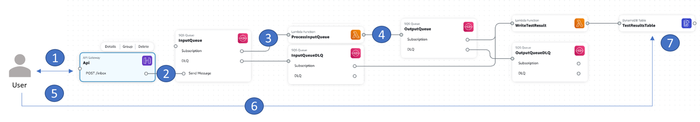

[](https://img.shields.io/badge/Python-3.9-green)
[](https://img.shields.io/badge/AWS-SQS-blueviolet)
[](https://img.shields.io/badge/Test-Integration-yellow)

# Python: Amazon Api Gateway, AWS Lambda, Amazon SQS Example

## Introduction
This project contains automated test sample code samples for serverless applications written in Python. The project demonstrates several techniques for executing tests in the cloud specifically when interacting with the AWS Lambda service. Based on current tooling, we recommend customers **focus on testing in the cloud** as much as possible. This example is designed to be used in a testing enviroment, not in a production enviroment. 

The project uses the [AWS Serverless Application Model](https://docs.aws.amazon.com/serverless-application-model/latest/developerguide/what-is-sam.html) (SAM) CLI for configuration, testing and deployment. 

---

## Contents
- [Python: Amazon Api Gateway, AWS Lambda, Amazon SQS Example](#python-amazon-api-gateway-aws-lambda-amazon-dynamodb-example)
  - [Introduction](#introduction)
  - [Contents](#contents)
  - [Key Files in the Project](#key-files-in-the-project)
  - [Sample project description](#sample-project-description)
  - [Testing Data Considerations](#testing-data-considerations)
  - [Run the Unit Test](#run-the-unit-test)
---

## Key Files in the Project
  - [process_input_queue.py](src/process_input_queue/process_input_queue.py) - Lambda handler code to read from input SQS queue, do some processing, and enqueue the processing results into the output SQS queue
  - [check_output_queue.py](src/check_output_queue/check_output_queue.py) - Lambda handler code to read from output SQS queue the result of the processing
  - [template.yaml](template.yaml) - SAM script for deployment
  - [test_api_gateway.py](tests/integration/test_api_gateway.py) - Integration test written in Python on a live stack deployed on AWS
   
[Top](#contents)

---

## Sample project description

The sample project allows a user to call an API endpoint (using /inbox) and generate a custom "test/hello" message. The user can also track the result of the processing of it in the cloud (using /outbox). The following diagram demonstatred the architecture and flow. The following diagram has been created using the [AWS Application Composer](https://aws.amazon.com/application-composer/), which can help you visually design and build serverless applications quickly.



This project consists of an [API Gateway](https://aws.amazon.com/api-gateway/), two [AWS Lambda](https://aws.amazon.com/lambda) functions, and two [Amazon SQS](https://aws.amazon.com/sqs) standart queues which are using 2 DLQ queues accordinally for error handling.

The Sequence is (corresponding steps 1-7  on the diagram): 

1. User is using the test client to invoke an API call (POST /inbox) to send a message/job/test to be later on processed in the backend by the ProcessInputQueue lambda function.
2. API GW is sending the message payload into the InputQueue.
3. InputQueue is triggering the ProcessInputQueue lambda function to process the message/job/test in the queue. this is where the lambda can be enhanced to do further processing/testing as needed by you. It's up to the user of this sample to decide what this lambda shuold eventualy do, as it can be extended and adapted to the testing needs. 
4. When the ProcessInputQueue lambda finished its processing, it sends the testing result to the OutputQueue (if needed - please adapt the result JSON/Message). The result will be kept in the queue until consumed by the User.
5. User is using the test client to invoke an API call (GET /outbox) to receive the testing result/message of the test it issued on step 1.
6. API GW is triggering the CheckOutputQueue lambda function to recieve the message from the OutputQueue.
7. CheckOutputQueue lambda function is receiving the the message from the OutputQueue and delivers it back to the test client via the API GW.


[Top](#contents)

---

## Prerequisites
The SAM CLI extends the AWS CLI that adds functionality for building and testing serverless applications. It contains features for building your application locally, deploying it to AWS, and emulating AWS services locally to support automated unit tests.  

To use the SAM CLI, you need the following tools.

* SAM CLI - [Install the SAM CLI](https://docs.aws.amazon.com/serverless-application-model/latest/developerguide/serverless-sam-cli-install.html)
* Python 3.9 - [Install Python 3.9](https://www.python.org/downloads/)

[Top](#contents)


```
The SAM CLI installs dependencies defined in `src/requirements.txt`, creates a deployment package, and saves it in the `.aws-sam/build` folder. [Read the documentation](https://docs.aws.amazon.com/serverless-application-model/latest/developerguide/serverless-building.html).

Use the following command to deploy your application package to AWS: 

``` bash
# deploy your application to the AWS cloud
apigw-sqs-lambda-sqs$ sam build
apigw-sqs-lambda-sqs$ sam deploy --guided
```

After running this command you will receive a series of prompts:

* **Stack Name**: The name of the stack to deploy to CloudFormation. This should be unique to your account and region, and a good starting point would be something matching your project name. Use `apigw-sqs-lambda-sqs` as the stack name for this project. you'll need the stack name to run the Integration test.
* **AWS Region**: The AWS region you want to deploy your app to.
* **Confirm changes before deploy**: If set to yes, SAM CLI shows you any change sets for manual review before deployment. If set to no, the AWS SAM CLI will automatically deploy application changes.
* **Allow SAM CLI IAM role creation**: Many AWS SAM templates, including this example, create AWS IAM roles required for the AWS Lambda function(s) included to access AWS services. By default, SAM CLI scopes these down to minimum required permissions. To deploy an AWS CloudFormation stack which creates or changes IAM roles, the `CAPABILITY_IAM` value for `capabilities` must be provided. If you don't provide permission through this prompt, you must explicitly pass `--capabilities CAPABILITY_IAM` to the `sam deploy` command.
* **CheckOutputQueue may not have authorization defined, Is this okay?**:set to yes. since this is for testing only we can proceed without client autoriztion for API GW, but for production enviroment we do recommand to have it.

* **Save arguments to samconfig.toml**: If set to yes, SAM CLI saves your choices to a configuration file inside the project, so that in the future you can just re-run `sam deploy` without parameters to deploy changes to your application.

You can find your API Gateway Endpoint URL in the output values displayed after deployment. Take note of this URL for use in the logging section below. On subsequent deploys you can run `sam deploy` without the `--guided` flag. [Read the documentation](https://docs.aws.amazon.com/serverless-application-model/latest/developerguide/serverless-deploying.html).

[Top](#contents)

---

## Run the Integration Test
[test_api_gateway.py](tests/integration/test_api_gateway.py) 

For integration tests, it is assumed the full stack is already deployed before testing. if not, you can use the following commands to deploy (see [Prerequisites](#prerequisites) section):
```shell
apigw-sqs-lambda-sqs$ sam build
apigw-sqs-lambda-sqs$ sam deploy --guided
```

The [integration test](tests/integration/test_api_gateway.py) setup determines the [API endpoint](tests/integration/test_api_gateway.py#L56).  

The [integration test tear-down](tests/integration/test_api_gateway.py#L79) is not cleaning any data from the queues, it is recomanaded before running any tests to verify (via the console) that the SQS queues are empty, and if not, you can purge the existing messages and perform clean up.

To run the integration test, create the environment variable "AWS_SAM_STACK_NAME" with the name of the test stack, and execute the test.

```shell
# Set the environment variables AWS_SAM_STACK_NAME and (optionally)AWS_DEFAULT_REGION 
# to match the name of the stack and the region where you will test
# pip install will check the requirements file and will install needed packages to run the pytest. it is required only once for setting the enviroment

apigw-sqs-lambda-sqs$ export AWS_SAM_STACK_NAME=<stack-name>
apigw-sqs-lambda-sqs$ pip install -r tests/requirements.txt 
apigw-sqs-lambda-sqs$ python -m pytest -s tests/integration -v 
```
in the [test_api_gateway.py](tests/integration/test_api_gateway.py) file you can control the polling mechanism for checking the test result, using:

interval_num = 5  # number of times to check if there is a message in the queue.

interval_timeout = 1 # amoount of time in sec to wait between each check.

This may be usefell if the testing takes more than the define default time (5 retries every 1 sec= total of 5 sec). if your lambda [process_input_queue.py](src/process_input_queue/process_input_queue.py) is doing processing for than ~5 seconds, than it is recomanded to adapt this paraemters accordinely.
*****TBD explain the DLQ and the malford message logic ************

[Top](#contents)

---

## Cleanup 

In order to remove the deployed resource in the cloud, please run:
```shell
apigw-sqs-lambda-sqs$ sam delete
```
answer "yes" to the questions and it will delete the sam stack.