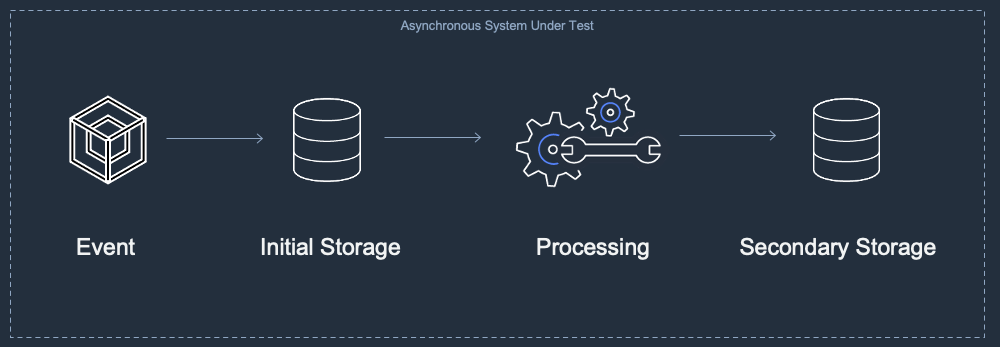
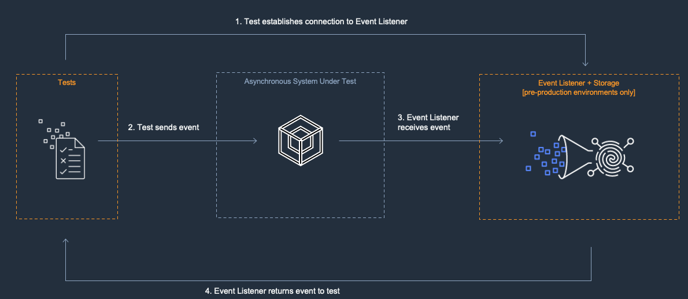

# Test Asynchronous Architectures

Automated tests are crucial components to event driven architectures. They help to ensure that your systems are developed efficiently, accurately and with high quality. This section provides some guidance for designing automated tests for event driven architectures and asynchronous systems using Python. 

## A Common Asynchronous Pattern
Asynchronous systems typically receive messages or events and immediately store them for future processing. Later, a secondary processing service may perform operations on the stored data. Processed data may then be sent as output to additional services or placed into another storage location. Below is a diagram illustrating a generic asynchronous pattern.

## Establish Logical Boundaries
Asynchronous systems rarely exist in isolation. Typically a production system will be made up of many interconnected subsystems. In order to create a reasonable testing strategy, it is useful to break complex systems into a set of logical subsystems. A subsystem may be a group of services that work together to accomplish a single task. A subsystem should have well understood inputs and outputs. A subsystem should be small enough to be able to reason about and understand. Breaking your complex architecture into smaller subsystems makes it easier to create isolated and targeted tests.

## Create Test Harnesses
When testing asynchronous systems, it can be useful to create test harnesses. These harnesses contain resources that generate inputs for your subsystem and then receive the system’s outputs. Your tests will use the harnesses to exercise the system and determine whether it is performing as expected. These harnesses are resources that are used for testing purposes only. They are not used by production features. Test harnesses are typically deployed to pre-production environments only. However, deploying test harnesses to production environments may be useful for production systems that are tolerant of test data. In these cases you may decide to perform tests in production.

## Event Producers and Event Listeners
Test harnesses are usually composed of event producers and event listeners. The producers provide input to the System Under Test (SUT) and the listeners are configured to receive output. The automated tests send configured events to the producer and then poll the listener to examine the output. If the output meets expectations the test passes.

## Define Your Service Level Agreements
Although your architecture may be asynchronous, it is still useful to establish reasonable expectations about the maximum duration your system may take to process before it considered to be in a failure state. These expectations may be explicitly defined as Service Level Agreements (SLAs). When you design your tests, you may set timeouts that match your SLA’s. If the system does not return results within the timeout period it can be considered to be in violation of the SLA and the tests will fail.

### Asynchronous Test Samples
|Project|Description|
---|---
|[Lambda with DynamoDB](./async-lambda-dynamodb/)|You may use a variety of resource types to create the event listener for your asynchronous system under test. We recommend starting with AWS Lambda and Amazon DynamoDB. DynamoDB creates a persistent storage resource that can enable long running tests or an aggregate a set of results.|
