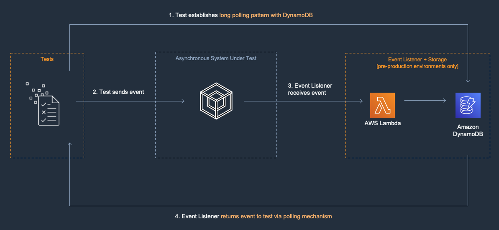

# Asynchronous System Test with Lambda Event Listener and DynamoDB
You may use a variety of resource types to create the event listener for your asynchronous system under test. We recommend starting with AWS Lambda and Amazon DynamoDB. DynamoDB creates a persistent storage resource that can enable long running tests or an aggregation of a set of results.

In this pattern, a Lambda function is configured to be an event listener to receive the SUT’s output data. DynamoDB is configured to be the event listener storage option. In Step 1 in the diagram below, the test establishes a long polling pattern with DynamoDB. In Step 2, the test sends input data to the asynchronous system under test. The async system processes the data and in Step 3 the the Lambda function receives the data and puts it into DynamoDB. The long poll queries DynamoDB and examines the result. We recommend writing tests for failure conditions including timeouts and malformed requests.

