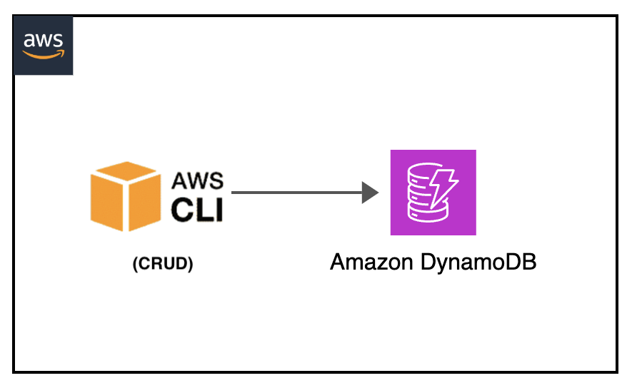

[](https://img.shields.io/badge/Python-3.10-green)
[](https://img.shields.io/badge/AWS-DynamoDB-blueviolet)
[](https://img.shields.io/badge/AWS-CLI-yellow)
[](https://img.shields.io/badge/Test-Pytest-red)
[](https://img.shields.io/badge/Test-Local-red)

# Local: Amazon DynamoDB CRUD Operations Testing

## Introduction

This project demonstrates how to test Amazon DynamoDB CRUD operations locally using Docker and PyTest. It provides complete examples of Create, Read, Update, and Delete operations without requiring actual AWS infrastructure, making it ideal for rapid development and automated testing cycles.

---

## Contents

- [Local: Amazon DynamoDB CRUD Operations Testing](#local-amazon-dynamodb-crud-operations-testing)
  - [Introduction](#introduction)
  - [Contents](#contents)
  - [Architecture Overview](#architecture-overview)
  - [Project Structure](#project-structure)
  - [Prerequisites](#prerequisites)
  - [Test Scenarios](#test-scenarios)
  - [About the Test Process](#about-the-test-process)
  - [Testing Workflows](#testing-workflows)
  - [CRUD Operations Documentation](#crud-operations-documentation)
  - [Additional Resources](#additional-resources)

---

## Architecture Overview

<p align="center">
  
</p>

Components:

- DynamoDB Local container via Docker
- AWS CLI for direct DynamoDB operations
- Python boto3 client for programmatic access
- PyTest for automated testing
- JSON files for test data management

---

## Project Structure

```
├── img/dynamodb-crud-cli.png                   _# visual architecture diagram_
├── events/    
│   ├── batch-get.json                          _# json file containing batch get input (aws cli debug)_
│   ├── batch-write.json                        _# json file containing batch write input (aws cli debug)_
│   ├── create-item.json                        _# json file containing create item input_
│   ├── delete-item.json                        _# json file containing delete item input_
│   └── update-item.json                        _# json file containing update item input_
├── tests/
│   ├── unit/src/test_dynamodb_local.py         _# python PyTest test definition_
│   └── requirements.txt                        _# pip requirements dependencies file_
└── README.md                                   _# instructions file_
```

---

## Prerequisites

- Docker
- AWS CLI v2
- Python 3.10 or newer
- Basic understanding of DynamoDB operations

---

## Test Scenarios

### 1. Table Management Operations

- Tests DynamoDB table creation with proper schema definition
- Verifies table existence and describes table properties
- Validates table deletion and cleanup operations

### 2. Create Operations (PUT)

- Tests item creation with basic attributes
- Verifies conditional PUT operations
- Validates return values and consumed capacity metrics
- Tests bulk item insertion scenarios

### 3. Read Operations (GET/SCAN/QUERY)

- Tests single item retrieval by primary key
- Verifies scan operations for all table items
- Validates query operations with filter expressions
- Tests pagination with large datasets

### 4. Update Operations

- Tests item updates with SET expressions
- Verifies atomic counter increments
- Validates conditional updates based on existing values
- Tests update operations with return values

### 5. Delete Operations

- Tests single item deletion by primary key
- Verifies conditional delete operations
- Validates batch delete operations
- Tests delete operations with return values

### 6. PyTest Integration Tests (end to end python test)

- **Full CRUD Workflow**: Complete lifecycle testing from creation to deletion
- **Concurrent Operations**: Tests parallel DynamoDB operations
- **Error Handling**: Validates proper error responses and exception handling
- **Performance Metrics**: Measures operation latency and throughput
- **Data Consistency**: Verifies eventual consistency behavior
- **Capacity Monitoring**: Tests consumed capacity units tracking

---

## About the Test Process

The test process leverages Docker and PyTest to provide comprehensive DynamoDB testing:

1. **Container Setup**: Docker starts a local DynamoDB instance on port 8000 with no authentication required.

2. **Environment Configuration**: Test fixtures configure AWS credentials and endpoint URLs to point to the local DynamoDB instance.

3. **Table Management**: PyTest fixtures handle table creation, schema definition, and cleanup operations automatically.

4. **Test Data Loading**: JSON files provide consistent test data for various CRUD operations, ensuring reproducible tests.

5. **Operation Validation**: Each test validates both the operation success and the expected data state changes in DynamoDB.

6. **Performance Monitoring**: Tests measure operation latencies and validate performance characteristics.

7. **Cleanup**: After tests complete, the container and test data are automatically cleaned up.

---

## Testing Workflows

### Setup Docker Environment

> Make sure Docker engine is running before running the tests.

```shell
dynamodb-crud-local$ docker version
Client: Docker Engine - Community
 Version:           24.0.6
 API version:       1.43
(...)
```

### Run the Unit Test - End to end python test

> Start the DynamoDB Local container in a separate terminal:

```shell
dynamodb-crud-local$
docker run --rm -d --name dynamodb-local --network host -p 8000:8000 amazon/dynamodb-local
```

> Set up the python environment:

```shell
dynamodb-crud-local$ cd tests
export AWS_ACCESS_KEY_ID='DUMMYIDEXAMPLE'
export AWS_SECRET_ACCESS_KEY='DUMMYEXAMPLEKEY'
export AWS_REGION='us-east-1'
python3 -m venv venv
source venv/bin/activate
pip install --upgrade pip
pip install -r requirements.txt
```

#### Run the Unit Tests

```shell
dynamodb-crud-local/tests$
python3 -m pytest -s unit/src/test_dynamodb_local.py
```

Expected output:

```shell
dynamodb-crud-local/tests$ python3 -m pytest -s unit/src/test_dynamodb_local.py
============================================== test session starts============================================== 
platform linux -- Python 3.10.12, pytest-8.4.1, pluggy-1.6.0
rootdir: /home/ubuntu/environment/python-test-samples/dynamodb-crud-cli-local/tests
plugins: timeout-2.4.0, xdist-3.8.0
collected 10 items                                                                                                                                                                                         

unit/src/test_dynamodb_local.py DynamoDB Local is running on port 8000
DynamoDB Local health check passed
Table 'CRUDLocalTable' created successfully
Table status: ACTIVE, Item count: 0
.Item created successfully: {'Id': '123', 'name': 'Batman'}
Create operation consumed capacity: 1.0 units
.Scan operation found 3 items
Get operation retrieved: {'Id': '123', 'name': 'Batman'}
Read operations completed successfully
.Item updated successfully: {'Id': '123', 'name': 'Robin', 'age': 35}
Update operation consumed capacity: 1.0 units
.Item deleted successfully
Delete operation consumed capacity: 1.0 units
.Full CRUD workflow completed successfully
Created: 3, Updated: 1, Deleted: 3
Final verification: Table is empty after cleanup
.Concurrent operations test passed
Results: Success_Rate=100.0%, Avg_Operation_Time=247ms, Successful_Operations=10/10
.Performance test completed: avg=6ms, operations=20, total_capacity=20.0 units
Batch operation time: 20ms for 20 deletes
.Error handling test passed - all expected errors were properly raised
.Data types and attributes test passed - all DynamoDB data types handled correctly
.

============================================== 10 passed in 1.46s============================================== 
```

#### Clean up section

> Clean pyenv environment:

```sh
dynamodb-crud-local/tests$
deactivate
rm -rf venv/
```

> Unsetting variables:

```sh
unset AWS_ACCESS_KEY_ID
unset AWS_SECRET_ACCESS_KEY
unset AWS_REGION
```

> cleaning docker:

```sh
dynamodb-crud-local$
docker stop dynamodb-local
docker rmi amazon/dynamodb-local
```

#### Debug - PyTest Debugging

For more detailed debugging in pytest:

```sh
# Run with verbose output
python3 -m pytest -s -v unit/src/test_dynamodb_local.py

# Run with debug logging
python3 -m pytest -s -v unit/src/test_dynamodb_local.py --log-cli-level=DEBUG

# List available individual test
python3 -m pytest tests/unit/src/test_dynamodb_local.py --collect-only

# Run a specific pytest test
python3 -m pytest -s -v unit/src/test_dynamodb_local.py::test_create_item_operation
```

---

### Manual CLI Testing (AWS CLI commands)

> Start the DynamoDB Local container:

```shell
dynamodb-crud-local$
docker run --rm -d --name dynamodb-local --network host -p 8000:8000 amazon/dynamodb-local
```

> Configure environment variables:

```shell
dynamodb-crud-local$
export AWS_ACCESS_KEY_ID='DUMMYIDEXAMPLE'
export AWS_SECRET_ACCESS_KEY='DUMMYEXAMPLEKEY'
export AWS_REGION='us-east-1'
```

#### Create Table

```shell
dynamodb-crud-local$
aws dynamodb create-table --endpoint-url http://localhost:8000 \
    --table-name CRUDLocalTable \
    --attribute-definitions AttributeName=Id,AttributeType=S \
    --key-schema AttributeName=Id,KeyType=HASH \
    --billing-mode PAY_PER_REQUEST
```

Expected output:
```json
{
    "TableDescription": {
        "AttributeDefinitions": [
            {
                "AttributeName": "Id",
                "AttributeType": "S"
            }
        ],
        "TableName": "CRUDLocalTable",
        "KeySchema": [
            {
                "AttributeName": "Id",
                "KeyType": "HASH"
            }
        ],
        "TableStatus": "ACTIVE",
    (...)
}
```

#### Create Item

```shell
dynamodb-crud-local$
aws dynamodb put-item --endpoint-url http://localhost:8000  \
    --table-name CRUDLocalTable                             \
    --item file://events/create-item.json                   \
    --return-consumed-capacity TOTAL                        \
    --return-item-collection-metrics SIZE
```

Expected output:
```json
{
    "ConsumedCapacity": {
        "TableName": "CRUDLocalTable",
        "CapacityUnits": 1.0
    }
}
```

#### Read Items (Scan)

```shell
dynamodb-crud-local$
aws dynamodb scan --endpoint-url http://localhost:8000 \
    --table-name CRUDLocalTable
```

Expected output:
```json
{
    "Items": [
        {
            "Id": {
                "S": "123"
            },
            "name": {
                "S": "Batman"
            }
        }
    ],
    "Count": 1,
    "ScannedCount": 1
}
```

#### Update Item

```shell
dynamodb-crud-local$
aws dynamodb update-item --endpoint-url http://localhost:8000   \
    --table-name CRUDLocalTable                                 \
    --key '{"Id": {"S": "123"}}'                                \
    --update-expression "SET #name = :n, age = :a"              \
    --expression-attribute-names '{"#name": "name"}'            \
    --expression-attribute-values file://events/update-item.json \
    --return-values ALL_NEW
```

Expected output:
```json
{
    "Attributes": {
        "Id": {
            "S": "123"
        },
        "name": {
            "S": "Robin"
        },
        "age": {
            "N": "35"
        }
    }
}
```

#### Delete Item

```shell
dynamodb-crud-local$
aws dynamodb delete-item --endpoint-url http://localhost:8000 \
    --table-name CRUDLocalTable \
    --key file://events/delete-item.json \
    --return-consumed-capacity TOTAL
```

Expected output:
```json
{
    "ConsumedCapacity": {
        "TableName": "CRUDLocalTable",
        "CapacityUnits": 1.0
    }
}
```

#### Clean up section

> Delete table:

```sh
dynamodb-crud-local$
aws dynamodb delete-table --endpoint-url http://localhost:8000 \
    --table-name CRUDLocalTable
```

> cleanning docker

```sh
docker stop dynamodb-local
docker rmi amazon/dynamodb-local
```

---

### Fast local development for DynamoDB

#### AWS CLI Commands for Manual Verification

If you need to manually verify table state or troubleshoot operations:

#### List all tables

```sh
dynamodb-crud-local$
aws dynamodb list-tables --endpoint-url http://localhost:8000
```

#### Describe table details

```sh
dynamodb-crud-local$
aws dynamodb describe-table --endpoint-url http://localhost:8000 \
    --table-name CRUDLocalTable
```

#### Get specific item

```sh
dynamodb-crud-local$
aws dynamodb get-item --endpoint-url http://localhost:8000 \
    --table-name CRUDLocalTable \
    --key '{"Id": {"S": "123"}}'
```

#### Query with conditions

```sh
dynamodb-crud-local$
aws dynamodb query --endpoint-url http://localhost:8000 \
    --table-name CRUDLocalTable \
    --key-condition-expression "Id = :id" \
    --expression-attribute-values '{":id": {"S": "123"}}'
```

#### Batch operations

```sh
# Batch write items
dynamodb-crud-local$
aws dynamodb batch-write-item --endpoint-url http://localhost:8000 \
    --request-items file://events/batch-write.json

# Batch get items
dynamodb-crud-local$
aws dynamodb batch-get-item --endpoint-url http://localhost:8000 \
    --request-items file://events/batch-get.json
```

---

## CRUD Operations Documentation

### Table Schema

| Attribute | Type | Key Type | Description |
|-----------|------|----------|-------------|
| `Id` | String (S) | HASH | Primary key for item identification |
| `name` | String (S) | - | Item name attribute |
| `age` | Number (N) | - | Optional numeric attribute |

### Operation Summary

| Operation | CLI Command | PyTest Test | Description |
|-----------|-------------|-------------|-------------|
| **Create Table** | `create-table` | `test_table_creation_and_setup` | Creates table with schema |
| **Create Item** | `put-item` | `test_create_item_operation` | Inserts new item |
| **Read Items** | `scan` / `get-item` | `test_read_operations_scan_and_get` | Retrieves items |
| **Update Item** | `update-item` | `test_update_item_operation` | Modifies existing item |
| **Delete Item** | `delete-item` | `test_delete_item_operation` | Removes item |
| **Full Workflow** | Combined | `test_crud_full_workflow` | Complete CRUD cycle |

---

## Additional Resources

- [DynamoDB Local Guide](https://docs.aws.amazon.com/amazondynamodb/latest/developerguide/DynamoDBLocal.html)
- [AWS CLI DynamoDB Reference](https://awscli.amazonaws.com/v2/documentation/api/latest/reference/dynamodb/index.html)
- [DynamoDB Developer Guide](https://docs.aws.amazon.com/amazondynamodb/latest/developerguide/Introduction.html)
- [Boto3 DynamoDB Documentation](https://boto3.amazonaws.com/v1/documentation/api/latest/reference/services/dynamodb.html)
- [PyTest Documentation](https://docs.pytest.org/)
- [Docker DynamoDB Local](https://hub.docker.com/r/amazon/dynamodb-local)

[Top](#contents)