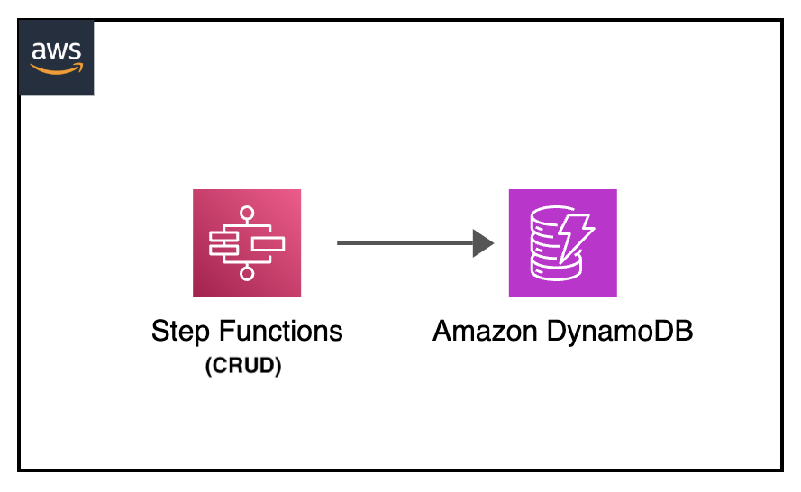

[](https://img.shields.io/badge/Python-3.10-green)
[](https://img.shields.io/badge/AWS-Step%20Functions-orange)
[](https://img.shields.io/badge/Language-ASL-blue)
[](https://img.shields.io/badge/AWS-Lambda-yellow)
[](https://img.shields.io/badge/AWS-SQS-green)
[](https://img.shields.io/badge/Test-Pytest-red)
[](https://img.shields.io/badge/Test-Local-red)

# AWS Step Functions: DynamoDB CRUD Operations with PyTest

## Introduction

This project demonstrates how to test AWS Step Functions state machines that perform DynamoDB CRUD operations locally using PyTest. It uses Docker containers to emulate both Step Functions and DynamoDB services, providing comprehensive testing of Create, Read, Update, Delete, and Initialize operations.

The containers are started manually before running the tests, giving you full control over the testing environment and allowing for easier debugging and inspection of the services.

---

## Contents

- [AWS Step Functions: DynamoDB CRUD Operations with PyTest](#aws-step-functions-dynamodb-crud-operations-with-pytest)
  - [Introduction](#introduction)
  - [Contents](#contents)
  - [Architecture Overview](#architecture-overview)
  - [Project Structure](#project-structure)
  - [Prerequisites](#prerequisites)
  - [Test Scenarios](#test-scenarios)
  - [About the Test Process](#about-the-test-process)
  - [Testing Workflows](#testing-workflows)
  - [Additional Resources](#additional-resources)

---

## Architecture Overview

<p align="center">
  
</p>

Components:

- Step Functions state machine for CRUD orchestration
- DynamoDB Local container for data persistence
- Choice state for operation routing
- PyTest fixtures for container lifecycle management

<p align="center">
  
</p>

---

## Project Structure

```
├── img/dynamodb-crud-stepfunctions.png             _# visual architecture diagram_
├── tests/
│   ├── unit/src/test_step_functions_local.py       _# python PyTest test definition_
│   └── requirements.txt                            _# pip requirements dependencies file_
├── aws-stepfunctions-local-credentials.txt         _# Step Functions Docker image environment vars_
├── README.md                                       _# instructions file_
└── state-machine.json                              _# json file containing DynamoDB CRUD state machine definition_
```

---

## Prerequisites

- Docker
- AWS CLI v2 (for debugging)
- Python 3.10 or newer
- Basic understanding of DynamoDB and Step Functions

---

## Test Scenarios

### 1. DynamoDB Table Initialization

- Tests the table creation operation through Step Functions
- Validates successful table creation using AWS SDK DynamoDB createTable
- Verifies that the DynamoDB Init state is properly executed
- Used to set up the table structure before CRUD operations

### 2. DynamoDB Create Operation

- Tests item creation in the DynamoDB table
- Validates putItem operation through Step Functions DynamoDB integration
- Verifies that items are successfully stored with correct attributes
- Ensures the Choice state correctly routes to DynamoDB Create state

### 3. DynamoDB Read Operation

- Tests item retrieval from the DynamoDB table
- Validates getItem operation with proper key specification
- Verifies successful data retrieval and response structure
- Tests retry logic for DynamoDB exceptions

### 4. DynamoDB Update Operation

- Tests item modification in the DynamoDB table
- Validates updateItem operation with expression attributes
- Verifies successful attribute updates (Name and Age fields)
- Ensures proper handling of UpdateExpression and ExpressionAttributeNames

### 5. DynamoDB Delete Operation

- Tests item removal from the DynamoDB table
- Validates deleteItem operation through Step Functions
- Verifies successful item deletion with proper key specification
- Confirms clean removal without errors

### 6. Complete CRUD Workflow Integration

- Tests the full workflow: Init → Create → Read → Update → Read → Delete
- Validates end-to-end functionality with real DynamoDB operations
- Verifies data consistency across all operations
- Demonstrates comprehensive testing of the entire workflow

### 7. Choice State Logic Validation

- Tests the Choice state routing mechanism
- Validates that different Operation values route to correct states
- Verifies all possible operation paths (Create, Read, Update, Delete, Init)
- Ensures proper state machine flow control

---

## About the Test Process

The test process leverages PyTest fixtures to connect to pre-existing DynamoDB Local and Step Functions Local containers:

1. **Service Verification**: The `dynamodb_container` and `sfn_container` fixtures verify that both services are running on their expected ports (8000 for DynamoDB, 8083 for Step Functions). Tests are skipped if services are not available.

2. **Client Creation**: The `dynamodb_client` and `sfn_client` fixtures create Boto3 clients for both services and create the state machine using the definition from `state-machine.json`.

3. **State Machine Creation**: The state machine is created with the real CRUD operations definition, including Choice state logic and DynamoDB integrations. If the state machine already exists, it reuses the existing one.

4. **Test Execution**: When tests run, they call `execute_stepfunction` with different operation types (Init, Create, Read, Update, Delete) and monitor execution until completion.

5. **Validation**: Each test verifies that:
   - The execution completed with the expected status
   - The correct DynamoDB operation state was executed
   - Choice state routing worked properly
   - DynamoDB operations completed successfully
   - Data consistency is maintained across operations

6. **External Container Management**: Unlike other testing approaches, the Docker containers are managed externally. You must start the containers before running tests and stop them manually afterward.

**Important**: The tests assume that both DynamoDB Local (port 8000) and Step Functions Local (port 8083) are already running. If either service is unavailable, the tests will be skipped with appropriate messages.

---

## Testing Workflows

### Setup Docker Environment

> Make sure Docker engine is running before running the tests.

```shell
dynamodb-crud-stepfunctions-local$ docker version
Client: Docker Engine - Community
 Version:           24.0.6
 API version:       1.43
(...)
```

### Start Required Services

Before running the tests, you need to start both DynamoDB Local and Step Functions Local containers:

#### Start DynamoDB Local

```shell
dynamodb-crud-stepfunctions-local$
docker run -d --network host                \
    --name dynamodb -p 8000:8000            \
    amazon/dynamodb-local -jar DynamoDBLocal.jar -sharedDb
```

#### Start Step Functions Local

```shell
dynamodb-crud-stepfunctions-local$
docker run -d --network host                \
    --name stepfunctions -p 8083:8083       \
    --env-file aws-stepfunctions-local-credentials.txt \
    amazon/aws-stepfunctions-local
```

> Verify both containers are running:

```shell
dynamodb-crud-stepfunctions-local$
docker ps --filter "name=dynamodb" --filter "name=stepfunctions"
```

### Run the Unit Tests - End to end python test

> Set up the python environment

```shell
dynamodb-crud-stepfunctions-local$ cd tests
export AWS_ACCESS_KEY_ID='DUMMYIDEXAMPLE'
export AWS_SECRET_ACCESS_KEY='DUMMYEXAMPLEKEY'
export AWS_DEFAULT_REGION='us-east-1'
python3 -m venv venv
source venv/bin/activate
pip install --upgrade pip
pip install -r requirements.txt
```

> Verify services are running (optional)

```shell
# Test DynamoDB Local
dynamodb-crud-stepfunctions-local/tests$
aws dynamodb list-tables --endpoint-url http://127.0.0.1:8000

# Test Step Functions Local  
dynamodb-crud-stepfunctions-local/tests$
aws stepfunctions list-state-machines --endpoint-url http://127.0.0.1:8083
```

#### Run the unit tests

```shell
dynamodb-crud-stepfunctions-local/tests$
python3 -m pytest -s unit/src/test_step_functions_local.py
```

Expected output:

```shell
dynamodb-crud-stepfunctions-local/tests$ ython3 -m pytest -s unit/src/test_step_functions_local.py
 ============================================================== test session starts ==============================================================
platform linux -- Python 3.10.12, pytest-8.4.1, pluggy-1.6.0
rootdir: /home/ubuntu/environment/python-test-samples/dynamodb-crud-stepfunctions-local/tests
plugins: xdist-3.6.0, timeout-2.3.1
collected 7 items                                                                                                                                            

unit/src/test_step_functions_local.py Step Functions Local is running on port 8083
Current test file directory: /home/ubuntu/environment/python-test-samples/dynamodb-crud-stepfunctions-local/tests/u it/src
Found project root: /home/ubuntu/environment/python-test-samples/dynamodb-crud-stepfunctions-local
Created state machine: arn:aws:states:us-east-1:123456789012:stateMachine:CRUDDynamoDB
DynamoDB Local is running on port 8000
DynamoDB client created for endpoint: http://127.0.0.1:8000
Both Step Functions and DynamoDB services are responding correctly
DynamoDB Init response: {'Status': 'FAILED', 'Operation': 'Init', 'TableName': 'CRUDStepFunctions'}
Note: Init operation failed - this may be expected if table already exists
.DynamoDB Create response: {'Status': 'SUCCEEDED', 'Operation': 'Create', 'ItemId': 'test-item-123', 'ItemName': 'TestUser'}
.Item retrieved: {'Id': {'S': 'test-item-123'}, 'Name': {'S': 'TestUser'}}
DynamoDB Read response: {'Status': 'SUCCEEDED', 'Operation': 'Read', 'ItemId': 'test-item-123', 'ItemFound': True}
.DynamoDB Update response: {'Status': 'SUCCEEDED', 'Operation': 'Update', 'ItemId': 'test-item-123', 'ItemName': 'UpdatedTestUser', 'ItemAge': '30'}
.DynamoDB Delete response: {'Status': 'SUCCEEDED', 'Operation': 'Delete', 'ItemId': 'test-item-123'}
.Init operation failed - table may already exist, continuing with workflow
Complete CRUD workflow integration test passed
Operations completed: Init -> Create -> Read -> Update -> Read -> Delete
All CRUD operations (except possibly Init) completed successfully
.Choice state correctly handled 'Create' -> Status: SUCCEEDED
Choice state correctly handled 'Read' -> Status: SUCCEEDED
Choice state correctly handled 'Update' -> Status: SUCCEEDED
Choice state correctly handled 'Delete' -> Status: SUCCEEDED
Choice state correctly handled 'Init' -> Status: SUCCEEDED
Choice state logic validation completed successfully
All 5 operations were correctly processed by the Choice state
Note: Choice state routing validated - operation success depends on table state and data
.

 ============================================================== 7 passed in 18.64s ==============================================================
```

#### Clean up section

> clean pyenv environment

```sh
dynamodb-crud-stepfunctions-local/tests$
deactivate
rm -rf venv/
```

> unsetting variables

```sh
dynamodb-crud-stepfunctions-local/tests$
unset AWS_ACCESS_KEY_ID
unset AWS_SECRET_ACCESS_KEY
unset AWS_DEFAULT_REGION
```

> stop and clean docker containers

```sh
dynamodb-crud-stepfunctions-local/tests$
# Stop the containers
docker stop dynamodb stepfunctions

# Remove the containers (optional)
docker rm dynamodb stepfunctions

# Remove the images (optional)
docker rmi amazon/dynamodb-local
docker rmi amazon/aws-stepfunctions-local
```

#### Debug - PyTest Debugging

For more detailed debugging in pytest:

```sh
dynamodb-crud-stepfunctions-local/tests$
# Run with verbose output
python -m pytest -s -v unit/src/test_step_functions_local.py

# Run with debug logging
python -m pytest -s -v unit/src/test_step_functions_local.py --log-cli-level=DEBUG

# List available individual test
python3 -m pytest unit/src/test_step_functions_local.py --collect-only

# Run a specific pytest test
python -m pytest -s -v unit/src/test_step_functions_local.py::test_dynamodb_table_initialization
```

---

### Fast local development for Step Functions

#### AWS CLI Commands for Manual Verification

If you need to manually verify the state machine or execution details, you can use these commands:

Note: Unlike other samples in this repository, these commands should be run from the project root directory `dynamodb-crud-stepfunctions-local`, not from within the `/tests` directory. This allows direct file paths without having to use "../" references.

#### Configure environment variables

```sh
dynamodb-crud-stepfunctions-local$
export AWS_ACCESS_KEY_ID='DUMMYIDEXAMPLE'
export AWS_SECRET_ACCESS_KEY='DUMMYEXAMPLEKEY'
export AWS_DEFAULT_REGION='us-east-1'
```

#### Set up state machine manually

```sh
dynamodb-crud-stepfunctions-local$
# Running DynamoDB Local container
docker run -d --name dynamodb -p 8000:8000 \
    --network host \
    amazon/dynamodb-local -jar DynamoDBLocal.jar -sharedDb

dynamodb-crud-stepfunctions-local$
# Running Step Functions Local container with credentials
docker run -d --name stepfunctions -p 8083:8083 \
    --network host \
    --env-file aws-stepfunctions-local-credentials.txt \
    amazon/aws-stepfunctions-local
```

```sh
dynamodb-crud-stepfunctions-local$
# Creating DynamoDB CRUD state machine
aws stepfunctions create-state-machine \
    --endpoint-url http://127.0.0.1:8083 \
    --name "CRUDDynamoDB" \
    --role-arn "arn:aws:iam::012345678901:role/DummyRole" \
    --region us-east-1 \
    --definition file://state-machine.json
```

#### Debug state machine - aws cli debugging

```sh
dynamodb-crud-stepfunctions-local$
# Get state machine ARN
aws stepfunctions list-state-machines --endpoint-url http://127.0.0.1:8083

# Check state machine definition
aws stepfunctions describe-state-machine --endpoint-url http://127.0.0.1:8083 \
    --state-machine-arn [STATE-MACHINE-ARN]

# Execute CRUD operations:

# Initialize DynamoDB table
aws stepfunctions start-execution \
    --endpoint-url http://127.0.0.1:8083 \
    --state-machine-arn "arn:aws:states:us-east-1:123456789012:stateMachine:CRUDDynamoDB" \
    --input '{"TableName": "CRUDStepFunctions", "Operation": "Init"}'

# Create item
aws stepfunctions start-execution \
    --endpoint-url http://127.0.0.1:8083 \
    --state-machine-arn "arn:aws:states:us-east-1:123456789012:stateMachine:CRUDDynamoDB" \
    --input '{"TableName": "CRUDStepFunctions", "Operation": "Create", "ItemId": "125", "ItemName": "RobinOriginal"}'

# Read item
aws stepfunctions start-execution \
    --endpoint-url http://127.0.0.1:8083 \
    --state-machine-arn "arn:aws:states:us-east-1:123456789012:stateMachine:CRUDDynamoDB" \
    --input '{"TableName": "CRUDStepFunctions", "Operation": "Read", "ItemId": "125"}'

# Update item
aws stepfunctions start-execution \
    --endpoint-url http://127.0.0.1:8083 \
    --state-machine-arn "arn:aws:states:us-east-1:123456789012:stateMachine:CRUDDynamoDB" \
    --input '{"TableName": "CRUDStepFunctions", "Operation": "Update", "ItemId": "125", "ItemName": "RobinNew", "ItemAge": "56"}'

# Delete item
aws stepfunctions start-execution \
    --endpoint-url http://127.0.0.1:8083 \
    --state-machine-arn "arn:aws:states:us-east-1:123456789012:stateMachine:CRUDDynamoDB" \
    --input '{"TableName": "CRUDStepFunctions", "Operation": "Delete", "ItemId": "125"}'

# Check execution details
aws stepfunctions describe-execution --endpoint-url http://127.0.0.1:8083 \
    --execution-arn [STATE-MACHINE-EXECUTION-ARN]

# Check execution history
aws stepfunctions get-execution-history --endpoint-url http://127.0.0.1:8083 \
    --execution-arn [STATE-MACHINE-EXECUTION-ARN]

# Debug DynamoDB operations directly
aws dynamodb list-tables --endpoint-url http://127.0.0.1:8000

# Check table contents
aws dynamodb scan --endpoint-url http://127.0.0.1:8000 \
    --table-name CRUDStepFunctions

# Check docker logs for debugging
docker logs dynamodb
docker logs stepfunctions
```

---

## Additional Resources

- [Step Functions Local Guide](https://docs.aws.amazon.com/step-functions/latest/dg/sfn-local.html)
- [DynamoDB Local Documentation](https://docs.aws.amazon.com/amazondynamodb/latest/developerguide/DynamoDBLocal.html)
- [Step Functions DynamoDB Integration](https://docs.aws.amazon.com/step-functions/latest/dg/connect-dynamodb.html)
- [DynamoDB CRUD Operations](https://docs.aws.amazon.com/amazondynamodb/latest/developerguide/WorkingWithItems.html)
- [Amazon States Language Documentation](https://docs.aws.amazon.com/step-functions/latest/dg/concepts-amazon-states-language.html)
- [AWS Step Functions Developer Guide](https://docs.aws.amazon.com/step-functions/latest/dg/welcome.html)
- [PyTest Documentation](https://docs.pytest.org/)
- [Testcontainers Python Documentation](https://testcontainers-python.readthedocs.io/en/latest/)

[Top](#contents)