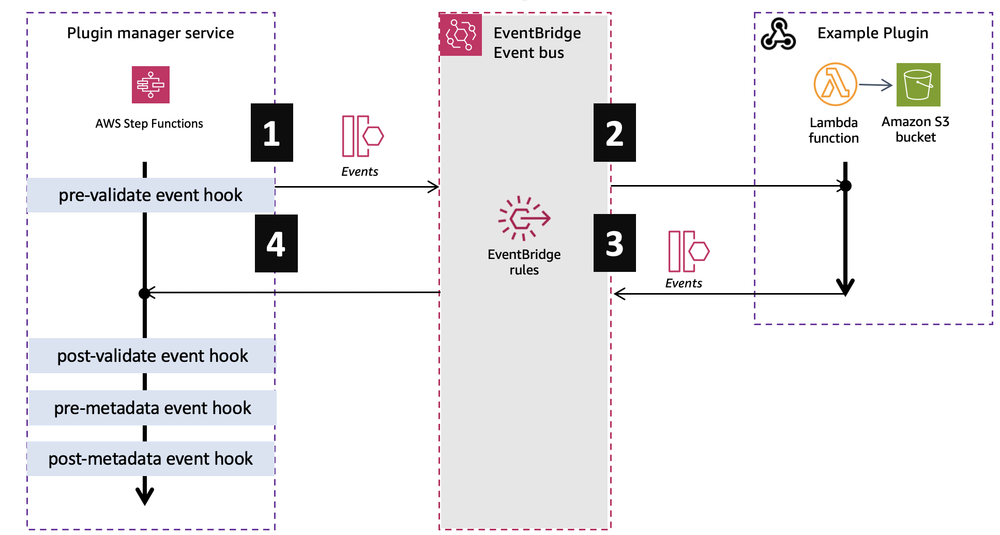
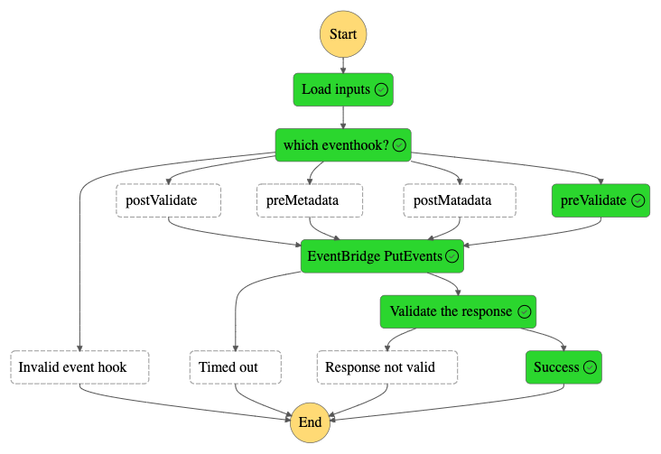

# Integrated Application Test Kit Project

## Introduction

This sample demonstrates how you can use the [AWS Integrated Application Test Kit (IATK)](https://awslabs.github.io/aws-iatk/) to develop integration tests for your serverless and event-driven applications. It can help you locate test resources hosted on the cloud, attach and monitor test harnesses within SLAs, extract tracing data for your test executions, and more.

Read more on the [Introducing the AWS Integrated Application Test Kit (IATK)](https://aws.amazon.com/blogs/compute/aws-integrated-application-test-kit/) blog post.

## Contents

* [Introduction](#introduction)
* [Contents](#contents)
* [Key Files](#key-files)
* [Sample project description](#sample-project-description)
* [Run the integration tests](#run-the-integration-tests)
  * [Build and deploy the plugin tester](#build-and-deploy-the-plugin-tester)
  * [Run the prevalidate integration tests](#run-the-prevalidate-integration-tests)
  * [Run the postvalidate integration tests](#run-the-postvalidate-integration-tests)
  * [Clean up](#clean-up)

## Key Files

* Prevalidate Plugin Sample
  * [app.js](./plugins/1-prevalidate-plugins/test-prevalidate-plugin/functions/app.js)
  * [tester.js](./plugins/1-prevalidate-plugins/test-prevalidate-plugin/tests/tester.js)
* Postvalidate Plugin Sample with the Integrated Application Test Kit
  * [app.py](./plugins/2-postvalidate-plugins/python-minimal-plugin/functions/app.py)
  * [test_by_polling.py](./plugins/2-postvalidate-plugins/python-minimal-plugin/tests/integration/test_by_polling.py)
  * [test_by_waiting.py](./plugins/2-postvalidate-plugins/python-minimal-plugin/tests/integration/test_by_waiting.py)
  * [test_by_polling_with_registry.py](./plugins/2-postvalidate-plugins/python-minimal-plugin/tests/integration/app.py)

## Sample project description

This sample is built around the idea of a Video Plugin application where users might upload video streams to the platform. Lifecycle events are triggered as the videos are processed. Plugins can react to the events to perform work on the video or video metadata.



The system includes a [plugin tester](./plugins/plugin_tester/), which is an AWS Step Functions workflow that acts as the video platform - emitting lifecycle events with the expected structure and sequence. [The sample tests](./plugins/2-postvalidate-plugins/python-minimal-plugin/tests/) integrate with the plugin tester to exercise plugin functionality.



## Run the integration tests

### Build and Deploy the plugin tester

Before you run the integration tests, deploy the [plugin tester](./plugins/plugin_tester/).

```bash
cd ./plugins/plugin_tester && sam build --use-container
cd ./plugins/plugin_tester && sam deploy --no-confirm-changeset --no-fail-on-empty-changeset
```

### Run the prevalidate integration tests

This example shows how you might write tests without the use of the IATK.

The prevalidate plugin is a sample plugin that acts on the [prevalidate event](./events/1-prevalidate-event.md) emitted by the platform. 

The integration tests use the AWS SDK to query the Amazon CloudFormation API directly and poll the plugin tester workflow.

Deploy the [test-prevalidate-plugin](./plugins/1-prevalidate-plugins/test-prevalidate-plugin/)

```bash
cd ./plugins/1-prevalidate-plugins/test-prevalidate-plugin && sam build --use-container
cd ./plugins/1-prevalidate-plugins/test-prevalidate-plugin && sam deploy --no-confirm-changeset --no-fail-on-empty-changeset
```

Run the [test-prevalidate-plugin](./plugins/1-prevalidate-plugins/test-prevalidate-plugin/) integration tests

Replace the `AWS_REGION` parameter with the region you deployed to.

```bash
cd ./plugins/1-prevalidate-plugins/test-prevalidate-plugin && npm install
cd ./plugins/1-prevalidate-plugins/test-prevalidate-plugin && PLUGIN_TESTER_STACK_NAME=video-plugin-tester AWS_REGION=us-west-2 npm test
```

### Run the postvalidate integration tests

In contrast to the previous test example, these tests show how the IATK simplifies some common testing tasks.

The postvalidate plugin is a sample plugin that acts on the [postvalidate event](./events/2-postvalidate-event.md) emitted by the platform. 

These integration tests use the Integrated Application Test Kit to find cloud-hosted resources and listen for activity.

Deploy the [python-minimal-plugin](./plugins/2-postvalidate-plugins/python-minimal-plugin/)

```bash
cd ./plugins/2-postvalidate-plugins/python-minimal-plugin && sam build --use-container
cd ./plugins/2-postvalidate-plugins/python-minimal-plugin && sam deploy --no-confirm-changeset --no-fail-on-empty-changeset
```

Run the [python-minimal-plugin](./plugins/2-postvalidate-plugins/python-minimal-plugin/) integration tests

Replace the `AWS_REGION` parameter with the region you deployed to.

```bash
cd ./plugins/2-postvalidate-plugins/python-minimal-plugin/tests/integration
PLUGIN_TESTER_STACK_NAME=video-plugin-tester AWS_REGION=us-west-2 python3 -m unittest ./test_by_polling.py
PLUGIN_TESTER_STACK_NAME=video-plugin-tester AWS_REGION=us-west-2 python3 -m unittest ./test_by_waiting.py
PLUGIN_TESTER_STACK_NAME=video-plugin-tester AWS_REGION=us-west-2 python3 -m unittest ./test_by_polling_with_registry.py
PLUGIN_TESTER_STACK_NAME=video-plugin-tester AWS_REGION=us-west-2 python3 -m unittest ./test_trace.py
```

### Clean up

Delete the [python-minimal-plugin](./plugins/2-postvalidate-plugins/python-minimal-plugin/)

```bash
cd ./plugins/2-postvalidate-plugins/python-minimal-plugin && sam delete
```

Delete the [test-prevalidate-plugin](./plugins/1-prevalidate-plugins/test-prevalidate-plugin/)

```bash
cd ./plugins/1-prevalidate-plugins/test-prevalidate-plugin && sam delete
```

Delete the [plugin tester](./plugins/plugin_tester/)

```bash
cd ./plugins/plugin_tester && sam delete
```

To learn more about testing serverless applications go to [serverlessland.com/testing](https://serverlessland.com/testing).
