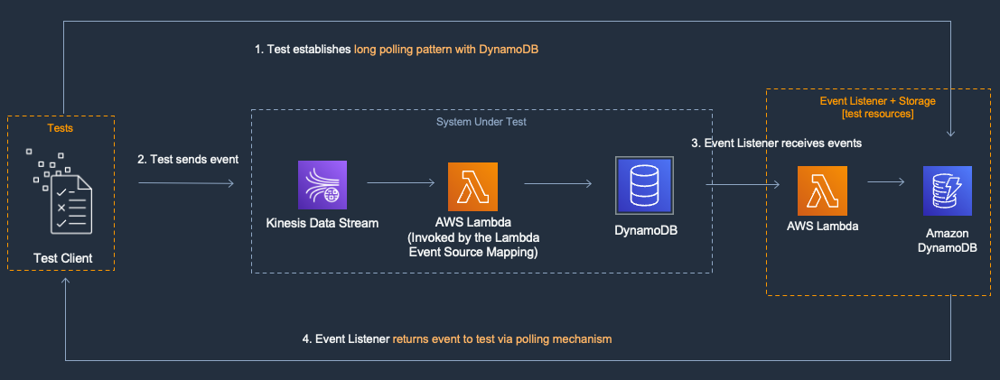

[](https://img.shields.io/badge/Python-3.9-green)
[](https://img.shields.io/badge/AWS-DynamoDB-blueviolet)
[](https://img.shields.io/badge/AWS-Kinesis-orange)
[](https://img.shields.io/badge/Test-Unit-blue)
[](https://img.shields.io/badge/Test-Integration-yellow)

# Python: Amazon Kinesis, AWS Lambda, Amazon DynamoDB Example

## Introduction
This project contains an example of testing a small data processing system that processes records from an Amazon Kinesis Data Stream and stores the processed records in an Amazon DynamoDB table. 

The project uses the [AWS Serverless Application Model](https://docs.aws.amazon.com/serverless-application-model/latest/developerguide/what-is-sam.html) (SAM) CLI for configuration, testing and deployment. 

---

## Contents
- [Python: Amazon Kinesis, AWS Lambda, Amazon DynamoDB Example](#python-amazon-kinesis-aws-lambda-amazon-dynamodb-example)
  - [Introduction](#introduction)
  - [Contents](#contents)
  - [About this Pattern](#about-this-pattern)
  - [Key Files in the Project](#key-files-in-the-project)
  - [Sample project description](#sample-project-description)
  - [Run the Unit Test](#run-the-unit-test)
  - [Integration Test](#run-the-integration-test)
---

## Key Files in the Project
  - [app.py](src/app.py) - Lambda handler code to test
  - [template.yaml](template.yaml) - SAM script for deployment
  - [mock_test.py](tests/unit/mock_test.py) - Unit test using mocks
  - [test_kinesis.py](tests/integration/test_kinesis.py) - Integration tests on a live stack
  
[Top](#contents)

---

## About this Pattern

### System Under Test (SUT)

The SUT is a streaming data processing system. A Lambda function has an Event Source Mapping to a Kinesis Data Stream. The Lambda Event Source Mapping (ESM) polls the Kinesis Data Stream and then synchronously invokes the Lambda function with a batch of messages. The Lambda function processes batches of messages and writes results to a DynamoDB Table.


### Goal

The goal of this example is to show how to test Lambda functions that are part of a streaming data processing application. In streaming workloads, the number of messages that are sent to Lambda in a batch can change with the rate of messages being published to the stream, so we show testing with different sized batches.

### Description

In this pattern you will deploy a streaming workload where a Lambda function is triggered by messages in a Kinesis Data Stream. This project demonstrates several techniques for executing tests including running Lambda function locally with a simulated payload as well integration tests in the cloud.


[Top](#contents)
---

## About this Example

This example contains an [Amazon Kinesis Data Stream](https://aws.amazon.com/kinesis/data-streams/), [AWS Lambda](https://aws.amazon.com/lambda/) and [Amazon DynamoDB](https://aws.amazon.com/dynamodb/) table core resources.

The Amazon Kinesis Data Stream can stream and data but the AWS Lambda function in this example expects Kinesis Stream Event data to contain a JSON object with 2 properties, `batch` and `id`:

```json
{
    "batch": "string",
    "id": "string"
}
```

 - `batch`: should be unique identifier that represents batch of test records that should all be processed before test is considered completed. Each record in the test batch should have a matching `batch` property value
 - `id`: unique identifier for each individual record. Each records should have a unique `id` property value

The AWS Lambda function processes records by writing them in batches into the DynamoDB table. The DynamoDB table item is a JSON object with format:

```json
{
    "PK": "string",
    "SK": "string"
}
```

The AWS Lambda function converts the incoming event data into the processed record JSON, setting the `PK` (DDB Partition Key) to be the value of `batch` event record property and `SK` (DDB Sort Key) to be the value of `id` event record propert.

[Top](#contents)
---

## Unit Test

### Unit Test description

This example contains a sample event with pre-generated records but we can also use the SAM CLI to generate a test event that matches the shape of the event that will be received by a Lambda functions subscribed to a Kinesis Data Stream. Another option to get test events is to log them, when logging is set to debug, in the Lambda function. This allows you to capture real world messages to use for testing, just ensure that they don’t contain any sensitive data.

When you configure the Lambda ESM for Kinesis you specify a batch size. This batch size functions as a maximum batch size. Your Lambda function may still be invoked with batches smaller than this, but not larger. Create a test events that contain a single message, your expected average message batch, and your max batch size. If the size of the individual records varies by a large amount you should also create some test payloads that have batches of larger records.


### Run the Unit Test

[mock_test.py](tests/unit/mock_test.py)

In the [unit test](tests/unit/mock_test.py), all references and calls to the DynamoDB service are mocked using aws-sdk-client-mock client.
To run the unit tests
``` shell
# Create and Activate a Python Virtual Environment
# One-time setup
kinesis-lambda-dynamodb$ pip3 install virtualenv
kinesis-lambda-dynamodb$ python3 -m venv venv
kinesis-lambda-dynamodb$ source ./venv/bin/activate

# install dependencies
kinesis-lambda-dynamodb$ pip3 install -r tests/requirements.txt --use-pep517

# run unit tests with mocks
kinesis-lambda-dynamodb$ python3 -m pytest -s tests/unit  -v

```

[Top](#contents)

---

## Integration Test

### Integration Test description

In order to run integration tests in the cloud we will use an event listener pattern to capture the items processed in the SUT. While we could just look directly at the DynamoDB table in the SUT, using a second table allows us to capture timings and other metadata, it also makes this pattern more re-usable across different types of streaming applications. This event listener should only be deployed in non-production environments for the purposes of testing. In Step 1 in the diagram below the test establishes a long polling pattern with DynamoDB. In Step 2, the test uses the Kinesis Data Streams APIs to send messages into the SUT. The streaming application processes those messages and in Step 3 the Event Listener Lambda function receives the messages and writes them to the Event Listener DynamoDB table. The test receives the results via the long polling mechanism and examines the results.



### Run the Integration Tests
[test_kinesis.py](tests/integration/test_kinesis.py) 

For integration tests, deploy the full stack before testing:
```shell
kinesis-lambda-dynamodb$ sam build
kinesis-lambda-dynamodb$ sam deploy --guided
```

The [integration tests](tests/integration/test_kinesis.py) needs to be provided a single environment variable `AWS_SAM_STACK_NAME` - the AWS CloudFormation Stack name of the stack that was deployed using the `sam deploy` command.

Set up the environment variables, replacing the `<PLACEHOLDERS>` with your values:

```shell
# Set the environment variables AWS_SAM_STACK_NAME and (optionally)AWS_DEFAULT_REGION 
# to match the name of the stack and the region where you will test

kinesis-lambda-dynamodb$  AWS_SAM_STACK_NAME=<stack-name> AWS_DEFAULT_REGION=<region_name> python -m pytest -s tests/integration -v
```

[Top](#contents)

---