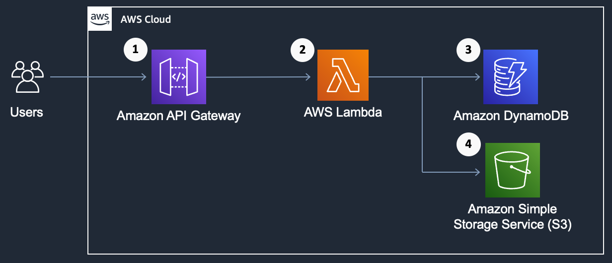
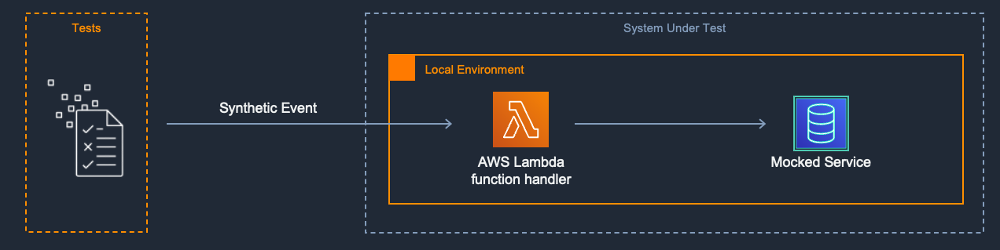

[](https://img.shields.io/badge/Python-3.9-green)
[](https://img.shields.io/badge/AWS-DynamoDB-blueviolet)
[](https://img.shields.io/badge/AWS-AWS-S3-green)
[](https://img.shields.io/badge/Test-Unit-blue)

# Test AWS Lambda function handlers locally using mocks

## Introduction

The project consists of an [Amazon API Gateway](https://aws.amazon.com/api-gateway/), an [AWS Lambda function](https://aws.amazon.com/lambda/), an [Amazon DynamoDB](https://aws.amazon.com/dynamodb/) table, and an [Amazon Simple Storage Service (S3)](https://aws.amazon.com/s3/) bucket. Although this project can be deployed, the focus of the code is to demonstrate local unit testing approaches using Python and mocking. This project demonstrates testing locally an AWS Lambda function handler replacing remote API calls with mocks. The Lambda function has optimizations for cold starts with global initializations, which are accomodated in the unit test. 

See the blog [Unit Testing AWS Lambda with Python and Mock AWS Services](
https://aws.amazon.com/blogs/devops/unit-testing-aws-lambda-with-python-and-mock-aws-services/) for more details and narrative on this example.

---

## Contents
- [Test AWS Lambda function handlers locally using mocks](#test-aws-lambda-function-handlers-locally-using-mocks)
  - [Introduction](#introduction)
  - [Contents](#contents)
  - [System Under Test (SUT)](#system-under-test-sut)
  - [Goal](#goal)
  - [Description](#description)
  - [Key Files in the Project](#key-files-in-the-project)
  - [Prerequisites](#prerequisites)
  - [Make commands for test and deployment](#make-commands-for-test-and-deployment)
  - [Running the project](#running-the-project)
---

## System Under Test (SUT)

The SUT in this pattern is a Lambda function that makes calls to other AWS cloud services using an AWS SDK. For this example, we demonstrate a system that generates a document, written to Amazon S3, based on contents from a key-value lookup in DynamoDB.



An API Gatway path [1] triggers an AWS Lambda function [2] that retrieves a data from a DynamoDB [3] table and writes data to a object on Amazon S3 [4]. The API path contains a Document Type and a Customer ID. The Lambda function retrieves both the Document Type data and Customer ID data and combines them, writing the data to S3 and returning the object key [1]. The DynamoDB table name and the S3 bucket name are provided to the Lambda function via environment variables. 

The DynamoDB table schema is comprised of a Partition Key (PK) for looking up a given item, and a “data” field containing string contents. Document Type Items are prefixed with D#, and Customer items have a PK prefixed with C#.

[Top](#contents)

---

## Goal

This pattern is intended to enable rapid development and testing of a Lambda function that makes calls to other AWS services. Testing occurs on a local desktop environment and does not affect cloud resources. This pattern speeds development by eliminating the need to perform a build and deploy of the Lambda function to the cloud between modifications of test or function code. This pattern eliminates the need to access cloud resources to conduct tests. Mock tests are also useful for testing failure conditions within your code, especially when mocking third party services beyond your control.

[Top](#contents)

---

## Description

In this pattern, you develop a Lambda function that makes calls to other AWS cloud services using an AWS SDK. The test first sets up mocked versions of the AWS services accessed by the Lambda function. Your tests then invoke the handler function on your local desktop, passing a synthetic event as a parameter. During the test the calls to external cloud services are handled instead by the mocked objects, returning the pre-configured results set up by the test code. 

This pattern can be used with a variety of infrastructure as code systems including SAM, Serverless Framework, CDK, CloudFormation and Terraform. This pattern uses a simple test framework, with the test harness directly calling the Lambda function handlers. No cloud resources or full ** stack emulation are required.



[Top](#contents)

---

## Key Files in the Project
 - [app.py](src/sample_lambda/app.py) - Lambda handler code to test
 - [test_sample_lambda.py](tests/unit/src/test_sample_lambda.py) - Unit test using mocks
 - [template.yaml](template.yaml) - SAM script for deployment
 - [Makefile](Makefile) - Commands for setup, test, and deployment
 

The code in this project is simplified - we’ve opted for concise snippets over fully completed or PEP8 compliant production code.

[Top](#contents)

---
## Prerequisites

* [AWS CLI](https://docs.aws.amazon.com/cli/latest/userguide/getting-started-install.html)
* [AWS Serverless Application Model (SAM) CLI](https://docs.aws.amazon.com/serverless-application-model/latest/developerguide/serverless-sam-cli-install.html)
* [Python 3.9](https://www.python.org/downloads/)
* [Make build utility](https://www.gnu.org/software/make/)

[Top](#contents)

---

## Make commands for test and deployment

The project Makefile contains helper commands for working with the project:
* ```make install```: Create a Python Virtual Envionment and install dependencies
* ```make test```: Run a unit test, guarding for socket connections
* ```make coverage```: Run unit tests and provide a coverage report
* ```make deploy```: Deploy the stack to an AWS Account
* ```make deploy.g```: Deploy the stack to an AWS Account, prompting for stack parameters
* ```make delete```: Remove the stack from AWS Account.  Note you will need to manually delete all the files in the S3 bucket to fully remove the stack.

[Top](#contents)

---

## Running the project

* First, create the Python Virtual Environment by using the ```make install``` command.
* Run the unit tests with the ```make test``` command.
* To (optionally) deploy the project, use the ```make deploy.g``` command.
* Once deployed, the DynamoDB table name will be in the "Outputs" section of the CloudFormation script.  Open the table in the AWS console, and manually add two records:

  * ```{ "PK": {"S": "C#TestCustomer"}, "data": {"S": "Testing Customer"}}```
  * ```{ "PK": {"S": "D#Welcome"}, "data": {"S": "\nHello and Welcome!\n"}}```

* To try the endpoint:
  * Find the API URL for the POST endpoint is listed as "oAPIEndpoint" the "Outputs" section of the CloudFormation script.  
  * Use ```"Welcome"``` for the ```{docType}``` parameter,
  * Use ```"TestCustomer"``` for the ```{customerId}``` parameter.  
  * You can test with a `curl` command, replacing the API Gateway endpoint in the curl request below:  
  ```curl -X POST https://{API Gateway endpoint}/Prod/SampleLambda/Welcome/TestCustomer```

[Top](#contents)
