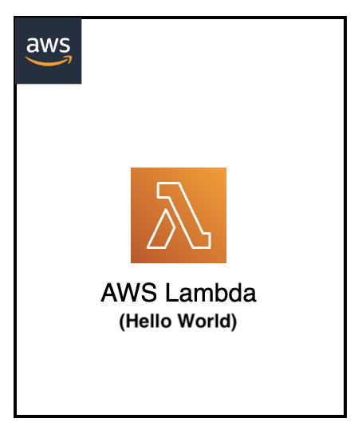

[](https://img.shields.io/badge/Python-3.9-green)
[](https://img.shields.io/badge/AWS-Lambda-orange)
[](https://img.shields.io/badge/Test-Pytest-red)
[](https://img.shields.io/badge/Test-Local-red)

# Local Testing: AWS Lambda Hello World

## Introduction

This project demonstrates how to test AWS Lambda functions locally using the SAM CLI and PyTest. It provides a comprehensive Hello World example that showcases local testing capabilities without requiring actual AWS infrastructure, including automated test execution and validation.

---

## Contents

- [Local Testing: AWS Lambda Hello World with PyTest](#local-testing-aws-lambda-hello-world-with-pytest)
  - [Introduction](#introduction)
  - [Contents](#contents)
  - [Architecture Overview](#architecture-overview)
  - [Project Structure](#project-structure)
  - [Prerequisites](#prerequisites)
  - [Test Scenarios](#test-scenarios)
  - [About the Test Process](#about-the-test-process)
  - [Testing Workflows](#testing-workflows)
  - [Common Issues](#common-issues)
  - [Additional Resources](#additional-resources)

---

## Architecture Overview

<p align="center">
  
</p>

Components:

- Python Hello World Lambda function
- SAM CLI for local Lambda emulation
- PyTest framework for automated testing
- Test events for various invocation scenarios

---

## Project Structure

```
├── events/                                     _# folder containing json files for Lambda input events_
│   ├── lambda-helloworld-event.json            _# basic Hello World event_
│   └── lambda-helloworld-custom-event.json     _# custom message event_
├── img/lambda-sam-helloworld.png               _# Architecture diagram_
├── lambda_helloworld_src/                      _# folder containing Lambda function source code_
│   └── app.py                                  _# main Lambda handler function_
├── tests/
│   ├── unit/src/test_lambda_local.py           _# python PyTest test definition_
│   └── requirements.txt                        _# pytest pip requirements dependencies file_
├── template.yaml                               _# sam yaml template file for Lambda function_
└── README.md                                   _# instructions file_
```

---

## Prerequisites

- AWS SAM CLI
- Docker
- Python 3.9 or newer
- AWS CLI v2 (for debugging)
- Basic understanding of AWS Lambda
- Basic understanding of PyTest framework

---

## Test Scenarios

### 1. Basic Hello World

- Tests the basic Lambda function invocation
- Validates the default "Hello World!" message response
- Verifies correct HTTP status code (200)
- Used to validate the basic functionality of the Lambda function

### 2. Custom Message Handling

- Tests the Lambda function with custom input parameters
- Validates that the function can process and return custom messages
- Verifies proper input parameter handling and response formatting

### 3. Error Handling

- Tests the Lambda function's behavior with invalid or missing input
- Validates error responses and proper exception handling
- Ensures graceful degradation when unexpected input is provided

---

## About the Test Process

The test process leverages PyTest fixtures to manage the lifecycle of the SAM Local Lambda emulator:

1. **SAM Local Setup**: The `lambda_container` fixture verifies that SAM Local Lambda emulator is available and running on the expected port (3001).

2. **Lambda Client Creation**: The `lambda_client` fixture creates a Boto3 Lambda client configured to connect to the local SAM emulator endpoint.

3. **Test Execution**: Each test invokes the Lambda function using the local client with different event payloads and validates:
   - Response structure and format
   - Status codes
   - Response body content
   - Execution metadata

4. **Validation**: Tests verify that:
   - The Lambda function executes successfully
   - Response contains expected message content
   - HTTP status codes are correct
   - Response format matches API Gateway integration format

5. **Cleanup**: After tests complete, the SAM Local process is gracefully terminated.

---

## Testing Workflows

### Setup Docker Environment

> Make sure Docker engine is running before running the tests.

```shell
lambda-sam-helloworld$ docker version
Client: Docker Engine - Community
 Version:           24.0.6
 API version:       1.43
(...)
```

### Run the Unit Test - End to end python test

> Start the SAM Local Lambda emulator in a separate terminal:

```shell
lambda-sam-helloworld$
sam local start-lambda -p 3001 &
```

> Set up the python environment:

```shell
lambda-sam-helloworld$ cd tests
export AWS_ACCESS_KEY_ID='DUMMYIDEXAMPLE'
export AWS_SECRET_ACCESS_KEY='DUMMYEXAMPLEKEY'
export AWS_REGION='us-east-1'
python3 -m venv venv
source venv/bin/activate
pip install --upgrade pip
pip install -r requirements.txt
```

#### Run the Unit Tests

```shell
lambda-sam-helloworld/tests$
python3 -m pytest -s unit/src/test_lambda_local.py
```

Expected output:

```
lambda-sam-helloworld/tests$
python3 -m pytest -s unit/src/test_lambda_local.py
================================================================= test session starts =================================================================
platform linux -- Python 3.10.12, pytest-7.4.4, pluggy-1.6.0
benchmark: 4.0.0 (defaults: timer=time.perf_counter disable_gc=False min_rounds=5 min_time=0.000005 max_time=1.0 calibration_precision=10 warmup=False warmup_iterations=100000)
rootdir: /home/ubuntu/environment/serverless-test-samples_lambda_pytest_try1/python-test-samples/lambda-sam-helloworld/tests
plugins: mock-3.11.1, timeout-2.1.0, Faker-24.4.0, xdist-3.3.1, metadata-3.1.1, benchmark-4.0.0, cov-4.1.0, html-3.2.0
collected 9 items                                                                                                                                                               

unit/src/test_lambda_local.py SAM Local Lambda emulator is running on port 3001
Lambda function is responding correctly
Lambda response: {'StatusCode': 200, 'Payload': '{"statusCode": 200, "body": "{\"message\": \"Hello World! This is local Run!\"}"}'}
.Lambda response: {'StatusCode': 200, 'Message': 'Hello World! This is local Run!', 'Input_Handled': True}
.Lambda response: {'StatusCode': 200, 'Scenarios_Tested': 6, 'All_Handled_Gracefully': True}
.Lambda response format validation passed - matches API Gateway integration format
.Performance metrics:
  Cold start: 403ms
  Warm start average: 423ms
  Performance improvement: False
Performance test completed: avg=416ms, min=403ms, max=424ms
.Concurrent invocations test passed
Results: Success_Rate=100.0%, Avg_Execution_Time=1328ms, Successful=5/5
.Response metadata available: ['HTTPStatusCode', 'HTTPHeaders', 'RetryAttempts']
Resource usage test passed - payload size: 81 bytes, response efficiency validated
.Edge cases test passed - 5 scenarios handled gracefully
.JSON serialization test passed - proper JSON handling validated
.
================================================================= 9 passed in 12.83s ===================================================================

```
#### Clean up section

> clean pyenv environment

```sh
lambda-sam-helloworld/tests$
deactivate
rm -rf venv/
```

> unsetting variables

```sh
unset AWS_ACCESS_KEY_ID
unset AWS_SECRET_ACCESS_KEY
unset AWS_REGION
```

> cleaning sam process

```sh
ps -axuf | grep '[s]am local start-lambda' | awk '{print $2}' | xargs -r kill
```

#### Debug - PyTest Debugging

For more detailed debugging in pytest:

```sh
# Run with verbose output
python3 -m pytest -s -v unit/src/test_lambda_local.py

# Run with debug logging
python3 -m pytest -s -v unit/src/test_lambda_local.py --log-cli-level=DEBUG

# Run a specific pytest test
python3 -m pytest -s -v unit/src/test_lambda_local.py::test_lambda_basic_hello_world
```

---

### Fast local development for Lambda Functions

#### AWS CLI Commands for Manual Verification

If you need to manually verify the Lambda function execution, you can use these commands:

#### Configure environment variables

```sh
lambda-sam-helloworld$
export AWS_ACCESS_KEY_ID='DUMMYIDEXAMPLE'
export AWS_SECRET_ACCESS_KEY='DUMMYEXAMPLEKEY'
export AWS_REGION='us-east-1'
```

#### Start Lambda emulator

```sh
lambda-sam-helloworld$
sam local start-lambda -p 3001 &
```

#### Debug lambda functions - Manual Lambda Testing

```sh
# Test Basic Hello World
lambda-sam-helloworld$
aws lambda invoke \
    --function-name LambdaHelloWorld \
    --endpoint-url http://127.0.0.1:3001 \
    --payload fileb://events/lambda-helloworld-event.json \
    output.txt
cat output.txt

# Test Custom Message
lambda-sam-helloworld$
aws lambda invoke \
    --function-name LambdaHelloWorld \
    --endpoint-url http://127.0.0.1:3001 \
    --payload fileb://events/lambda-helloworld-custom-event.json \
    output.txt
cat output.txt
```

#### Direct SAM Local Invoke

```sh
# Basic invocation
sam local invoke LambdaHelloWorld \
    --event events/lambda-helloworld-event.json

# Custom message invocation
sam local invoke LambdaHelloWorld \
    --event events/lambda-helloworld-custom-event.json

# Debug mode with container logs
sam local invoke LambdaHelloWorld \
    --event events/lambda-helloworld-event.json \
    --debug
```

---

## Common Issues

### SAM Local Connection Issues

If tests are skipped with "Lambda invocation failed, SAM might not be running properly":

- Ensure SAM Local is running on port 3001
- Check that you've started SAM with the correct template.yaml file
- Verify the Lambda function name matches the template definition
- Check SAM logs for any errors with `sam local start-lambda --debug`

### Lambda Function Import Issues

If the Lambda function fails to import or execute:

- Verify the Python runtime version matches your local environment
- Check that all required dependencies are included in the function package
- Ensure the handler path is correctly specified in template.yaml
- Review the Lambda function logs in the SAM Local output

### Port Conflicts

If SAM Local fails to start due to port conflicts:

- Check if port 3001 is already in use with `lsof -i :3001`
- Use a different port with `sam local start-lambda -p 3002`
- Update your test configuration to match the new port

### Docker Container Issues

If Docker containers fail to start or behave unexpectedly:

- Ensure Docker daemon is running and accessible
- Check Docker permissions for your user account
- Verify sufficient disk space for container images
- Try pulling the latest Lambda runtime images manually

---

## Additional Resources

- [SAM CLI Documentation](https://docs.aws.amazon.com/serverless-application-model/latest/developerguide/serverless-sam-cli-command-reference.html)
- [AWS Lambda Developer Guide](https://docs.aws.amazon.com/lambda/latest/dg/welcome.html)
- [SAM Local Lambda Testing Guide](https://docs.aws.amazon.com/serverless-application-model/latest/developerguide/serverless-sam-cli-using-invoke.html)
- [PyTest Documentation](https://docs.pytest.org/)
- [AWS Lambda Python Runtime](https://docs.aws.amazon.com/lambda/latest/dg/lambda-python.html)
- [SAM Template Specification](https://docs.aws.amazon.com/serverless-application-model/latest/developerguide/sam-specification.html)

[Top](#contents)