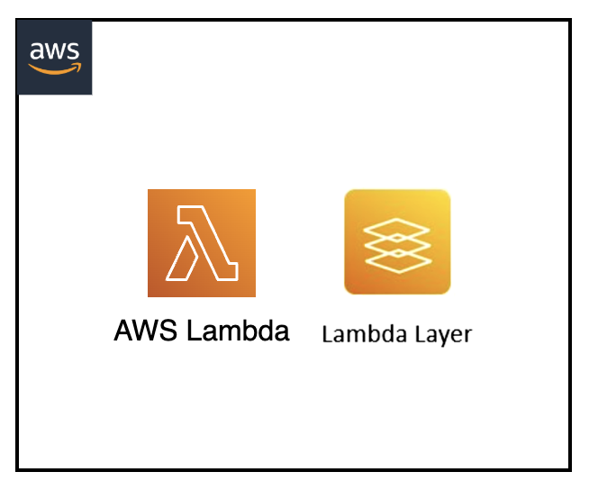

[](https://img.shields.io/badge/Python-3.9-green)
[](https://img.shields.io/badge/AWS-Lambda-orange)
[](https://img.shields.io/badge/AWS-Lambda%20Layers-yellow)
[](https://img.shields.io/badge/Test-Pytest-red)
[](https://img.shields.io/badge/Test-Local-red)

# Local Testing: AWS Lambda with Custom Layers and PyTest

## Introduction

This project demonstrates how to test AWS Lambda functions with custom layers locally using SAM CLI and PyTest. It showcases the complete process of building, deploying, and testing Lambda layers without requiring actual AWS infrastructure, including automated test execution and validation of layer functionality.

---

## Contents

- [Local Testing: AWS Lambda with Custom Layers and PyTest](#local-testing-aws-lambda-with-custom-layers-and-pytest)
  - [Introduction](#introduction)
  - [Contents](#contents)
  - [Architecture Overview](#architecture-overview)
  - [Project Structure](#project-structure)
  - [Prerequisites](#prerequisites)
  - [Test Scenarios](#test-scenarios)
  - [About the Test Process](#about-the-test-process)
  - [Testing Workflows](#testing-workflows)
  - [Common Issues](#common-issues)
  - [Additional Resources](#additional-resources)

---

## Architecture Overview

<p align="center">
  
</p>

Components:

- Python Lambda function with external API integration
- Custom Lambda layer containing third-party dependencies (requests library)
- SAM CLI for local building, layer management, and execution
- PyTest framework for automated testing and validation
- Test events for various layer functionality scenarios

---

## Project Structure

```
├── custom-lambda-layer/                       _# folder containing python dependencies for the layer_
│   └── requirements.txt                       _# layer dependencies specification_
├── events/                                    _# folder containing json files for Lambda Layers input events_
│   ├── lambda-layers-event.json               _# basic layer functionality event_
│   └── lambda-layers-api-event.json           _# API integration test event_
├── img/lambda-sam-layers.png                  _# Architecture diagram_
├── lambda_layers_src/                         _# folder containing Lambda function source code_
│   └── app.py                                 _# main Lambda handler function_
├── tests/
│   ├── unit/src/test_lambda_layers_local.py   _# python PyTest test definition_
│   ├── requirements.txt                       _# pytest pip requirements dependencies file_
│   └── template.yaml                          _# sam yaml template file for Lambda function and layer_
└── README.md                                  _# instructions file_
```

---

## Prerequisites

- AWS SAM CLI
- Docker
- Python 3.9 or newer
- pip package manager
- zip utilities
- AWS CLI v2 (for debugging)
- Basic understanding of AWS Lambda
- Basic understanding of Lambda Layers
- Basic understanding of PyTest framework

---

## Test Scenarios

### 1. Layer Dependency Loading

- Tests that the Lambda function can successfully import dependencies from the custom layer
- Validates that the requests library is available and functional
- Verifies the correct version of dependencies is loaded from the layer
- Used to validate basic layer functionality and dependency resolution

### 2. External API Integration

- Tests the Lambda function's ability to make HTTP requests using the layer's requests library
- Validates successful API calls to external services (GitHub API endpoints)
- Verifies proper error handling when external services are unavailable
- Ensures layer dependencies work correctly in real-world scenarios

### 3. Layer Version Compatibility

- Tests that the layer dependencies are compatible with the Lambda runtime
- Validates that no version conflicts exist between layer and runtime
- Verifies that all required dependencies are properly packaged in the layer

### 4. Performance with Layers

- Tests the Lambda function's performance when using layers
- Validates that layer loading doesn't significantly impact cold start times
- Measures memory usage with layer dependencies loaded

---

## About the Test Process

The test process leverages PyTest fixtures and SAM CLI to manage the complete lifecycle of Lambda layers and functions:

1. **Layer Building**: The `layer_build` fixture ensures the custom Lambda layer is built with all dependencies before testing begins.

2. **SAM Local Setup**: The `lambda_container` fixture verifies that SAM Local Lambda emulator is available and running with layer support enabled.

3. **Lambda Client Creation**: The `lambda_client` fixture creates a Boto3 Lambda client configured to connect to the local SAM emulator endpoint with layer-enabled functions.

4. **Test Execution**: Each test:
   - Builds the layer with required dependencies
   - Invokes the Lambda function using the local client
   - Validates layer dependency availability
   - Tests specific functionality enabled by the layer

5. **Validation**: Tests verify that:
   - Layer dependencies are correctly loaded and accessible
   - External library functionality works as expected
   - API calls using layer dependencies execute successfully
   - Response format and content match expectations
   - No import errors or dependency conflicts occur

6. **Cleanup**: After tests complete, built artifacts and containers are cleaned up.

---

## Testing Workflows

### Setup Docker Environment

> Make sure Docker engine is running before running the tests.

```shell
lambda-sam-layers$ docker version
Client: Docker Engine - Community
 Version:           24.0.6
 API version:       1.43
(...)
```

### Build Lambda Layer

> Build the custom layer with dependencies:

```shell
lambda-sam-layers$ 
cd tests
sam build LambdaLayersLayer \
    --use-container \
    --build-image amazon/aws-sam-cli-build-image-python3.9
```

Expected output:

```
Starting Build inside a container                                                                                                                                            
Building layer 'LambdaLayersLayer'                                                                                                                                           
(...)
Build Succeeded

Running PythonPipBuilder:ResolveDependencies
Running PythonPipBuilder:CopySource
```

### Run the Unit Test - End to end python test

> Start the SAM Local Lambda emulator in a separate terminal:

```shell
lambda-sam-layers/tests$
sam local start-lambda -p 3001 &
```

> Set up the python environment:

```shell
lambda-sam-layers/tests$
export AWS_ACCESS_KEY_ID='DUMMYIDEXAMPLE'
export AWS_SECRET_ACCESS_KEY='DUMMYEXAMPLEKEY'
export AWS_REGION='us-east-1'
python3 -m venv venv
source venv/bin/activate
pip install --upgrade pip
pip install -r requirements.txt
```

#### Run the Unit Tests

```shell
lambda-sam-layers/tests$
python3 -m pytest -s unit/src/test_lambda_layers_local.py
```

Expected output:

```
lambda-sam-layers/tests$
python3 -m pytest -s unit/src/test_lambda_layers_local.py
================================================================= test session starts =================================================================
platform linux -- Python 3.10.12, pytest-8.3.5, pluggy-1.6.0
benchmark: 4.0.0 (defaults: timer=time.perf_counter disable_gc=False min_rounds=5 min_time=0.000005 max_time=1.0 calibration_precision=10 warmup=False warmup_iterations=100000)
rootdir: /home/ubuntu/environment/serverless-test-samples_lambda_pytest_try1/python-test-samples/lambda-sam-layers/tests
plugins: Faker-24.4.0, parallel-0.1.1, allure-pytest-2.13.5, profiling-1.7.0, subprocess-1.5.0, metadata-3.1.1, benchmark-4.0.0, html-4.1.1, mock-3.12.0, pytest_httpserver-1.0.10, anyio-4.9.0, xdist-3.5.0, timeout-2.3.1, cov-5.0.0
collected 7 items                                                                                                                                                           

unit/src/test_lambda_layers_local.py SAM Local Lambda emulator is running on port 3001
Building Lambda layer with SAM...
Lambda layer built successfully
Lambda function with layers is responding correctly
Layer dependency loading test passed - requests library is working
Lambda response: {'StatusCode': 200, 'GitHub_API_Success': True, 'Response_Length': 2396}
.External API integration test passed
Lambda response: {'StatusCode': 200, 'GitHub_Endpoints': 33, 'Execution_Time_ms': 834}
.Layer version compatibility test passed
Lambda response: {'StatusCode': 200, 'Requests_Working': True, 'Python_Version': '3.10.12', 'Layer_Compatible': True}
.Performance analysis:
  Cold start: 852ms
  Warm start average: 854ms
  Performance improvement: False
Performance with layers test passed
Lambda response: {'StatusCode': 200, 'Avg_Execution_Time_ms': 853, 'Min_Time_ms': 848, 'Max_Time_ms': 861}
.Layer isolation and dependencies test passed
Lambda response: {'StatusCode': 200, 'Dependencies_Working': True, 'GitHub_API_Success': True}
.Error handling test 1: StatusCode=200, Body_Length=2396
Error handling test 2: StatusCode=200, Body_Length=2396
Error handling with layers test passed - Lambda handles scenarios gracefully
.Concurrent layer usage test passed
Results: Success_Rate=100.0%, Avg_Execution_Time=1976ms, Successful_Invocations=3/3
.

================================================================= 7 passed in 32.28s =================================================================
```

#### Clean up section

> clean pyenv environment

```sh
lambda-sam-layers/tests$
deactivate
rm -rf venv/
```

> unsetting variables

```sh
unset AWS_ACCESS_KEY_ID
unset AWS_SECRET_ACCESS_KEY
unset AWS_REGION
```

> cleaning sam process

```sh
ps -axuf | grep '[s]am local start-lambda' | awk '{print $2}' | xargs -r kill
```

> cleaning build artifacts

```sh
lambda-sam-layers/tests$
rm -rf .aws-sam/
```

#### Debug - PyTest Debugging

For more detailed debugging in pytest:

```sh
# Run with verbose output
python3 -m pytest -s -v unit/src/test_lambda_layers_local.py

# Run with debug logging
python3 -m pytest -s -v unit/src/test_lambda_layers_local.py --log-cli-level=DEBUG

# Run a specific pytest test
python3 -m pytest -s -v unit/src/test_lambda_layers_local.py::test_layer_dependency_loading
```

---

### Fast local development for Lambda Layers

#### AWS CLI Commands for Manual Verification

If you need to manually verify the Lambda function with layers, you can use these commands:

#### Configure environment variables

```sh
lambda-sam-layers$
export AWS_ACCESS_KEY_ID='DUMMYIDEXAMPLE'
export AWS_SECRET_ACCESS_KEY='DUMMYEXAMPLEKEY'
export AWS_REGION='us-east-1'
```

#### Build and Start Lambda emulator

```sh
# Build the layer
lambda-sam-layers$
cd tests
sam build LambdaLayersLayer \
    --use-container \
    --build-image amazon/aws-sam-cli-build-image-python3.9

# Start Lambda emulator
lambda-sam-layers/tests$
sam local start-lambda -p 3001 &
```

#### Debug lambda functions - Manual Lambda Testing with Layers

```sh
# Test Layer Dependency Loading
lambda-sam-layers/tests$
aws lambda invoke \
    --function-name LambdaLayersFunction \
    --endpoint-url http://127.0.0.1:3001 \
    --payload fileb://../events/lambda-layers-event.json \
    output.txt
cat output.txt

# Test API Integration
lambda-sam-layers/tests$
aws lambda invoke \
    --function-name LambdaLayersFunction \
    --endpoint-url http://127.0.0.1:3001 \
    --payload fileb://../events/lambda-layers-event.json \
    output.txt
cat output.txt
```

#### Direct SAM Local Invoke with Layers

```sh
# Basic layer functionality invocation
lambda-sam-layers/tests$
sam local invoke LambdaLayersFunction \
    --event ../events/lambda-layers-event.json

# API integration test
lambda-sam-layers/tests$
sam local invoke LambdaLayersFunction \
    --event ../events/lambda-layers-api-event.json

# Debug mode with container logs
lambda-sam-layers/tests$
sam local invoke LambdaLayersFunction \
    --event ../events/lambda-layers-event.json \
    --debug
```

#### Layer Build Verification

```sh
# Check layer contents
lambda-sam-layers/tests$
unzip -l .aws-sam/build/LambdaLayersLayer/python.zip | head -20

# Verify layer structure
tree .aws-sam/build/LambdaLayersLayer/
```

---

## Common Issues

### Layer Build Failures

If the layer build fails:

- Ensure Docker is running and accessible
- Verify the requirements.txt file exists in the custom-lambda-layer directory
- Check that the build image matches your Python runtime version
- Review build logs for specific dependency resolution errors
- Try building with `--debug` flag for detailed output

### Layer Dependency Import Errors

If the Lambda function can't import layer dependencies:

- Verify the layer is correctly referenced in template.yaml
- Check that the layer structure follows AWS Lambda requirements (python/lib/python3.9/site-packages/)
- Ensure compatibility between dependency versions and Python runtime
- Validate that all required dependencies are included in requirements.txt

### SAM Local Layer Loading Issues

If SAM Local fails to load layers:

- Ensure the layer is built before starting the emulator
- Check that the layer ARN is correctly configured in the function definition
- Verify the layer compatibility with the function's runtime
- Try rebuilding the layer with `--use-container` flag

### Performance Issues with Layers

If Lambda functions with layers are slow:

- Check the layer size - large layers increase cold start times
- Consider splitting large layers into smaller, more focused layers
- Monitor memory usage - layers consume Lambda memory allocation
- Optimize dependencies by removing unused packages

### Docker Container Issues for Layer Building

If Docker containers fail during layer building:

- Ensure sufficient disk space for container images and build artifacts
- Check Docker daemon permissions and configuration
- Verify the build image is available and compatible
- Try pulling the build image manually: `docker pull amazon/aws-sam-cli-build-image-python3.9`

---

## Additional Resources

- [SAM CLI Layer Documentation](https://docs.aws.amazon.com/serverless-application-model/latest/developerguide/building-layers.html)
- [AWS Lambda Layers Guide](https://docs.aws.amazon.com/lambda/latest/dg/configuration-layers.html)
- [SAM Local Testing Documentation](https://docs.aws.amazon.com/serverless-application-model/latest/developerguide/serverless-sam-cli-using-invoke.html)
- [PyTest Documentation](https://docs.pytest.org/)
- [AWS Lambda Python Runtime](https://docs.aws.amazon.com/lambda/latest/dg/lambda-python.html)
- [Lambda Layer Best Practices](https://docs.aws.amazon.com/lambda/latest/dg/best-practices.html)
- [SAM Template Layer Specification](https://docs.aws.amazon.com/serverless-application-model/latest/developerguide/sam-resource-layerversion.html)

[Top](#contents)
