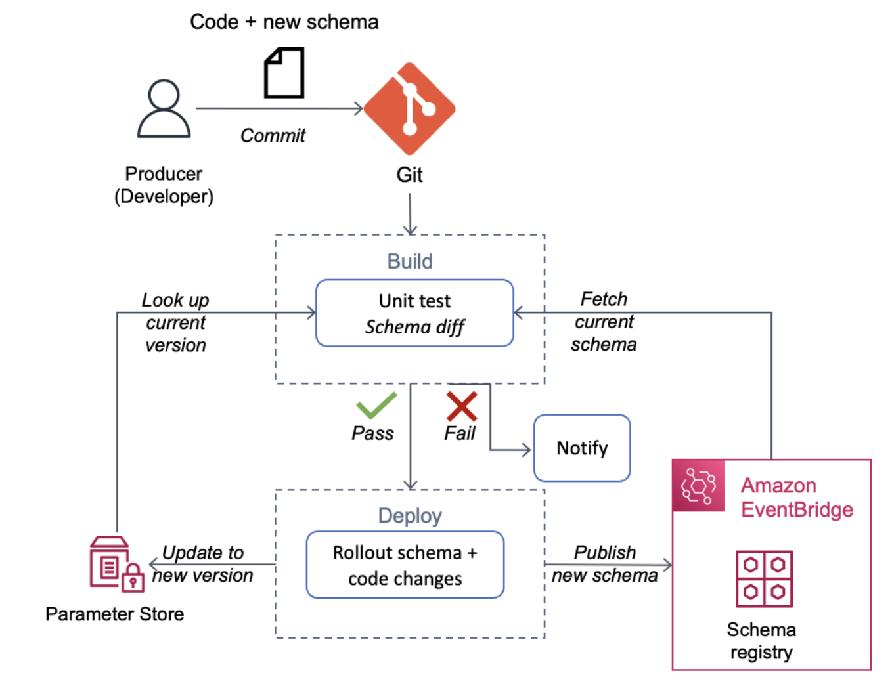
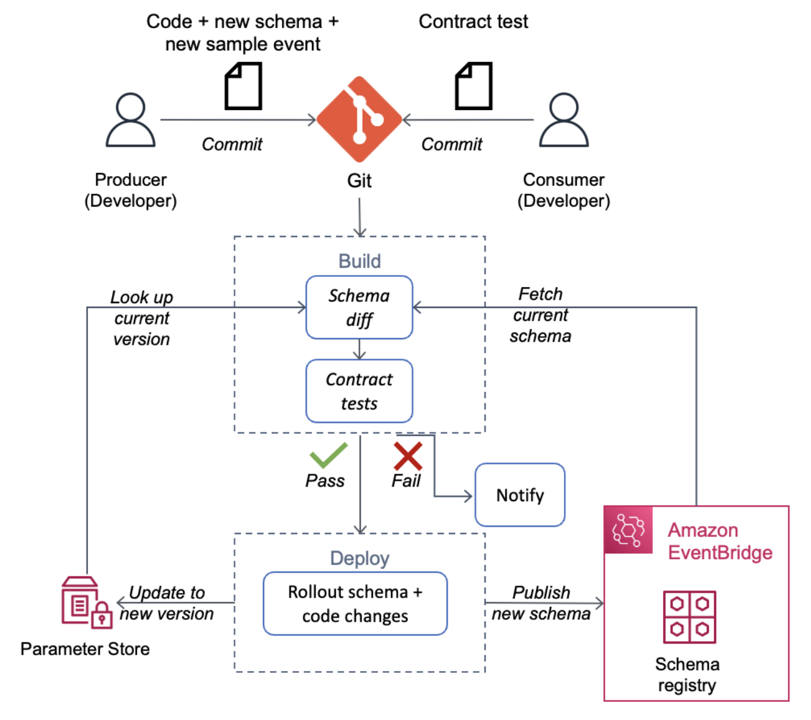

[](https://img.shields.io/badge/Python-3.13-green)
[](https://img.shields.io/badge/Test-Unit-blue)

# Python: Schema and Contract Testing for Event-Driven Architectures

---

## Contents

- [Python: Schema and Contract Testing for Event-Driven Architectures](#python-schema-and-contract-testing-for-event-driven-architectures)
  - [Contents](#contents)
  - [Introduction](#introduction)
  - [Schema Testing](#schema-testing)
    - [Goal](#goal)
    - [Description](#description)
    - [System Under Test (SUT)](#system-under-test-sut)
    - [Schema test limitations](#schema-test-limitations)
  - [Contract Testing](#contract-testing)
    - [Goal](#goal-1)
    - [Description](#description-1)
    - [System Under Test (SUT)](#system-under-test-sut-1)
    - [Contract test limitations](#contract-test-limitations)
  - [Key Files in this Project](#key-files-in-this-project)
  - [Run the Tests](#run-the-tests)

---

## Introduction

Event driven architectures decouple producers and consumers at the infrastructure layer, but these resources may still be coupled at the application layer by the event contract. Consumers may write business logic that expects events to conform to specific schemas. If schemas change over time the consumer code may fail. Creating automated tests that validate event schemas can help increase the quality of your systems and prevent breaking changes.

## Schema Testing

### Goal

To prevent event schema changes from breaking consumer applications.

### Description

Schema tests are designed to check for changes that are not backward-compatible, such as removing elements, changing a field type or adding new mandatory elements. Adding optional elements is considered backward-compatible. If a new schema version is backward-compatible, the schema tests will pass and the consumer application business logic should not fail.

### System Under Test (SUT)

This test is integration service agnostic, as it runs against the schema published to a schema registry. [Amazon EventBridge Schema Registry](https://docs.aws.amazon.com/eventbridge/latest/userguide/eb-schema.html) is one example of such a registry. It provides schemas for all events that are generated by AWS services. When you turn on schema discovery it will automatically detect and provide schemas for your custom events (OpenAPI and JSON Schemas). You can also use your own Git repository as a registry for storing schemas. In our test we will use a local “schemas” folder as a registry for simplicity.

The diagram below shows an example of how schema tests may run as part of a producer’s CI/CD pipeline. You can [view a sample schema test](tests/test_schema.py) that could be run during the "Build" step of the process.



[Top](#contents)

### Schema test limitations

Schema tests have two limitations worth mentioning.

First, schemas are inherently ambiguous as they do not capture business requirements. They may not express that a particular combination of fields is invalid, or they may not explicitly state the dependencies between fields. For example, when you create an AWS Lambda function, the `runtime` property is mandatory for zip packaging formats, but this field is not required for container image packaging formats. The schema for the Lambda `create-function` API payload will not convey this requirement. If an event consumer makes invalid assumptions about a new version of the payload, its business logic may fail even if there are technically no breaking schema changes.

Second, unless an event consumer uses SDK/code bindings generated specifically for the version of schema in use, the code and the schema may drift apart over time and the consumer business logic may eventually fail. In these cases, the schema validation test results create a false sense of security.

Both of these limitations can be addressed with [contract testing](#contract-testing).

[Top](#contents)

## Contract Testing

### Goal

To identify the side effects of non-breaking schema changes on consumer applications.

### Description

Contract testing uses sample events provided by producers to validate consumer side business logic and to provide a stronger guarantee of preventing breaking changes. Contract tests are owned by consumers.

Consider the following example. In a schema test, changing the format of an `address` field from a full address to a street address only and then adding new event fields like `country`, `city`, `state` and `postcode` would not produce a failure. These schema changes would be considered to be backward compatible, since the changes only add new elements. In contrast, a consumer test expecting a full address in the `address` field would fail and notify us that this change is actually not backward compatible.

There are other common strategies for implementing contract testing. One strategy is to establish test doubles. Test doubles are resources that replace production objects for testing purposes. The contract tests with test doubles run on the consumer side and expect that calls to the doubles return the same results as calls to the production application. Review the [Pact.io documentation](https://docs.pact.io/) for examples of this approach.

### System Under Test (SUT)

This test is integration service agnostic as it uses sample events generated from a schema published to a schema registry. The diagram below shows one way of implementing contract testing as part of producer’s CI/CD pipeline.

The diagram below shows an example of how contract testing can be used as part of a producer’s CI/CD pipeline. You can [view a sample contract test](tests/test_contract.py) that could be run during the "Build" step of the process.



[Top](#contents)

### Contract test limitations

Writing tests and performing on-going maintenance requires a degree of additional effort. However once written, schema changes can be done more efficiently and with less effort to prevent and resolve breaking changes.

You may choose to be selective in deciding where to implement contract testing. Start by identifying critical applications where the cost of breaking changes is highest. Applications with greater tolerances for failure may choose to rely on schema testing only.

[Top](#contents)

---

## Key Files in this Project

- [test_schema.py](tests/test_schema.py) - unit test for schema testing
- [test_contract.py](tests/test_contract.py) - unit test for contract testing
- [src](src/) - [Pydantic](https://docs.pydantic.dev/) model representation of event contract
- [schemas](schemas) - versioned [JSON Draft-07](https://json-schema.org/draft-07/json-schema-release-notes.html) schemas used for schema testing
- [events](events) - sample events used for contract testing

The event schema is documented using [JSON Draft-07](https://json-schema.org/draft-07/json-schema-release-notes.html) specification. Instead of comparing the JSON schema directly, we will compare the [Pydantic](https://docs.pydantic.dev/) model representation of the schemas. Pydantic provides a Python native way to manipulate and validate data. In a real-world application, this will be part of the producer event generation logic. You can export Pydantic models as JSON schema. You can also do the reverse to generate Pydantic models from JSON schema using the [`datamodel-code-generator`](https://docs.pydantic.dev/datamodel_code_generator/).

In order to detect breaking changes using schema testing, we will generate an event from the new Pydantic schema model and parse it using the old schema model. To detect breaking business logic changes using contract testing, we will follow the same approach but rely on consumer to provide the schema model with the business validations incorporated into the model. Review the [test files](tests/) to learn more.

[Top](#contents)

---

## Run the Tests

Create a virtual environment and install the dependencies.

```shell
python3 -m virtualenv .venv
source .venv/bin/activate
pip install -r requirements.txt
```

Run the tests.

```shell
pytest tests --verbose
```

[Top](#contents)

---
