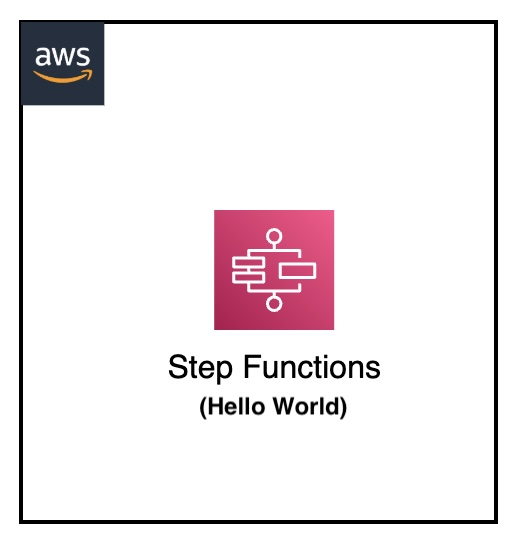
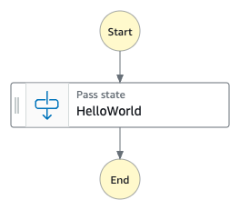

[](https://img.shields.io/badge/Python-3.10-green)
[](https://img.shields.io/badge/AWS-Step%20Functions-orange)
[](https://img.shields.io/badge/Language-ASL-blue)
[](https://img.shields.io/badge/Test-Pytest-red)
[](https://img.shields.io/badge/Test-Local-red)

# AWS Step Functions: Hello World with PyTest

## Introduction

This project demonstrates how to test AWS Step Functions state machines locally using Docker and PyTest. It focuses on a simple "Hello World" state machine with a Pass state, showing how to create and validate automated tests for AWS Step Functions locally.


---

## Contents
- [AWS Step Functions: Hello World with PyTest](#aws-step-functions-hello-world-with-pytest)
  - [Introduction](#introduction)
  - [Contents](#contents)
  - [Architecture Overview](#architecture-overview)
  - [Project Structure](#project-structure)
  - [Prerequisites](#prerequisites)
  - [Test Scenarios](#test-scenarios)
  - [About the Test Process](#about-the-test-process)
  - [Testing Workflows](#testing-workflows)
  - [Debug](#debug)
  - [Additional Resources](#additional-resources)

---

## Architecture Overview
<p align="center">
  
</p>

Components:
- Simple Step Functions state machine with a Pass state
- Testcontainers for container management
- PyTest for automated testing
- AWS Step Functions Local for local execution

<p align="center">
  
</p>

---

## Project Structure
```
├── img/
│   └── stepfunctions-helloworld-states.png     _# Step Functions state flow_
│   └── stepfunctions-mock.png                  _# visual architecture diagram_
├── statemachine/                              
│   └── local_testing.asl.json                  _# json file containing "Hello World" state machine definition_
│   └── test/valid_input.json                   _# json file containing "Hello World" state machine input_
├── tests/
│   └── unit/src/test_step_functions_local.py   _# python PyTest test definition_
│   └── requirements.txt                        _# pip requirments dependencies file_
└── README.md                                   _# instructions file_
```

---

## Prerequisites
- Docker
- AWS cli (debugging)
- Python 3.10 or newer
- Basic understanding of Step Functions
- Basic understanding of Amazon States Language (ASL)


---

## Test Scenarios

### 1. Hello World
- Tests the happty path where a single state in step funtions succeed on the first attempt
- Used to validate the basic functionality of the state machine

---

## About the Test Process

The test process leverages PyTest fixtures to manage the lifecycle of the Step Functions Local container and the state machine:

1. **Container Setup**: The `fixture_container` fixture downloads and starts the `amazon/aws-stepfunctions-local` container.

2. **State Machine Creation**: The `fixture_sfn_client` fixture creates a Boto3 client for Step Functions and creates the state machine using the definition from `local_testing.asl.json`.

3. **Test Execution**: When the test runs, it calls `execute_stepfunction` to start an execution of the state machine and monitor it until completion.

4. **Validation**: The test verifies that:
   - The execution completed successfully
   - The HelloWorld state was properly exited

5. **Cleanup**: After the test completes, the container is automatically shut down by the finalizer added in the `fixture_container`.

---

## Testing Workflows

### Run the Unit Test
> Make sure docker engine is running before running the tests.

``` shell
step-functions-local$ docker version
Client: Docker Engine - Community
 Version:           24.0.6
 API version:       1.43
...
```

To set it up:

``` shell
step-functions-local$ cd tests
python3 -m venv venv
source venv/bin/activate
pip install --upgrade pip
pip install -r requirements.txt
```


To run the unit tests:

``` shell
step-functions-local$ cd tests
python3 -m pytest -s unit/src/test_step_functions_local.py -v
```


Expected output:
```
============================= test session starts ==============================
...
unit/src/test_step_functions_local.py::test_happy_path PASSED
============================== 1 passed in 28.27s ==============================
```

---

## Debug


### AWS CLI Commands for Manual Verification

If you need to manually verify the state machine or execution details, you can use these commands:

#### Configure environment

```sh
export AWS_ACCESS_KEY_ID='DUMMYIDEXAMPLE'
export AWS_SECRET_ACCESS_KEY='DUMMYEXAMPLEKEY'
export REGION='us-east-1'
```

#### Check Execution Status

```sh
# Check state machine definition
aws stepfunctions describe-state-machine --endpoint-url http://localhost:8083 \
    --state-machine-arn [STATE-MACHINE-ARN]

# Check execution details
aws stepfunctions describe-execution --endpoint http://localhost:8083 \
    --execution-arn [STATE-MACHINE-EXECUTION-ARN]

# Check execution history
aws stepfunctions get-execution-history --endpoint http://localhost:8083 \
    --execution-arn [STATE-MACHINE-EXECUTION-ARN]
```

### PyTest Debugging

For more detailed PyTest output:

```sh
# Run with verbose output
python -m pytest -s -v unit/src/test_step_functions_local.py

# Run with debug logging
python -m pytest -s -v unit/src/test_step_functions_local.py --log-cli-level=DEBUG
```

---

## Additional Resources
- [Step Functions Local Guide](https://docs.aws.amazon.com/step-functions/latest/dg/sfn-local.html)
- [Amazon States Language Documentation](https://docs.aws.amazon.com/step-functions/latest/dg/concepts-amazon-states-language.html)
- [AWS Step Functions Developer Guide](https://docs.aws.amazon.com/step-functions/latest/dg/welcome.html)
- [PyTest Documentation](https://docs.pytest.org/)
- [Testcontainers Python Documentation](https://testcontainers-python.readthedocs.io/en/latest/)

[Top](#contents)