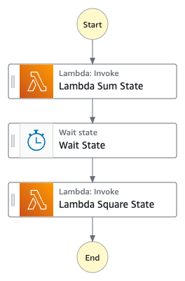

[](https://img.shields.io/badge/Python-3.10-green)
[](https://img.shields.io/badge/AWS-Step%20Functions-orange)
[](https://img.shields.io/badge/Language-ASL-blue)
[](https://img.shields.io/badge/AWS-Lambda-yellow)
[](https://img.shields.io/badge/Test-Pytest-red)
[](https://img.shields.io/badge/Test-Local-red)

# Local: AWS Step Functions with Lambda Integration

## Introduction

This project demonstrates how to test AWS Step Functions state machines that integrate with Lambda functions locally. It showcases a mathematical workflow that performs sum and square operations using separate Lambda functions, all tested through PyTest.

---

## Contents
- [Local: AWS Step Functions with Lambda Integration](#local-aws-step-functions-with-lambda-integration)
  - [Introduction](#introduction)
  - [Contents](#contents)
  - [Architecture Overview](#architecture-overview)
  - [Project Structure](#project-structure)
  - [Prerequisites](#prerequisites)
  - [Test Scenarios](#test-scenarios)
  - [About the Test Process](#about-the-test-process)
  - [Testing Workflows](#testing-workflows)
  - [Debug](#debug)
  - [Common Issues](#common-issues)
  - [Additional Resources](#additional-resources)

---

## Architecture Overview
<p align="center">
  
</p>

Components:
- Step Functions state machine for orchestration
- Two Python Lambda functions
  - Sum function: adds three numbers adds three numbers (x + y + z)
  - Square function: squares an entry number
- Wait state for demonstration

<p align="center">
  
</p>

---

## Project Structure
```
├── img/
│   └── stepfunctions-lambda-states.png             _# step functions Lambda state flow_
│   └── stepfunctions-mock.png                      _# visual architecture diagram_
├── lambda_stepfunctions_src                        _# folder containing source code for Step Functions Lambda functions_
├── statemachine/                              
│   └── test/                                       _# folder containing valid inputs json input files for the different tests_
│   └── local_testing.asl.json                      _# json file containing Lambda state machine definition_
├── tests/
│   └── unit/src/test_step_functions_local.py       _# python PyTest test definition_
│   └── requirements.txt                            _# pip requirements dependencies file_
│   ├── README.md                                   _# instructions file_
│   └── template.yaml                               _# sam yaml template file for necessary components test_
```

---

## Prerequisites
- Docker
- Python 3.10 or newer (running pytest)
- AWS SAM CLI (running SAM Lambda emulator)
- AWS CLI v2 (for debugging)
- Basic understanding of Step Functions
- Basic understanding of Lambda Functions

---

## Test Scenarios

### 1. Lambda Sum Operation
- Tests the Lambda function that adds three numbers (x, y, z)
- Verifies the correct calculation and response structure

### 2. Lambda Square Operation
- Tests the Lambda function that squares an input number
- Verifies the correct calculation and response structure

### 3. Step Functions Sum-Square Workflow
- Tests the full workflow execution:
  1. Sum three numbers (x + y + z)
  2. Wait for 3 seconds
  3. Square the result (sum^2)
- Verifies that all states are exited successfully
- Checks final result matches expected calculation

### 4. Large Number Handling
- Tests the workflow with larger numbers to ensure no integer overflow issues
- Uses large values for x, y, z (9999, 8888, 7777)
- Validates correct calculation of sum and square operations

---

## About the Test Process

The test process leverages PyTest fixtures to manage the lifecycle of the services and state machine:

1. **SAM Lambda Verification**: The `lambda_container` fixture verifies that the SAM Local Lambda emulator is running on port 3001.

2. **Step Functions Container**: The `sfn_container` fixture starts the `amazon/aws-stepfunctions-local` Docker container with host network mode to allow communication with the Lambda emulator.

3. **State Machine Creation**: The `sfn_client` fixture creates a Boto3 client for Step Functions and creates the state machine using the definition from `local_testing.asl.json`.

4. **Test Execution**: Each test either:
   - Directly tests a Lambda function using the Lambda client
   - Executes the state machine with `execute_stepfunction` and validates the results

5. **Cleanup**: After tests complete, the container is automatically shut down by the finalizer in the `sfn_container` fixture.
6. 

---

---

## Testing Workflows

### Setup Environment

> Make sure Docker engine is running before running the tests.

```shell
$ docker version
Client: Docker Engine - Community
 Version:           24.0.6
 API version:       1.43
...
```

To set up the Python environment:

```shell
$ cd tests
$ python3 -m venv venv
$ source venv/bin/activate
$ pip install --upgrade pip
$ pip install -r requirements.txt
```

### Start SAM Local Lambda Emulator

Start the SAM Local Lambda emulator in a separate terminal:

```shell
$ sam local start-lambda -p 3001 --docker-network host
```

### Run the Unit Tests

```shell
$ cd tests
$ python3 -m pytest -s unit/src/test_step_functions_local.py -v
```

Expected output:

```
$ python3 -m pytest -s unit/src/test_step_functions_local.py -v
================================================================= test session starts =================================================================
platform linux -- Python 3.10.12, pytest-8.3.5, pluggy-1.5.0 -- /home/ubuntu/environment/step-functions-local-lambda/tests/venv/bin/python3
cachedir: .pytest_cache
rootdir: /home/ubuntu/environment//step-functions-local-lambda/tests
plugins: xdist-3.5.0, timeout-2.3.1
collected 4 items                                                                                                                                     

unit/src/test_step_functions_local.py::test_lambda_sum_operation Lambda sum response: {'Payload': {'result': 60}}
PASSED
unit/src/test_step_functions_local.py::test_lambda_square_operation Lambda square response: {'Payload': {'result': 81}}
PASSED
unit/src/test_step_functions_local.py::test_stepfunctions_sum_square_workflow_execution Output received: {'Payload': {'result': 289}}
PASSED
unit/src/test_step_functions_local.py::test_stepfunctions_large_number_handling Output received for large numbers: {'Payload': {'result': 710968896}}
PASSEDstepfunctions-local-test


================================================================= 4 passed in 16.35s ==================================================================

```


---

## Debug

### AWS CLI Commands for Manual Verification

If you need to manually verify the state machine or execution details, you can use these commands:

#### Configure environment

```sh
export AWS_ACCESS_KEY_ID='DUMMYIDEXAMPLE'
export AWS_SECRET_ACCESS_KEY='DUMMYEXAMPLEKEY'
export REGION='us-east-1'
```

#### Start Lambda emulator

```sh
sam local start-lambda -p 3001 --docker-network host &
```

#### Test Individually Lambda Functions
```sh
# Test Sum Lambda
aws lambda invoke \
    --function-name StepFunctionExampleSumLambda \
    --endpoint-url http://127.0.0.1:3001 \
    --payload '{"x": 10, "y": 20, "z": 30}' \
    output.txt

# Test Square Lambda
aws lambda invoke \
    --function-name StepFunctionExampleSquareLambda \
    --endpoint-url http://127.0.0.1:3001 \
    --payload '{"result": 9}' \
    output.txt
```

#### Start Step Functions local:

```sh
docker run -d --network host            \
    --name stepfunctions -p 8083:8083   \
    --env-file aws-stepfunctions-local-credentials.txt amazon/aws-stepfunctions-local
```

### 2. Create State Machine
```sh
aws stepfunctions create-state-machine --endpoint http://localhost:8083 \
  --definition "{                                       \
  \"StartAt\": \"Lambda Sum State\",                    \
  \"States\": {                                         \
    \"Lambda Sum State\": {                             \
      \"Next\": \"Wait State\",                         \
      \"Type\": \"Task\",                               \
      \"InputPath\": \"$\",                             \
      \"OutputPath\": \"$.Payload\",                    \
      \"Resource\": \"arn:aws:states:::lambda:invoke\", \
      \"Parameters\": {                                 \
        \"FunctionName\": \"arn:aws:lambda:us-east-1:123456789012:function:StepFunctionExampleSumLambda\",\
        \"Payload.$\": \"$\"                            \
      }                                                 \
    },                                                  \
    \"Wait State\": {                                   \
      \"Type\": \"Wait\",                               \
      \"Seconds\": 3,                                   \
      \"Next\": \"Lambda Square State\"                 \
    },                                                  \
    \"Lambda Square State\": {                          \
      \"End\": true,                                    \
      \"Type\": \"Task\",                               \
      \"InputPath\": \"$.Payload\",                     \
      \"OutputPath\": \"$.Payload\",                    \
      \"Resource\": \"arn:aws:states:::lambda:invoke\", \
      \"Parameters\": {                                 \
        \"FunctionName\": \"arn:aws:lambda:us-east-1:123456789012:function:StepFunctionExampleSquareLambda\",\
        \"Payload.$\": \"$\"                            \
      }                                                 \
    }                                                   \
  },                                                    \
  \"TimeoutSeconds\": 300                               \
  }" --name "StepFunctionsLambdaStateMachine" --role-arn "arn:aws:iam::123456789012:role/DummyRole"
```

### 3. Execute State Machine
```sh
aws stepfunctions start-execution \
    --endpoint http://localhost:8083 \
    --state-machine [STATE-MACHINE-ARN] \
    --input '{"x": 2s "y": 8, "z": 7}'
```

#### Check State Machine Execution

Checking state machine definition
```sh
aws stepfunctions describe-state-machine    --endpoint-url http://localhost:8083     \
    --state-machine-arn [STATE-MACHINE-ARN]
```

Checking state machine execution flow, execution and state variables
```sh
aws stepfunctions describe-execution        --endpoint http://localhost:8083       \
    --execution-arn [STATE-MACHINE-EXECUTION-ARN]
```

Checking state machine states execution variables
```sh
aws stepfunctions get-execution-history     --endpoint http://localhost:8083    \
  --execution-arn [STATE-MACHINE-EXECUTION-ARN]
```

### PyTest Debugging

For more detailed PyTest output:

```sh
# Run with verbose output
python3 -m pytest -s -v unit/src/test_step_functions_local.py

# Run with debug logging
python3 -m pytest -s -v unit/src/test_step_functions_local.py --log-cli-level=DEBUG

# Run a specific test
python3 -m pytest -s -v unit/src/test_step_functions_local.py::test_lambda_sum_operation
```

---

## Common Issues

### SAM Local Connection Issues

If tests are skipped with "Lambda invocation failed, SAM might not be running properly":
- Ensure SAM Local is running on port 3001
- Check that you've started SAM with `--docker-network host`
- Verify the Lambda functions are correctly defined in template.yaml
- Check SAM logs for any errors

### Step Functions Container Fails to Start

If the Step Functions container fails to start:
- Check if the container name is already in use with `docker ps -a`
- Verify Docker permissions and network settings
- Ensure port 8083 is available

### Lambda Function Input/Output Issues

If Lambda functions aren't receiving or returning expected data:
- Check that the input JSON files have the correct structure
- For the sum function, ensure it has "x", "y", and "z" fields
- For the square function, ensure it has a "result" field
- Verify the Lambda handler in app.py correctly processes the input

### Step Functions Execution Failure

If Step Functions executions fail:
- Check the execution history with the AWS CLI
- Verify the Lambda resource ARNs in the state machine definition
- Ensure the Step Functions container's LAMBDA_ENDPOINT points to the correct SAM Local port

---

## Additional Resources
- [Step Functions Local Guide](https://docs.aws.amazon.com/step-functions/latest/dg/sfn-local.html)
- [SAM CLI Documentation](https://docs.aws.amazon.com/serverless-application-model/latest/developerguide/serverless-sam-cli-command-reference.html)
- [AWS Lambda Local Testing](https://docs.aws.amazon.com/serverless-application-model/latest/developerguide/serverless-sam-cli-using-invoke.html)
- [AWS Lambda Developer Guide](https://docs.aws.amazon.com/lambda/latest/dg/welcome.html)
- [Amazon States Language Documentation](https://docs.aws.amazon.com/step-functions/latest/dg/concepts-amazon-states-language.html)
- [PyTest Documentation](https://docs.pytest.org/)
- 
[Top](#contents)

