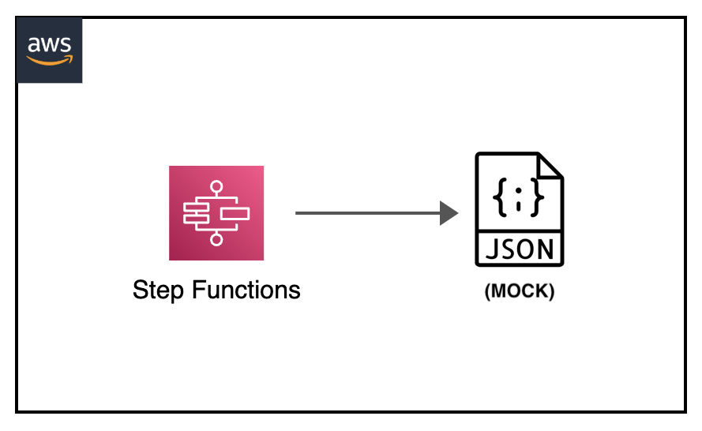
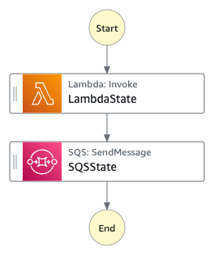

[](https://img.shields.io/badge/Python-3.10-green)
[](https://img.shields.io/badge/AWS-Step%20Functions-orange)
[](https://img.shields.io/badge/Language-ASL-blue)
[](https://img.shields.io/badge/AWS-Lambda-yellow)
[](https://img.shields.io/badge/AWS-SQS-green)
[](https://img.shields.io/badge/Test-Pytest-red)
[](https://img.shields.io/badge/Test-Local-red)

# Local: AWS Step Functions with Service Mocking

## Introduction

This project demonstrates how to test AWS Step Functions workflows locally using service mocks. By leveraging the Step Functions Local Docker container and a mock configuration file, it showcases different testing scenarios including happy path, retry path, and hybrid testing approaches.

---

## Contents
- [Local: AWS Step Functions with Service Mocking](#local-aws-step-functions-with-service-mocking)
  - [Introduction](#introduction)
  - [Contents](#contents)
  - [Architecture Overview](#architecture-overview)
  - [Project Structure](#project-structure)
  - [Prerequisites](#prerequisites)
  - [Test Scenarios](#test-scenarios)
  - [Testing Workflows](#testing-workflows)
  - [Debug](#debug)
  - [Additional Resources](#additional-resources)

---

## Architecture Overview
<p align="center">
  
</p>

Components:
- Step Functions state machine with two states:
  - LambdaState: Invokes a Lambda function with retry logic
  - SQSState: Sends a message to an SQS queue
- Mock service responses for both Lambda and SQS

<p align="center">
  
</p>

---

## Project Structure
```
├── img/
│   └── stepfunctions-mock-states.png               _# step functions MOCK state flow_
│   └── stepfunctions-mock.png                      _# visual architecture diagram_
├── statemachine/                              
│   └── test/MockConfigFile.json                    _# json file defining MOCK answers from Step Funtions state machine_
│   └── local_testing.asl.json                      _# json file containing MOCK state machine definition_
├── tests/
│   └── unit/src/test_step_functions_local.py       _# python PyTest test definition_
│   └── requirements.txt                            _# pip requirements dependencies file_
└── README.md                                       _# instructions file_
```

---

## Prerequisites
- Docker
- Python 3.10 or newer
- AWS CLI v2 (for debugging)
- Basic understanding of Step Functions

---

## Test Scenarios

### 1. Happy Path
- Tests the scenario where both Lambda and SQS operations succeed on the first attempt
- Verifies that both states exit successfully and all tasks complete
- Used to validate the basic functionality of the state machine

### 2. Retry Path
- Tests the state machine's retry mechanism
- Lambda fails initially with a ResourceNotReadyException and then with TimeoutExceptions
- After 3 failures, Lambda succeeds on the 4th attempt
- Verifies that the retry policy is applied correctly and the state machine can recover from transient errors

### 3. Hybrid Path
- Tests both Lambda and SQS with mocked responses
- Verifies that the overall execution completes successfully
- Ensures both states are properly exited
- Demonstrates how to test a workflow end-to-end with mocked components

---

## Testing Workflows

> Make sure docker engine is running before running the tests.

``` shell
step-functions-local-mock$ docker version
Client: Docker Engine - Community
 Version:           24.0.6
 API version:       1.43
```

To set it up:

``` shell
step-functions-local-mock$ cd tests
python3 -m venv venv
source venv/bin/activate
pip install --upgrade pip
pip install -r requirements.txt
```

To run the unit tests:

``` shell
step-functions-local-mock$ cd tests
python3 -m pytest -s unit/src/test_step_functions_local.py -v
```

expected output

```
step-functions-local-mock$ python3 -m pytest -s unit/src/test_step_functions_local.py -v
============================================================== test session starts ==============================================================
platform linux -- Python 3.10.12, pytest-8.3.5, pluggy-1.5.0 -- /home/ubuntu/environment/step-functions-local-mock/tests/venv/bin/python3
cachedir: .pytest_cache
rootdir: /home/ubuntu/environment/step-functions-local-mock/tests
collected 3 items                                                                                                                               

unit/src/test_step_functions_local.py::test_happy_path Pulling image testcontainers/ryuk:0.8.1
Container started: 86676d42c5de
Waiting for container <Container: 86676d42c5de> with image testcontainers/ryuk:0.8.1 to be ready ...
Pulling image amazon/aws-stepfunctions-local
Container started: 034b00a0307a
Waiting for container <Container: 034b00a0307a> with image amazon/aws-stepfunctions-local to be ready ...
PASSED
```

---

## Debug

### AWS CLI Commands for Manual Testing

#### 1. Start the Step Functions Local container:

```sh
docker run -d -p 8083:8083 \
    --mount type=bind,readonly,source=$(pwd)/MockConfigFile.json,destination=/home/StepFunctionsLocal/MockConfigFile.json \
    --env-file aws-stepfunctions-local-credentials.txt \
    amazon/aws-stepfunctions-local
```

#### 2. Set up environment variables:

```sh
export AWS_ACCESS_KEY_ID='DUMMYIDEXAMPLE'
export AWS_SECRET_ACCESS_KEY='DUMMYEXAMPLEKEY'
export REGION='us-east-1'
```

#### 3. Create the state machine:

```sh
aws stepfunctions create-state-machine \
    --endpoint http://localhost:8083 \
    --name LambdaSQSIntegration \
    --definition file://statemachine/local_testing.asl.json \
    --role-arn "arn:aws:iam::123456789012:role/DummyRole"
```

#### 4. Execute test scenarios:

Happy Path:
```sh
aws stepfunctions start-execution \
    --endpoint http://localhost:8083 \
    --state-machine "arn:aws:states:us-east-1:123456789012:stateMachine:LambdaSQSIntegration#HappyPath"
```

Retry Path:
```sh
aws stepfunctions start-execution \
    --endpoint http://localhost:8083 \
    --state-machine "arn:aws:states:us-east-1:123456789012:stateMachine:LambdaSQSIntegration#RetryPath"
```

Hybrid Path:
```sh
aws stepfunctions start-execution \
    --endpoint http://localhost:8083 \
    --state-machine "arn:aws:states:us-east-1:123456789012:stateMachine:LambdaSQSIntegration#HybridPath"
```

#### 5. Inspect execution results:

Checking state machine execution
```sh
aws stepfunctions describe-execution \
    --endpoint http://localhost:8083 \
    --execution-arn "<execution-arn>"
```

Checking state machine definition
```sh
aws stepfunctions describe-state-machine    --endpoint-url http://localhost:8083     \
    --state-machine-arn [STATE-MACHINE-ARN]
```

Checking state machine execution flow, execution and state variables
```sh
aws stepfunctions describe-execution        --endpoint http://localhost:8083       \
    --execution-arn [STATE-MACHINE-EXECUTION-ARN]
```

Checking state machine states execution variables
```sh
aws stepfunctions get-execution-history     --endpoint http://localhost:8083    \
  --execution-arn [STATE-MACHINE-EXECUTION-ARN]
```

### PyTest Debugging

For more detailed debugging in pytest:

```sh
# Run with verbose output and show print statements
python3 -m pytest -s -v unit/src/test_step_functions_local.py

# Run with debug logging
python3 -m pytest -s -v unit/src/test_step_functions_local.py --log-cli-level=DEBUG

# Run only a specific test
python3 -m pytest -s -v unit/src/test_step_functions_local.py::test_hybrid_path
```

---

## Additional Resources
- [Step Functions Local Testing Guide](https://docs.aws.amazon.com/step-functions/latest/dg/sfn-local-test-sm-exec.html)
- [Service Mocking Documentation](https://docs.aws.amazon.com/step-functions/latest/dg/sfn-local-mock-cfg-file.html)
- [AWS Step Functions Developer Guide](https://docs.aws.amazon.com/step-functions/latest/dg/welcome.html)
- [Mocking Service Integrations with Step Functions Local](https://aws.amazon.com/blogs/compute/mocking-service-integrations-with-aws-step-functions-local/)
- [Step Functions Service Mocking Documentation](https://docs.aws.amazon.com/step-functions/latest/dg/sfn-local-mock-cfg-file.html)
- [Amazon States Language Specification](https://states-language.net/spec.html)
- [AWS Step Functions Developer Guide](https://docs.aws.amazon.com/step-functions/latest/dg/welcome.html)


[Top](#contents)

