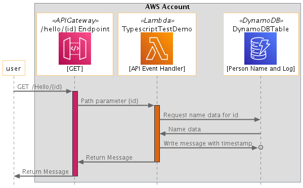

[](https://badgen.net/badge/Built%20With/TypeScript/blue9)
[](https://img.shields.io/badge/AWS-DynamoDB-blueviolet)
[](https://img.shields.io/badge/Test-Unit-blue)
[](https://img.shields.io/badge/Test-Integration-yellow)

# Typescript: Amazon Api Gateway, AWS Lambda, Amazon DynamoDB Example

## Introduction
This project contains automated test sample code samples for serverless applications written in Typescript. The project demonstrates several techniques for executing tests including mocking, emulation and testing in the cloud specifically when interacting with the Amazon DynamoDB service. Based on current tooling, we recommend customers **focus on testing in the cloud** as much as possible. 

The project uses the [AWS Serverless Application Model](https://docs.aws.amazon.com/serverless-application-model/latest/developerguide/what-is-sam.html) (SAM) CLI for configuration, testing and deployment. 

---

## Contents
- [Typescript: Amazon Api Gateway, AWS Lambda, Amazon DynamoDB Example](#python-amazon-api-gateway-aws-lambda-amazon-dynamodb-example)
  - [Introduction](#introduction)
  - [Contents](#contents)
  - [Key Files in the Project](#key-files-in-the-project)
  - [Sample project description](#sample-project-description)
  - [Testing Data Considerations](#testing-data-considerations)
  - [Run the Unit Test](#run-the-unit-test)
  - [Run the Integration Test](#run-the-integration-test)
---

## Key Files in the Project
  - [app.ts](src/app.ts) - Lambda handler code to test
  - [template.yaml](template.yaml) - SAM script for deployment
  - [test-handler.test.ts](src/tests/unit/test-handler.test.ts) - Unit test using mocks
  - [integ-handler.test.ts](src/tests/integration/integ-handler.test.ts) - Integration tests on a live stack
  
[Top](#contents)

---

## Sample project description

The sample project allows a user to call an API endpoint generate a custom "hello" message, and also tracks the messages it generates.  A user provides an "id", which the endpoint uses to look up the person's name associated with that id, and generates a message.  The message is recorded in DynamoDB and also returned to the caller:



This project consists of an [API Gateway](https://aws.amazon.com/api-gateway/), a single [AWS Lambda](https://aws.amazon.com/lambda) function, and a [Amazon DynamoDB](https://aws.amazon.com/dynamodb) table.

The DynamoDB Table is a [single-table design](https://aws.amazon.com/blogs/compute/creating-a-single-table-design-with-amazon-dynamodb/), as both the name lookup and the message tracking use the same table. The table schema is defined as follows:
* For all records, the "Partition Key" is the id.
* For name records, the "Sort Key" is set to a constant = "NAME#"
* For message history records, the "Sort Key" is set to "TS#" appended with the current date-time stamp.
* The payloads are in a field named "data".

[Top](#contents)

---

## Run the Unit Test
[test-handler.test.ts](src/tests/unit/test-handler.test.ts) 

In the [unit test](src/tests/unit/test-handler.test.ts#L44), all references and calls to the DynamoDB service are mocked using aws-sdk-client-mock client.
To run the unit tests
``` shell
apigw-lambda-dynamodb$ cd src
src $ npm install
src $ npm run test:unit
```


[Top](#contents)

---

## Run the Integration Test
[integ-handler.test.ts](src/tests/integration/integ-handler.test.ts) 

For integration tests, the full stack is deployed before testing:
```shell
apigw-lambda-dynamodb$ sam build
apigw-lambda-dynamodb$ sam deploy --guided
```
 
The [integration test](src/tests/integration/integ-handler.test.ts) needs to be provided 2 environment variables
``` shell
export DYNAMODB_TABLE_NAME=<<DYNAMODB_TABLE_NAME>
export API_URL=<<APIGATEWAY_URL>>
```

The integration test then [populates data into the DyanamoDB table](src/tests/integration/integ-handler.test.ts#L24-28).

The [integration test tear-down](src/tests/integration/integ-handler.test.ts#L30-49) removes the seed data, as well as data generated during the test.

``` shell
apigw-lambda-dynamodb$ cd src
src $ npm install
src $ npm run test:integration
```

[Top](#contents)

---
