# Testing Serverless architectures with Datadog Synthetic Testing and Monitoring

This example is about creating Synthetic Tests and Monitors, to ensure Serverless services are functioning properly in a real, AWS environment.

Datadog makes it easy to add logging, metrics, distributed tracing, profiling, and more to Serverless architectures built on AWS.

For this testing experience we'll use API Gateway, SNS, SQS, and Lambda:
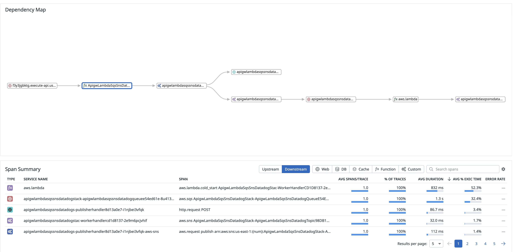


## Setup

1. Pull this repository
2. Navigate to this example
3. Run `npm install`
4. Sign up for free [Datadog](https://datadoghq.com) trial
5. Create an [API Key](https://app.datadoghq.com/account/login?next=%2Forganization-settings%2Fapi-keys)
6. Deploy this example to AWS! Run `DD_API_KEY=<Your API Key> cdk deploy`

## Testing
1. Manually curl the endpoint to verify things work:
```
curl -d '{"text": "Hello, world!"}' -H 'Content-Type: application/json' <your API Gateway URL>
{"status":"pushed"}
```

2. Within Datadog, open APM and select `Traces`. You should see something like this:
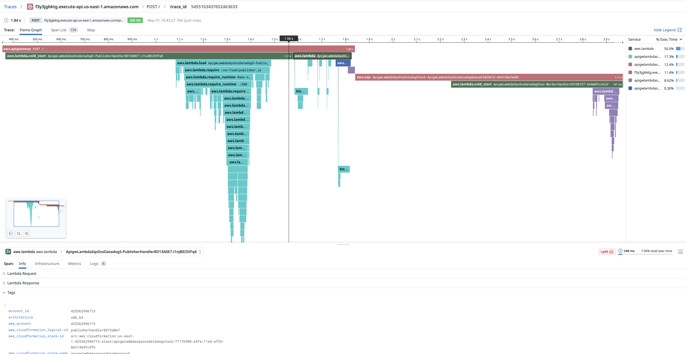

Spend some time exploring this flamegraph. We can see a full end to end trace of our service, across API Gateway to Lamdba, through SNS and SQS, back into another Lambda function. Finally, we can also see the entire request and response payload:
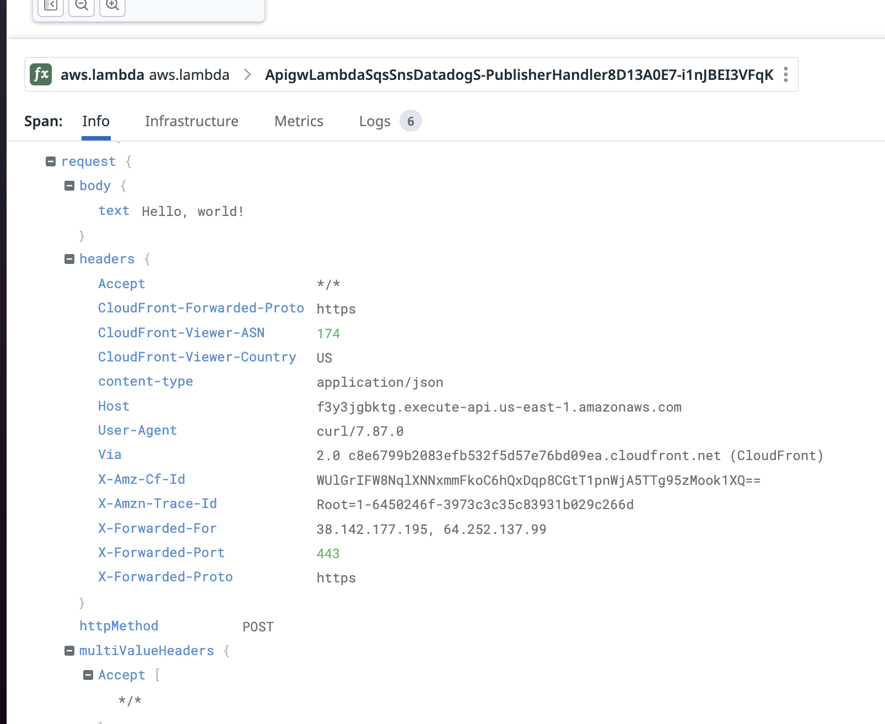

We can see the impact of loading both the AWS SNS client from the AWS SDK, along with Axios.
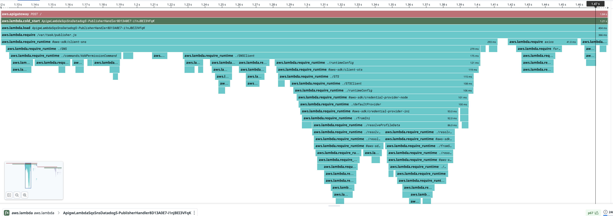

Additionally, we can see requests we make to datadoghq.com from Axios in both the publisher and the worker, and we can see the time spent in SNS and SQS. The detailed breakdown on the trace map will be helpful when debugging our test requests to API Gateway  - now it's time to automate our test!
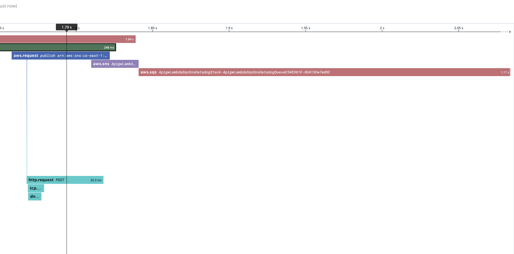

Great! Now it's time to automate this test.

## Synthetic Testing

[Datadog Synthetic](https://docs.datadoghq.com/synthetics/) tests make it easy to simulate requests and actions from around the globe.

Datadog tracks the performance of your webpages and APIs from the backend to the frontend, and at various network levels (HTTP, SSL, DNS, WebSocket, TCP, UDP, ICMP, and gRPC) in a controlled and stable way, alerting you about faulty behavior such as regressions, broken features, high response times, and unexpected status codes.

1. Select `Synthetic Tests` from the last icon in the left navigation sidebar.
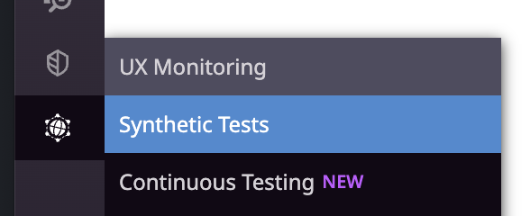

2. Select `New Test` in the upper right corner. Choose `API Test`
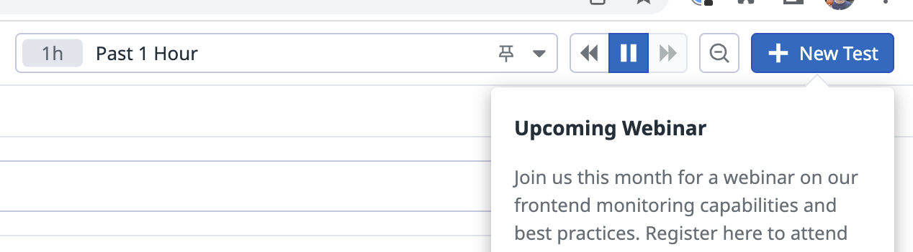

3. Let's give our test a name, `Test API Gateway -> Lambda -> SNS -> SQS -> Lambda service`
4. Now we can add our URL, and a POST request Body.


5. Finally we can `test` our endpoint!
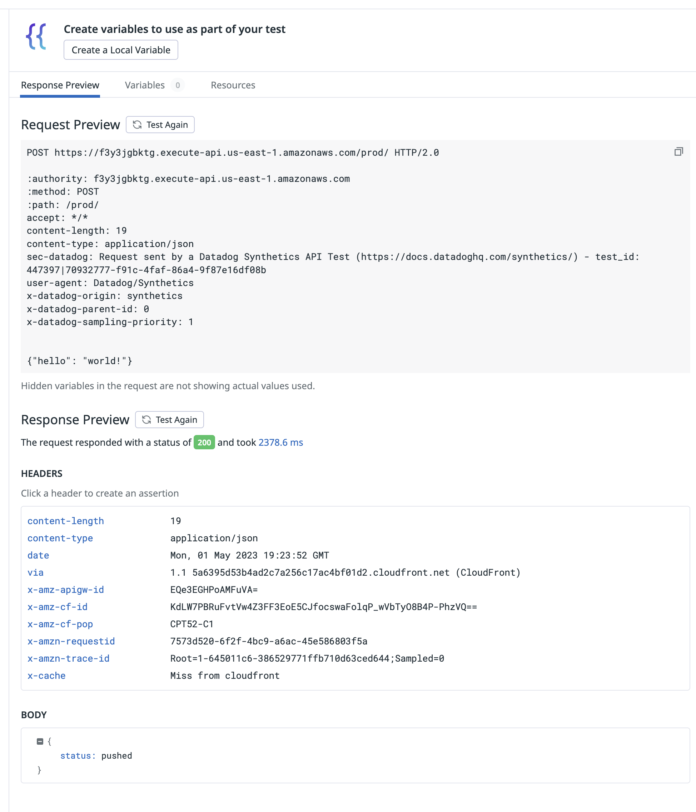

6. Let's schedule this test to run once per day, from N. Virginia (us-east-1). We can assert on the response code, body, and [more](https://docs.datadoghq.com/synthetics/api_tests/http_tests/?tab=requestoptions#define-assertions)!
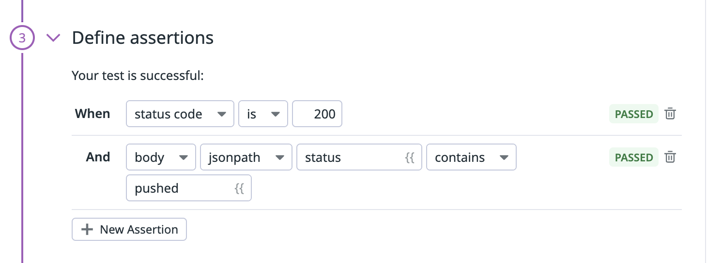

## Monitoring
In addition to active tracing and synthetics testing, we can create a monitor which can alert us if the service throws any errors.

1. Select `Monitors -> New Monitor` from the left nav.

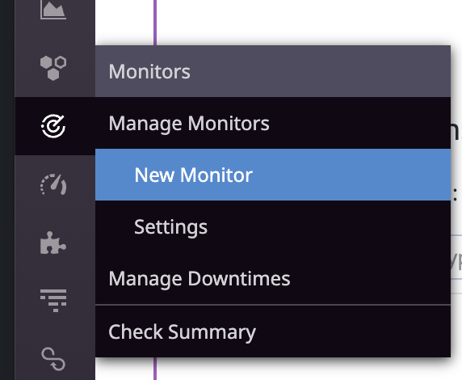

2. Choose `APM Monitor`
3. Find our service:
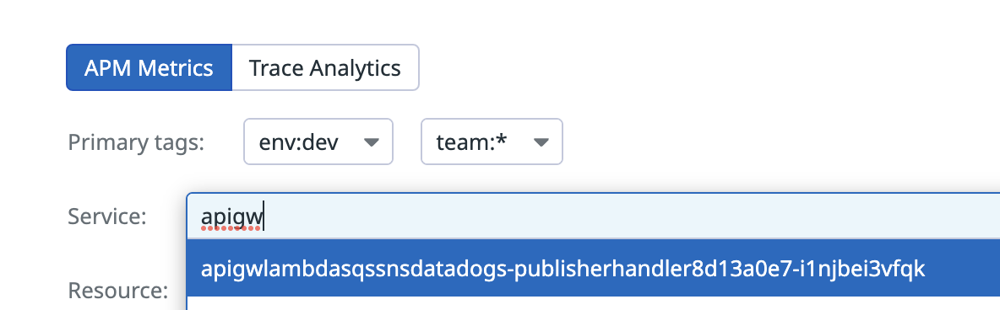
4. Create a new error monitor. This monitor will alert us *every* time we see an error but note that you can [configure the sensitivity](https://docs.datadoghq.com/monitors/types/metric/?tab=threshold#data-window) of the monitor depending on how critical the test is:
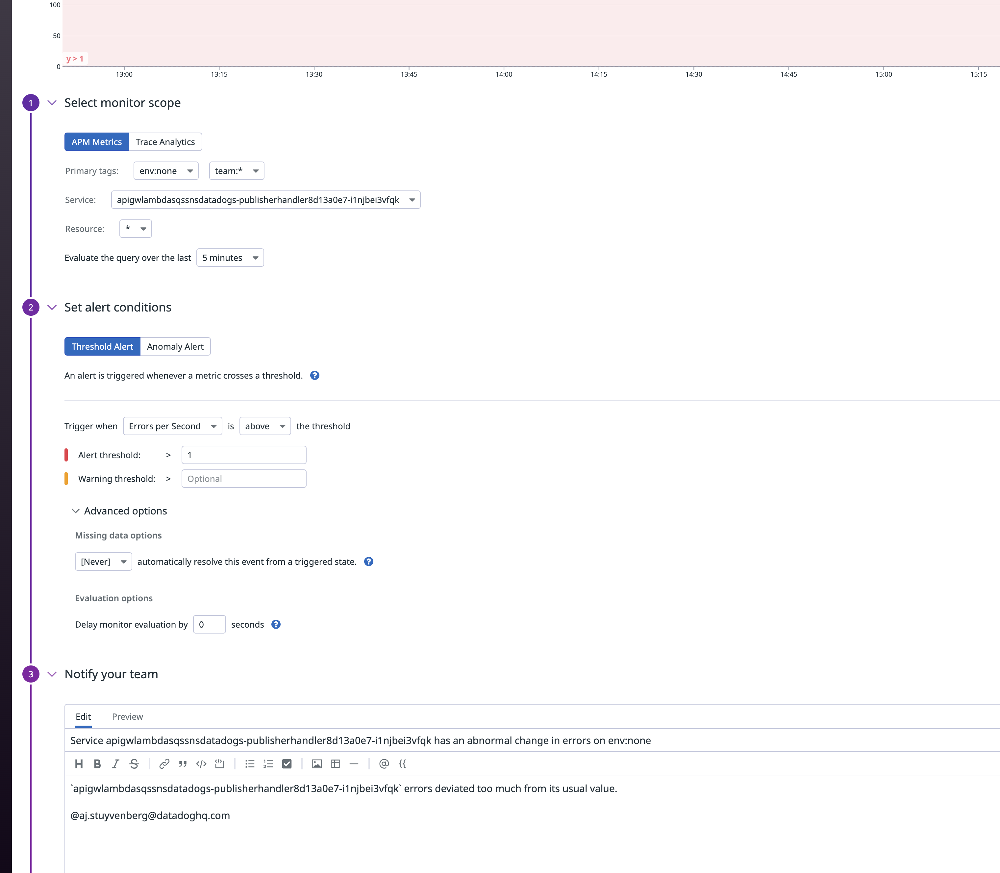

5. We're done! Now we'll be alerted if there is a problem with our service!
