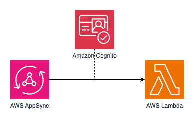

[](https://badgen.net/badge/Built%20With/TypeScript/blue9)
[](https://img.shields.io/badge/Amazon-Cognito-blueviolet)
[](https://img.shields.io/badge/Amazon-Cognito-blueviolet)
[](https://img.shields.io/badge/Test-Integration-yellow)

# Typescript: AWS AppSync, Amazon Cognito, AWS Lambda

## Introduction

This example contains introductory testing examples of TypeScript tests written for AWS AppSync with authentication provided by Amazon Cognito.

The project uses [AWS CDK](https://aws.amazon.com/cdk/) for Infrastructure as Code.

---

## Contents

-   [Introduction](#introduction)
-   [Contents](#contents)
-   [About this Pattern](#about-this-pattern)
-   [About this Example](#about-this-example)
    -   [Key Files in the Project](#key-files-in-the-project)
-   [Run the Integration Tests](#run-the-integration-tests)

---

## About this Pattern

### System Under Test (SUT)

The SUT in this pattern is a synchronous AWS Appsync API with an AWS Lambda data source, authenticated by Amazon Cognito.



### Goal

The goal of this pattern is to provide an example of an API-level integration test for an authenticated AppSync endpoint. The pattern provides helpers for signing up a new user, getting an access token and calling AWS AppSync via an HTTP request.

[Top](#contents)

## About this Example

This specific sample project allows a user to execute an AppSync query to generate a random message.

This project consists of an [AppSync GraphQL API](https://aws.amazon.com/appsync/), a single [AWS Lambda](https://aws.amazon.com/lambda) function, and [Amazon Cognito](https://aws.amazon.com/cognito) User Pool.

### Key Files in the Project

-   [stack.ts](lib/stack.ts) - CDK stack definition for deployment
-   [integration-handler.test.ts](tests/integration/integration-handler.test.ts) - API-level integration tests on a live stack

[Top](#contents)

## Run the Integration Tests

### Prerequisites

**AWS CLI Configuration**: Make sure you have the AWS CLI installed and configured on your system. You can configure it using the command `aws configure`. This will prompt you to enter your AWS Access Key ID, Secret Access Key, AWS Region, and output format.

**Default Profile**: The tests assume that you are using your default AWS CLI profile. If you have multiple profiles, you can set the default profile in your AWS configuration file or switch to the default profile using the `aws configure` command.

### Deployment

[integration-handler.test.ts](tests/integration/integration-handler.test.ts)

For integration tests, deploy the full stack before testing:

```shell
appsync-cognito-lambda$ npm i
appsync-cognito-lambda$ npm run cdk deploy
```

Deploying the stack will output three variables: the AppSync URL, the Cognito User Pool ID and the Cognito Client ID. Save these values for the next step.

### Environment setup

The [integration tests](tests/integration/integration-handler.test.ts) need three environment variables.

1. The `APPSYNC_URL` is the URL of AppSync
2. The `COGNITO_USER_POOL_ID` is the User Pool ID of Cognito
3. The `COGNITO_CLIENT_ID` is the Client ID of Cognito

Set up the environment variables by making a copy of `env.template` and naming it `.env`. Replace the placeholder values with the values of your deployed environment (from the previous step).

To run the test suite:

```shell
appsync-cognito-lambda$ npm i
appsync-cognito-lambda$ npm run test:integration
```

[Top](#contents)
