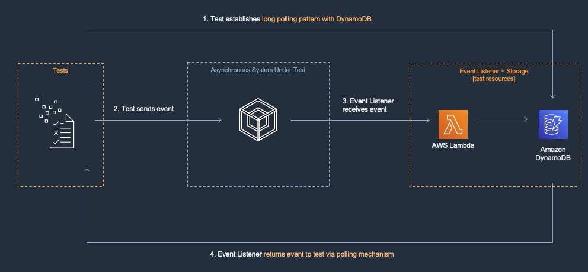

# Asynchronous Integration Test with Lambda Event Listener and DynamoDB

You may use a variety of resource types to create the event listener for your asynchronous system under test ([more about event listeners](https://github.com/aws-samples/serverless-test-samples/tree/main/typescript-test-samples/async-architectures#create-event-listeners-in-test-environments)). We recommend starting with AWS Lambda and Amazon DynamoDB. DynamoDB creates a persistent storage resource that can enable long running tests or an aggregation of a set of results.

In this pattern, a Lambda function is configured to be an event listener to receive the System Under Test's output data. DynamoDB is configured to be the event listener storage option. In Step 1 in the diagram below, the test establishes a polling pattern with DynamoDB. In Step 2, the test sends input data to the asynchronous system under test. The async system processes the data and in Step 3 the the Lambda function receives the data and puts it into DynamoDB. The polling process queries DynamoDB and examines the result. We recommend writing tests for failure conditions including timeouts and malformed requests.

[[top]](#asynchronous-integration-test-with-lambda-event-listener-and-dynamodb)

## Review the System Under Test

The System Under Test (SUT) in this example is an asynchronous text processor. It contains a source S3 bucket that receives a text file. A Lambda function is configured to be notified when the putObject event is executed on this bucket. The Lambda function gets the file from the source bucket, transforms the contents of the file to uppercase, then puts the file into a destination S3 bucket.

Your goal is to test this asynchronous process. You will use the Lambda Event Listener and DynamoDB test pattern to test the process. You will deploy the following resources:

-   S3 Source Bucket
-   Lambda function text processor
-   S3 Destination Bucket
-   Lambda event listener (test environments only)
-   DynamoDB results storage (test environments only)

[[top]](#asynchronous-integration-test-with-lambda-event-listener-and-dynamodb)

## Prerequisites

The SAM CLI is an extension of the AWS CLI that adds functionality for building and testing serverless applications. It contains features for building your appcation locally, deploying it to AWS, and emulating AWS services locally to support automated unit tests.

To use the SAM CLI, you need the following tools.

-   SAM CLI - [Install the SAM CLI](https://docs.aws.amazon.com/serverless-application-model/latest/developerguide/serverless-sam-cli-install.html)
-   Python 3 - [Install Python 3](https://www.python.org/downloads/)
-   Docker - [Install Docker community edition](https://hub.docker.com/search/?type=edition&offering=community)

[[top]](#asynchronous-integration-test-with-lambda-event-listener-and-dynamodb)

## Build the project

-   `sam build` - Creates a deployment package.
-   `sam deploy --guided` - Deploy the project to the AWS cloud.

[[top]](#asynchronous-integration-test-with-lambda-event-listener-and-dynamodb)

The deploy process accepts a parameter named `DeployTestResources`. The allowed values for this parameter are `true` and `false`.
If you pass `true` as this parameter's value CloudFormation will attempt to deploy the test event listener and storage resources
(Lambda and DynamoDB) to your account. If you pass `false` these resources will not be deployed.

[[top]](#asynchronous-integration-test-with-lambda-event-listener-and-dynamodb)

## Run the tests

Install the dependencies and execute your tests.
Run these commands in sequence.

-   `npm install` - Install project dependencies locally
-   `npm run test:integration` - Run integration test against cloud environment (requires AWS_SAM_STACK_NAME environment variable)
    -   usage: `AWS_SAM_STACK_NAME=<your-aws-stack-name> npm run test:integration`

[[top]](#asynchronous-integration-test-with-lambda-event-listener-and-dynamodb)

## Cleanup

To delete the sample application that you created, use the following command.

-   `sam delete --stack-name <your-aws-stack-name>`

[[top]](#asynchronous-integration-test-with-lambda-event-listener-and-dynamodb)
