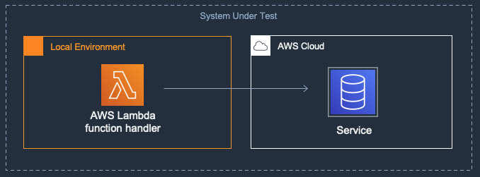
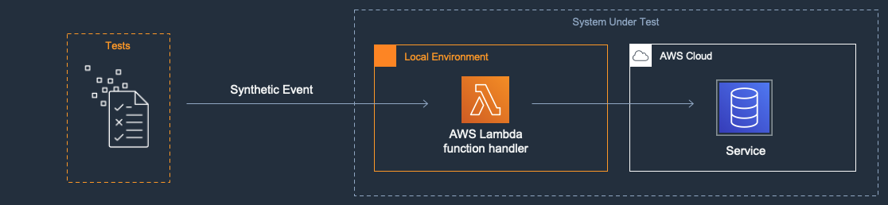

[](https://badgen.net/badge/Built%20With/TypeScript/blue9)
[](https://img.shields.io/badge/AWS-DynamoDB-blueviolet)
[](https://img.shields.io/badge/Test-Unit-blue)
[](https://img.shields.io/badge/Test-Integration-yellow)

# Typescript: Test locally an AWS Lambda function handler that calls remote cloud services.

## Introduction

The project consists of an [AWS Lambda function](https://aws.amazon.com/lambda/), an [Amazon DynamoDB](https://aws.amazon.com/dynamodb/) table. Although this project can be deployed, the focus of the code is to demonstrate local testing approaches using typescript. This project demonstrates testing locally an AWS Lambda function handler that calls remote cloud services. The Lambda function handler is being called locally which makes a call to DynamoDB table in cloud in the integration test. 

---

## Contents

- [Introduction](#introduction)
- [Contents](#contents)
- [About this Pattern](#about-this-pattern)
- [About this Example](#about-this-example)
  - [Key Files in the Project](#key-files-in-the-project)
- [Sample project description](#sample-project-description)
- [Integration Test](#integration-test)
- [Cleanup](#cleanup)

---

## About this Pattern

### System Under Test (SUT)

The SUT in this pattern is a Lambda function that makes calls to other AWS cloud services using an AWS SDK. For this example, we demonstrate a system that generates a new item, written to Amazon DynamoDB table using AWS Lambda function.



### Goal

This pattern is intended to increase development speed. It enables rapid development and testing of a Lambda function that makes calls to other AWS cloud services using an AWS SDK. This pattern eliminates the need to perform a build and deploy of the Lambda function to the cloud between modifications of test or function code.

### Description

In this pattern you develop a Lambda function that makes calls to Amazon DynamoDB using an AWS SDK. Your tests invoke the handler function method on your local desktop passing to it a synthetic event as a parameter. The handler function executes within your local desktop environment. When the SDK invokes the Amazon DynamoDB table, they uses your AWS credentials contained in your local environment. The SDK calls resources deployed to the cloud.

In this pattern, we have used AWS CDK(Cloud Development Kit) for infrastructure as code but it can be also be done using SAM, Serverless Framework, CloudFormation and Terraform. This pattern simplifies the process of attaching a debugger to the handler code. You may generate synthetic events using several methods including the ‘sam local generate-event’ command, by copying event template samples in the AWS Lambda console test section, or by printing events to CloudWatch logs.



[Top](#contents)
---

## About this Example

This example contains an [AWS Lambda](https://aws.amazon.com/lambda/) and [Amazon DynamoDB](https://aws.amazon.com/dynamodb/) table core resources.

AWS CDK is used to deploy the AWS Lambda function and Amazon DynamoDB table. The AWS Lambda function generates an item in the json format and put this item in the DynamoDB table using AWS SDK. The DynamoDB table item is a JSON object with format:

```json
{
    "PK": "string",
    "SK": "string"
}
```

### Key Files in the Project

  - [app.ts](src/app.ts) - Lambda handler code to test
  - [lambda-handler-dynamodb-stack.ts](lib/lambda-handler-dynamodb-stack.ts) - CDK stack for deploying required resources
  - [integ-handler.test.ts](test/integration/integ-handler.test.ts) - Integration tests on a live stack

[Top](#contents)
---

## Integration Test

### Integration Test description

In order to run integration tests in the cloud we will first need to deploy the full CDK stack which will create a lambda function and dynamodb table in your AWS account. The lambda function code inserts an item in the deployed dynamodb table. We will invoke the handler function method on the local desktop passing to it a synthetic event as a parameter. The handler function executes within your local desktop environment. When the SDK invokes the cloud services, they use the AWS_ACCESS_KEY_ID and AWS_SECRET_ACCESS_KEY credentials contained in your local environment, typically as environment variables. The SDK calls resources deployed in the cloud. 

### Run the Integration Tests
[integ-handler.test.ts](test/integration/integ-handler.test.ts) 

For integration tests, deploy the full stack before testing:
```shell
lambda-handler-dynamodb$ npm install
lambda-handler-dynamodb$ cdk deploy
```
 
The [integration tests](test/integration/integ-handler.test.ts) need to be provided 1 environment variable. 

1. The `DatabaseTable` is the name of the DynamoDB table providing persistence. 
    * The integration tests [invoke lambda handler locally and the call was successful](test/integration/integ-handler.test.ts#L46-49).
    * The [integration test retrieves item from dynamodb](test/integration/integ-handler.test.ts#L51-56) sends a get command query to dynamo and confirms if the item was found.

Set up the environment variables, replacing the `<PLACEHOLDERS>` with your values:
```shell
lambda-handler-dynamodb$ cd test
test $ export DatabaseTable=<YOUR_DYNAMODB_TABLE_NAME>
test $ export 
```

Then run the test suite.
```shell
lambda-handler-dynamodb$ cd test
test $ npm run test
```

Alternatively, you can set the environment variables and run the test suite all in one command:
```shell
lambda-handler-dynamodb$ cd test
test $ npm install
test $ DatabaseTable=<YOUR_DYNAMODB_TABLE_NAME> npm run test
```

## Cleanup

In order to delete the sample application that you created, use the AWS cdk command as shown below:

```bash
lambda-handler-dynamodb$ cdk destroy
```


[Top](#contents)