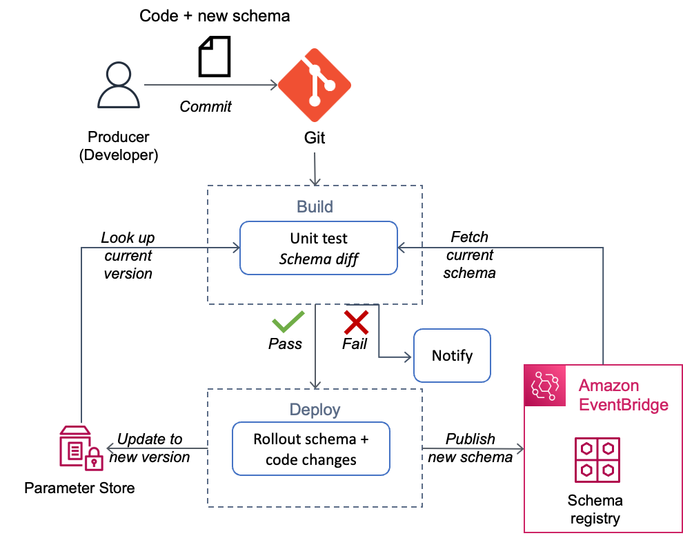
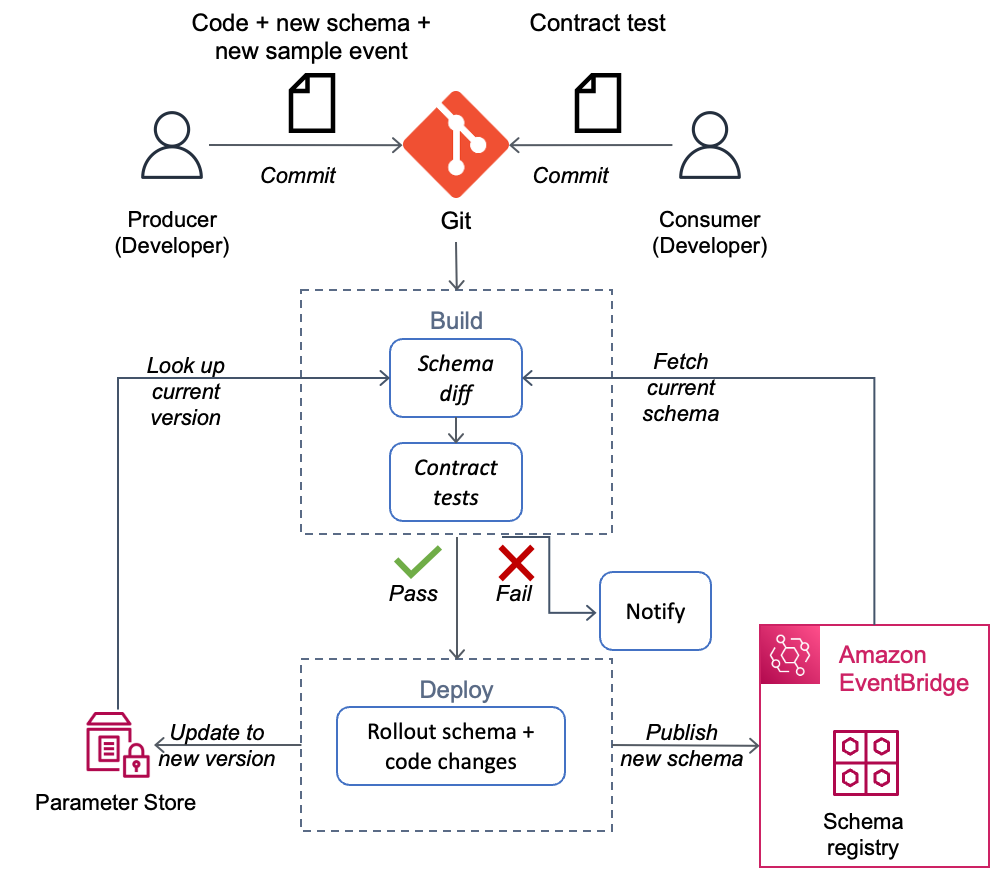

[](https://badgen.net/badge/Built%20With/TypeScript/blue9)
[](https://img.shields.io/badge/Test-Unit-blue)

# Typescript: Schema and Contract testing for Event-Driven Architectures

---

## Contents

- [Introduction](#introduction)
- [Schema testing](#schema-testing-schema-difference)
  - [Goal](#goal)
  - [Description](#description)
  - [System under test](#system-under-test-sut)
  - [Limitations](#limitations)
- [Contract testing](#contract-testing)
  - [Goal](#goal-1)
  - [Description](#description-1)
  - [System under test](#system-under-test-sut-1)
  - [Limitations](#limitations-1)


- [Key Files in the Project](#key-files-in-the-project)
- [Run the tests](#run-the-unit-tests)

---


## Introduction

This project contains introductory examples of TypeScript unit tests demonstrating schema and contract testing.

## Schema Testing (Schema Difference)

### Goal

Prevent changes to event schema from breaking consumer applications.

### Description

Event driven architectures decouple producers and consumers at the infrastructure layer but they are still coupled at the application layer by the event contract. Consumers rely on the event contract and schema to write their processing logic. 

With a small number of producers and consumers, it might be easy to collaborate to avoid breaking changes. But as time goes on your event-driven architectures will grow and keeping on top of producer and consumer relationships can be hard. Hence it is important to automate schema validation to prevent breaking changes. 

### System Under Test (SUT)

This test is integration service agnostic, as it runs against the schema published to a schema registry. Amazon EventBridge Schema Registry is one example of such a registry. It provides schemas for all events that are generated by AWS services. When you turn on schema discovery it will automatically detect and provide schemas for your custom events (OpenAPI and JSON Schemas). You can also use your own Git repository as a registry for storing schemas. In our test we will use a local “schemas” folder as a registry for simplicity. 

Schema testing checks for changes that are not backward-compatible, such as removing elements, changing a field type or adding new mandatory elements. Adding optional elements is considered backward-compatible.

The diagram below shows an example of running the schema validation as part of a producer’s CI/CD pipeline. A sample unit test from the "Build" step is provided in this pattern - .


 

### Limitations

First, schema inherently has ambiguity as does not capture business constraints. It does not tell if particular combination of fields is invalid, or make explicit dependencies between fields. As an example, when you create a AWS Lambda function, the runtime property is mandatory for zip packaging formats but not required for container image packaging. The schema for create function request payload will not capture this. There is always the possibility of business logic breaking on consumer side due to assumptions made about payload even though there are no breaking schema changes.

Second, unless consumer uses SDK/code bindings generated specifically for the version of schema in use, there is a likelihood of drift between code and schema. There is no way to guarantee the business logic adhere to the schema. Schema validation results in a false sense of security in such cases.

Both of these limitations can be addressed with [Contract testing](#contract-testing).

## Contract Testing

### System Under Test (SUT)

This test is integration service agnostic as it uses sample events generated from schema published to a schema registry. The diagram below shows one way of implementing contract testing as part of producer’s CI/CD pipeline.

The diagram below shows an example of running the schema validation as part of a producer’s CI/CD pipeline. A sample unit test from the "Build" step is provided in this pattern - .


 

### Goal

Identify side effects of non-breaking schema changes on consumer applications.

### Description

Event driven architectures decouple producers and consumers at the infrastructure layer but they are still coupled at the application layer by the event contract. Consumers rely on the event contract and schema to write their processing logic. Contract testing uses sample events provided by producers to validate business logic on consumer side for strong guarantee of no breaking changes. Contract tests are owned by consumers. As an example, changing the format of an “address” field from full address to only street address and adding new event fields like country, city, state and postcode would be considered a backward compatible schema change, since it’s only adding new elements. However, a consumer test expecting the full address in the “address’ field will fail and hence we will know that this change is actually not backward compatible.

There are other ways to implement contract testing. For instance, one of the common ways is to use test doubles on the consumer and check that all the calls to your test doubles return the same results as a call to the real application would. Review the Pact.io documentation for an example of this approach.


### Limitations

There is upfront effort required on consumer side to write tests and on-going maintenance efforts. However once written, the tests are reusable. It takes longer to roll out schema changes and increases collaboration overhead to resolve breaking changes. 

Customers can be selective in using contract testing for critical applications where cost of breaking changes is much higher than the additional work of extra tests and collaboration. For applications with lax SLA, not in critical path, they can trade off strong guarantee in favour of lower overhead by using only schema testing.


---

### Key Files in this Project

  - [schema-testing.test.ts](tests/schema-testing.test.ts) - unit test for schema testing
  - [contract-testing.test.ts](tests/contract-testing.test.ts) - unit test for contract testing
  - [schemas](schemas) - versioned schemas used for schema testing
  - [events](events) - sample events used for contract testing

## Run the Tests
```
 $ npm run test
```

[Top](#contents)

---