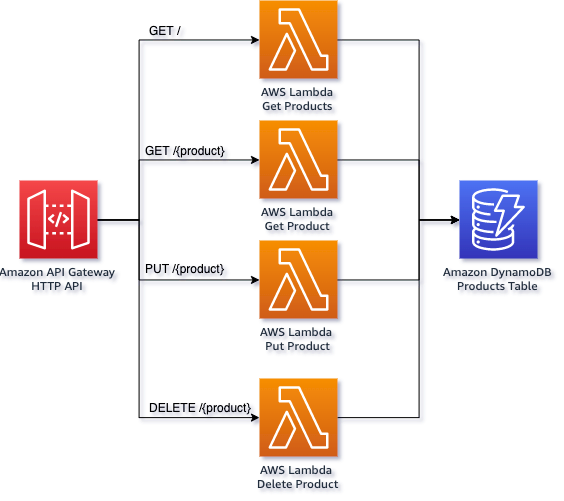
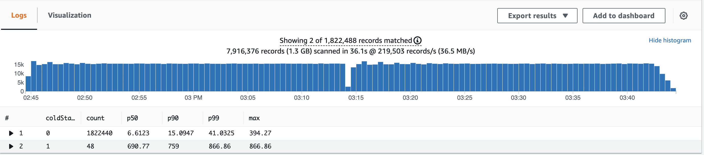

## Serverless Typescript Demo

Initial application forked from AWS [Serverless Typescript Demo](https://github.com/aws-samples/serverless-typescript-demo) project.

<p align="center">
  
</p>

This is a simple serverless application built in Typescript and uses Node.js 14 runtime. It consists of an 
[Amazon API Gateway](https://aws.amazon.com/api-gateway/) backed by four [AWS Lambda](https://aws.amazon.com/lambda/) 
functions and an [Amazon DynamoDB](https://aws.amazon.com/dynamodb/) table for storage. 

## Requirements

- [AWS CLI](https://aws.amazon.com/cli/)
- [AWS CDK](https://aws.amazon.com/cdk/)
- [Node.js 14](https://nodejs.org/)
- [Artillery](https://www.artillery.io/) for load-testing the application

## Software

Within folder is the products npm project. This project contains all the code for all four Lambda 
functions. It uses the hexagonal architecture pattern to decouple the entry points, from the main domain logic and the 
storage logic.


### Deployment

Deploy the demo to your AWS account using [AWS CDK](https://aws.amazon.com/cdk/).

```bash
npm install
cdk deploy
```

The command `cdk deploy` will first build the products TypeScript project using a docker build image esbuild.
Then it will use AWS CloudFormation to deploy the resources to your account.

CDK will create an output of the API Gateway endpoint URL for future use in our load tests.

## Load Test

[Artillery](https://www.artillery.io/) is used to make 300 requests / second for 10 minutes to our API endpoints. You can run this
with the following command.

```bash
cd load-test
./run-load-test.sh
```

This is a demanding load test, to change the rate alter the `arrivalRate` value in `load-test.yml`.

## Monitoring

This app leverages the [AWS Lambda Powertools for TypeScript](https://awslabs.github.io/aws-lambda-powertools-typescript) to emit monitoring data. 

### Logs

Using this CloudWatch Logs Insights query you can analyse the latency of the requests made to the Lambda functions.

This query returns the last 20 logs of the Lambda function that returns the products list.

```
fields resource_path, message, timestamp
| filter service = 'serverless-typescript-demo'
| filter function_name LIKE /GetProducts/
| sort @timestamp desc
| limit 20
```

This query returns the last 20 logs that contain an error or a warning.

```
fields resource_path, message, timestamp
| filter service = 'serverless-typescript-demo'
| filter level = 'WARN' or level = 'ERROR'
| sort @timestamp desc
| limit 20
```

This query returns the last 20 logs related to a specific product ID.

```
"63f74370-1d0b-49f8-be86-586efdef13be"
| fields resource_path, message, timestamp
| filter service = 'serverless-typescript-demo'
| sort @timestamp desc
| limit 20
```

This query returns the last 20 logs of invocations that experienced a cold start.

```
fields resource_path, message, timestamp
| filter service = 'serverless-typescript-demo'
| filter cold_start = 1
| sort @timestamp desc
| limit 20
```

This query separates cold starts from other requests and then gives you p50, p90 and p99 percentiles.

```
filter @type="REPORT"
| fields greatest(@initDuration, 0) + @duration as duration, ispresent(@initDuration) as coldStart
| stats count(*) as count, pct(duration, 50) as p50, pct(duration, 90) as p90, pct(duration, 99) as p99, max(duration) as max by coldStart
```
<p align="center">
  
</p>


## 👀 With other languages

You can find implementations of this project in other languages here:

* [🦀  Rust](https://github.com/aws-samples/serverless-rust-demo)
* [☕ Java with GraalVM](https://github.com/aws-samples/serverless-graalvm-demo)
* [🐿️ Go](https://github.com/aws-samples/serverless-go-demo)
* [🤖 Kotlin](https://github.com/aws-samples/serverless-kotlin-demo)
* [🥅 .NET](https://github.com/aws-samples/serverless-dotnet-demo)

## Security

See [CONTRIBUTING](CONTRIBUTING.md#security-issue-notifications) for more information.

## License

This library is licensed under the MIT-0 License. See the LICENSE file.

