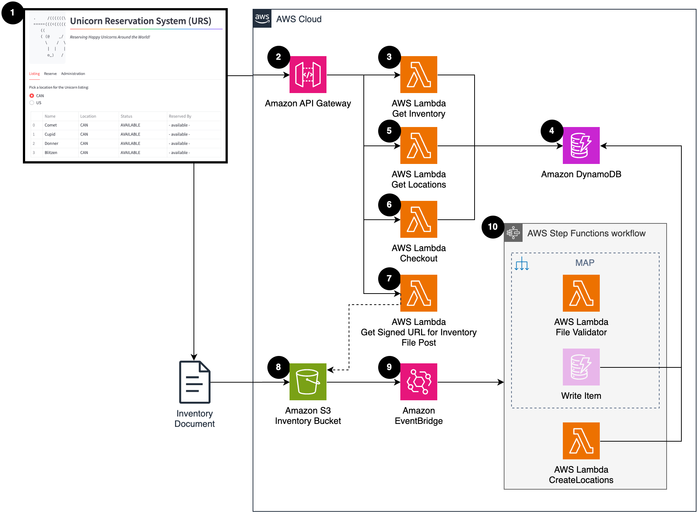

# Serverless Testing Workshop System Under Test (SUT) 

This folder contains the source for the System Under Test (SUT) in the [Serverless Testing Workshop](https://catalog.us-east-1.prod.workshops.aws/workshops/0f9013f4-3960-426d-a445-dc3519b8e3d4/en-US). 

---

## Architecture

This system under test is a thin front-end of a fictitious Unicorn Reservation System (URS) which  makes API calls to back-end services. The system includes an event-driven integration with Amazon EventBridge between Amazon S3 and a Step Functions workflow.

1. Users interact with a locally hosted UI.
2. Amazon API Gateway routes requests to AWS Lambda functions
3. AWS Lambda function returns unicorn inventory.
4. Amazon DynamoDB Table stores the inventory of unicorns, including the name, location, reservation status, and reserved by info. 
5. Lambda function returns a list of unicorn locations.
6. Lambda function handles unicorn reservations
7. Lambda function produces a signed URL to upload a CSV file with bulk inventory data.
8. Inventory documents (CSV) can be uploaded to an Amazon S3 bucket, which triggers an event to Amazon EventBridge.
9. Amazon EventBridge invokes a workflow to import and process the bulk inventory document (CSV).
10. AWS Step Function workflow reads the inventory CSV file from S3, runs a Lambda function to validate the file, writes items to the DynamoDB table, and compiles an updated list of Unicorn locations.
